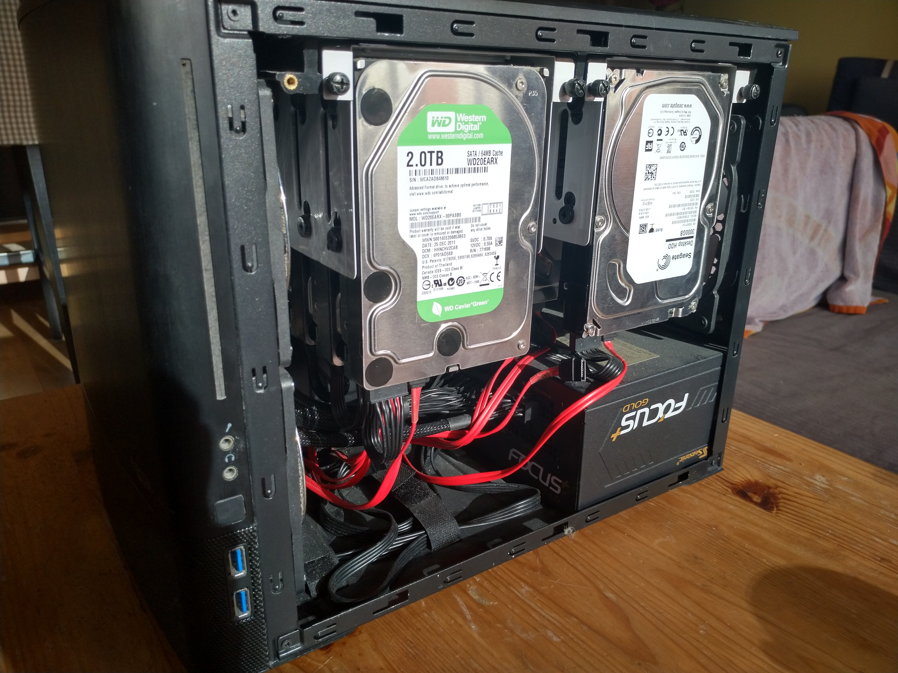
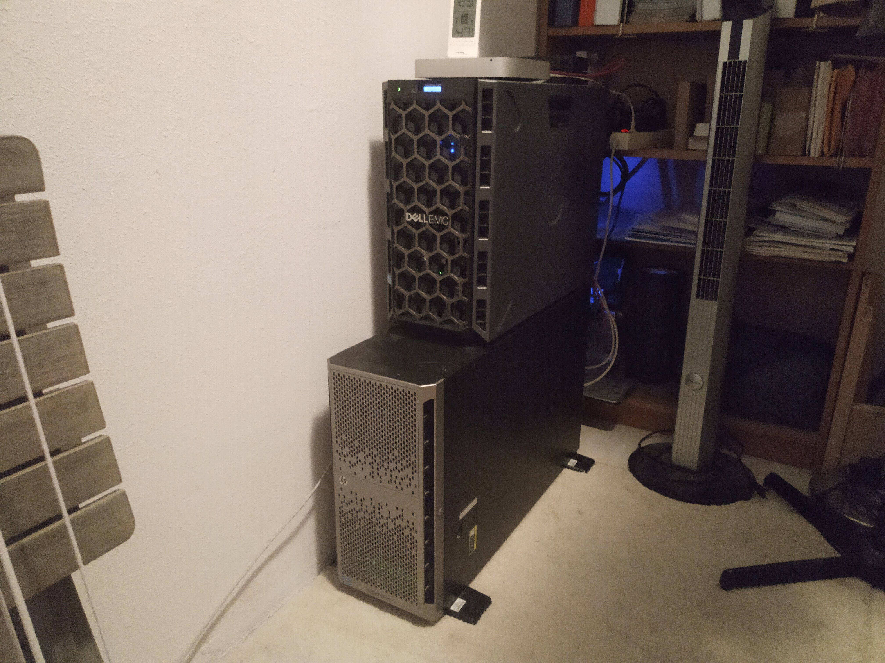
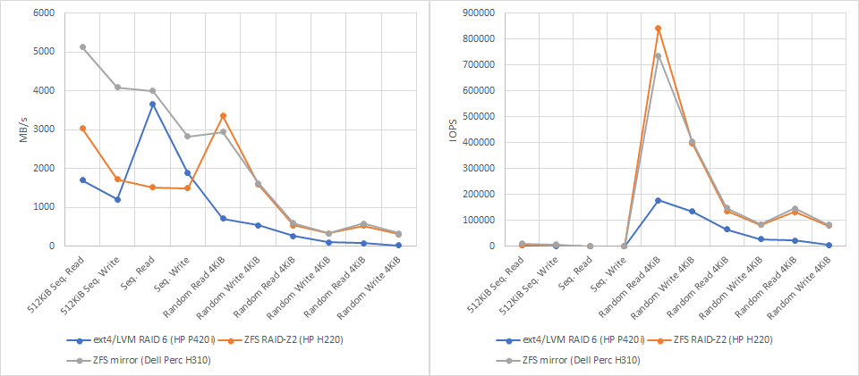
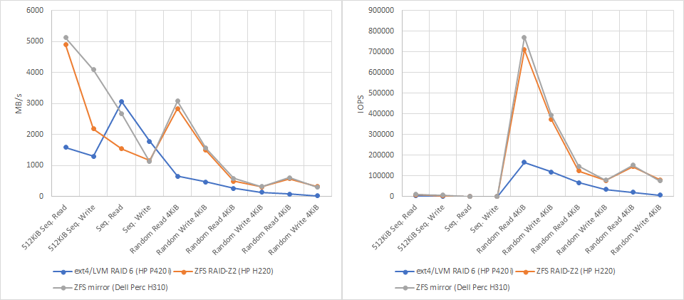
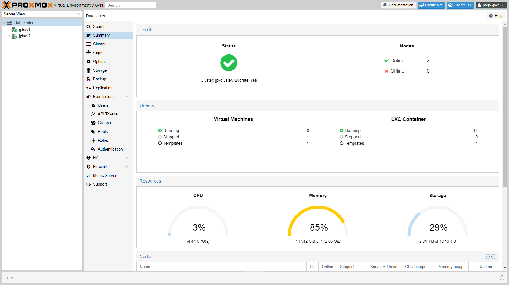

## Introduction

I haven't posted on this blog for over a year. There are multiple reasons for that, which I might explain someday, but I don't want to go into them now. Except for one thing... I have been keeping myself busy with [jodiBooks](https://jodibooks.com) and stuff I wanted to do for myself. This was one of them.

For years I wanted to build my own proper server setup, but all kinds of "rational" reasons prevented me from doing so: *"Having your own server is too expensive"*, *"it's too wasteful with electricity"*, *"it's too much work"*, *"you don't have the time"*, *"it's too much risk"*. Well, I still agree that all of them are true, but fuck it, I wanted my own servers.

After years of struggling with a -more than decent- custom build home server, I decided to buy some proper equipment. My idea for what I wanted exactly was still really vague. And because I still consider this a semi-hobby project ([jodiBooks](https://jodibooks.com) is my main project), I looked for a cheap used server. After some browsing through classifieds on the Dutch site [Tweakers](https://tweakers.net/servers/aanbod/), I found two ads for two servers from the same seller and decided to buy them both and see what would happen.

That was 3 months ago and, man, I learned a lot in this short period. This has been a hard and frustrating, but ultimately satifying ride. And I am glad I finally have some time to write everything down (🤞*please don't crash now and have me start from scratch*🤞).

On [my website](https://joeplaa.com) I have written down all the nitty-gritty details of [how to](https://joeplaa.com/howto) build and configure these servers. Here I want to tell you more about the background of the project, like why I did it and what I learned.

## History

Ever since my dad bought his first PC I have been intrigued by computers. I can still remember that I wanted to upgrade the RAM of one of our first computers to 64 MB! Omg, I almost had to beg my dad to do it. He was so afraid I would ruin the computer that I could only do it if someone who had done it before was with me. Luckily, or off course, everything went ok and later my brother and I were allowed to add a graphics card. That was so cool. It sounds weird now, but instantly every game looked so much better. It gave me a feeling of power: look what I can do, I can make things better.

Later when I went to university -15 years ago- I saw all this network equipment in the university buildings and it gripped me. I can't explain exactly what it is, but I like flashing lights, knowing the flashing means something. There is actual "stuff" going through those cables and every flicker of a LED shows someone is sending or receiving data. It's sort of magical.

In that same period I got my own laptop and through study loans and some work I got the funds to buy a PC. I knew I wasn't going to build a full network with all those lights from scratch, that was way above my understanding, so I just build a PC for myself. Over the years however, this PC morphed into a server. It changed so much that the latest incarnation looked nothing like the initial PC. The processor, graphics card, hard disks, mainboard, monitor and chassis changed. It even got watercooling added.

After graduating and getting a job, I finally had the money to do things properly. Through the years I experimented with different chassis, operating systems, water cooling, virtualization and more. That was until we started jodiBooks and there was no time left to "play around". Other things were always more important and taking risks with serving our applications and tools was not a smart thing to do.

So there we were, a [man in crisis](/tearing-down-the-house/) who didn't allow himself a moment of play. Until a light started burning (or flickering) again and I decided to build the server(s) I always wanted. I knew it is always frustrating and it costs me days of Googling, but it is always so satisfying to see those lights flickering, knowing I build it.

## What I wanted to do

I wanted to build a server that was capable of storing lots of data safely and be powerful enough to run a lot of virtual machines. I had read an article on [web3](https://www.freecodecamp.org/news/what-is-web3/) and wanted to build a server that could be used to run those applications on.

So I made a list of things this server (or servers) should do:

* Store lots of data
* Run virtual machines
* Do network routing
* Automate lots of stuff for jodiBooks
* Let me fiddle with [crypto/web3](https://www.freecodecamp.org/news/what-is-web3/)

### Hardware selection

My existing (home) server -the one that was the pinnacle of all my previous work- had a [Supermicro X9SCM](https://www.supermicro.com/products/motherboard/xeon/c202_c204/x9scm-f.cfm) mainboard, [Xeon E3-1230 v2](https://www.cpubenchmark.net/compare/Intel-Xeon-E3-1230-V2-vs-Intel-Xeon-E5-2650-v2-vs-Intel-Xeon-E5-2420-v2/1189vs2042vs2217) CPU and 32 GB of ECC RAM. I also installed an [IBM Serveraid M1115](https://www.amazon.com/IBM-Serveraid-Controller-System-81Y4448/dp/B007V8S0D8) HBA card which has a LSI SAS2008 chip. Back when I build it this was one of the most [recommended HBA chips](https://www.servethehome.com/buyers-guides/top-hardware-components-freenas-nas-servers/top-picks-freenas-hbas/). Together with 4x 2TB and ~~4~~3x 3TB disks, it was an amazing machine. Especially the chassis; a [Fractal design node 804](https://www.amazon.com/Fractal-Design-Node-Case-Computer/dp/B00JBBH93K). It has lots of space, is very quiet and its fan filters catch a lot of dust.

Although this server has been of great service and has helped me learn so much, it just didn't have enough RAM to do this seriously and the disks were running on their last legs. It was running some virtual machines for jodiBooks in VirtualBox, but I didn't dare to store any data on it or host a website or production-like application on it. After all those years it just felt too unreliable.

Normally I would have started with a plan, make an Excel sheet and look for hardware that fits and wouldn't be too expensive. This time however I just listed all available second hand servers and bought the two that were most convenient (we happened to be in the neighborhood). So I bought an old Dell T320 and HP ML350p. I than upgraded those by adding RAM and in the case of the ML350 I switched out the CPU's.

Because I hadn't properly planned, but mainly because my requirements changed, more hardware was needed. I then found that on Ebay I could buy server hardware really cheap. Omg, why didn't I think of that earlier. Anyway, I bought SSD's, HDD's, a new HBA (see "[OS filesystem](#os-filesystem)"), changed the CPU's of the ML350 again and even more -I don't know anymore what exactly. Anyway it culminated in these two servers.

:::important HP(E) branded hardware requirement
HP, now HPE, is notorious for being very picky about the hardware you install. If it is not HP(E) labeled/branded, the server doesn't recognize the sensor data and assumes the worst. This results in very high fan speeds and thus an unbearable amount of noise. So in the HP server I had to install an HP branded HBA: the HP H220.
:::

    <table class="table table-striped">
        <thead>
            <tr>
                <th>Server</th>
                <th>Type</th>
                <th>CPU</th>
                <th>Cores / threads</th>
                <th>RAM</th>
            </tr>
        </thead>
        <tbody>
            <tr>
                <td>1</td>
                <td>HP ML350p gen 8</td>
                <td>2x&nbsp;<a href='https://www.cpubenchmark.net/compare/Intel-Xeon-E3-1230-V2-vs-Intel-Xeon-E5-2650-v2-vs-Intel-Xeon-E5-2420-v2/1189vs2042vs2217'>Xeon&nbsp;E5-2650&nbsp;v2</a></td>
                <td>16/32</td>
                <td>112&nbsp;GB</td>
            </tr>
            <tr>
                <td>2</td>
                <td>Dell T320 gen 12</td>
                <td>1x&nbsp;<a href='https://www.cpubenchmark.net/compare/Intel-Xeon-E3-1230-V2-vs-Intel-Xeon-E5-2650-v2-vs-Intel-Xeon-E5-2420-v2/1189vs2042vs2217'>Xeon&nbsp;E5-2420&nbsp;v2</a></td>
                <td>6/12</td>
                <td>64&nbsp;GB</td>
            </tr>
        </tbody>
    </table>

    <table class="table table-striped ">
        <thead>
            <tr>
                <th>Server</th>
                <th>OS&nbsp;disk&nbsp;size</th>
                <th>OS&nbsp;disk&nbsp;config</th>
                <th>Data&nbsp;disk&nbsp;size</th>
                <th>Data&nbsp;disk&nbsp;config</th>
            </tr>
        </thead>
        <tbody>
            <tr>
                <td>1</td>
                <td>~800&nbsp;GB</td>
                <td>SSD&nbsp;-&nbsp;RAID-Z2</td>
                <td>-</td>
                <td>-</td>
            </tr>
            <tr>
                <td>2</td>
                <td>~500&nbsp;GB</td>
                <td>SSD&nbsp;-&nbsp;ZFS&nbsp;mirror</td>
                <td>12.3&nbsp;TB</td>
                <td>HDD&nbsp;-&nbsp;RAID-Z2 + hot spare</td>
            </tr>
        </tbody>
    </table>

    <table class="table table-striped">
        <thead>
            <tr>
                <th>Server</th>
                <th>HBA type</th>
                <th>HBA chip</th>
                <th>HBA firmware</th>
            </tr>
        </thead>
        <tbody>
            <tr>
                <td>1</td>
                <td>HP H220</td>
                <td>~800&nbsp;GB</td>
                <td>HP v13 hba mode*</td>
            </tr>
            <tr>
                <td>2</td>
                <td>Dell Perc H310</td>
                <td>LSI 9205-8i</td>
                <td>LSI IT mode</td>
            </tr>
        </tbody>
    </table>

## Hypervisor selection

The most difficult decision thing was choosing the hypervisor. The hypervisor is the main software that runs on the server and allow for running the virtual machines. I knew [ESXi](https://www.vmware.com/products/esxi-and-esx.html) from my first dabbles into home servers, but later I ditched it in favor of using Ubuntu (Linux) with [VirtualBox](https://www.virtualbox.org/). This is not the way you want to run virtual machines in a production environment, so I tried multiple hypervisors and ultimately settled on using Proxmox.

Why Proxmox? Well, as said I used ESXi before. I think the GUI is amazing, but as a free product the functionality is too limited. I really want to make backups and move VM's between servers, which is not possible with the free license. So I searched for free, open-source alternatives and found KVM with [Cockpit](https://cockpit-project.org/), [Proxmox](https://www.proxmox.com), [OpenNebula](https://opennebula.io/), [XEN](https://xenproject.org/) and [oVirt](https://ovirt.org/).

> ### In short (TLDR)
>
> * Price: **free**
>     * Proxmox is free and open-source as opposed to ESXi (VMWare).
> * Technology: **[KVM](https://en.wikipedia.org/wiki/Kernel-based_Virtual_Machine) / [QEMU](https://en.wikipedia.org/wiki/QEMU)**
>     * Proxmox is based on KVM which is build into the Linux kernel.
>     * [Big players (AWS) are migrating](https://www.freecodecamp.org/news/aws-just-announced-a-move-from-xen-towards-kvm-so-what-is-kvm/) from XEN, the "other" open-source option, to KVM.
>     * I couldn't find even the most basic Xen commands. So I couldn't start the GUI after a reboot. This put me off too much to continue.
> * Ease of use: **GUI**
>     * Proxmox was the only KVM based option that I actually got to a stable working state.
>     * KVM with the Cockpit GUI (on Ubuntu) is too fragile and limited. Most things still needed to be done through the CLI.
>     * OpenNebula's implementation is too complicated. Everything needs to be configured manually.
>     * oVirt needs a dedicated storage machine.
>     * ESXi so far has the best GUI in my opinion, but the free version is too limited.

I started with Cockpit as I already had Ubuntu installed and KVM is available in the kernel. However, it felt too fragile and I couldn't do a lot of things through the GUI. Also documentation for running KVM/QEMU through the command line is very hard to find. I now see that "[The Cockpit Web Console is extendable](https://cockpit-project.org/applications.html)". Well that would have helped, but nobody mentioned a word about them in the tutorials and manuals I found.

The next try was Proxmox. I didn't want it at first as it is not a stand-alone application, but a full OS. At least, it needs Debian and I had Ubuntu installed. Maybe it works on Ubuntu, but I didn't want to go there. However, when I installed it -which was really easy- I got a VM running in a few minutes. I then tried to configure more and more, [converted](https://docs.openstack.org/image-guide/convert-images.html) and [imported](https://mangolassi.it/topic/21751/import-a-qcow2-into-proxmox) all my VirtualBox VM's, clustered my servers and fucked up. I was stupid enough to do stuff in the config files (without backing them up).

I was so pissed, I didn't want to have to do anything with Proxmox, that I tried several other hypervisors. The first was Xen server ([XCP-ng](https://xcp-ng.org/)) with [Xen Orchestra](https://xen-orchestra.com/). I had some trouble with this too. The GUI (Xen Orchestra) runs as a VM in Xen server. After a reboot this VM wasn't started so I couldn't access it to start it... Get it? Also I couldn't find how to start a VM through the command line. Seriously, this should be so straight-forward, yet I couldn't find that command. Also, on XEN I couldn't get a VM with [Golem](https://www.golem.network/) to work. Which was to be expected as they wrote: "[We do not support XEN hypervisor](https://handbook.golem.network/troubleshooting/provider-troubleshooting)".

The next: [OpenNebula](https://opennebula.io/). They claimed to be superior to Proxmox, although they used the same technology (KVM). The first thing: installation is way harder than Proxmox or Xen. Second, when you finally have it in a running state, the amount of configuration options is enormous. I just drowned in them, it was to frickin' huge. Thinking back OpenNebula has a different use case (running your own cloud) and so it's logical it wasn't for me.

The last one I tried was [oVirt](https://ovirt.org/). Installation again was a breeze, but in the initial configuration there was a hickup: oVirt expects you to have a centralized storage node for your VM disks. That was a bit above my station. So in the end I did go back to Proxmox with this warning printed in big font and flashing in my mind:

:::warning Always make backups
Proxmox config is very delicate. Almost all settings can be configured through the GUI, but sometimes you might have to dig into config files with the CLI. **ALWAYS make a backup before doing so!** I learned the hard way that messing up only one file (especially related to the cluster) can mean a full reinstall of that cluster!
:::

## Putting it all together

### OS filesystem

First I had to install Proxmox on both servers. You can read how that works in [How to install and configure Proxmox](https://joeplaa.com/how-to-install-and-configure-proxmox/). At first I hooked up the 6 HP SSD's I bought of Ebay to the P420i RAID card in the ML350p server. However, the performance wasn't what I expected. I read somewhere (but forgot to save the source) that RAID 6 is hard for older RAID cards. That made me decide to buy an HBA and use a software RAID solution. Proxmox has ZFS enabled and with those beefy CPU's, ZFS RAID-Z2 should be no problem.

I don't know how to benchmark this properly, but I found a [script on StackExchange](https://unix.stackexchange.com/a/480191) that should at least give me some relative numbers -relative between hardware RAID6 and software RAID-Z2. The results when using a test size of 1024MB are shown in the table below.

    <table class="table">
        <thead>
            <tr>
                <th rowspan="2">File system type</th>
                <th rowspan="2">Card type</th>
                <th rowspan="2">Unit</th>
                <th>512KiB Seq. Read</th>
                <th>512KiB Seq. Write</th>
                <th>Seq. Read</th>
                <th>Seq. Write</th>
                <th>Random Read 4KiB</th>
                <th>Random Write 4KiB</th>
                <th>Random Read 4KiB</th>
                <th>Random Write 4KiB</th>
                <th>Random Read 4KiB</th>
                <th>Random Write 4KiB</th>
            </tr>
            <tr>
                <th>Q=1 T=1</th>
                <th>Q=1 T=1</th>
                <th>Q=32 T=1</th>
                <th>Q=32 T=1</th>
                <th>Q=8 T=8</th>
                <th>Q=8 T=8</th>
                <th>Q=32 T=1</th>
                <th>Q=32 T=1</th>
                <th>Q=1 T=1</th>
                <th>Q=1 T=1</th>
            </tr>
        </thead>
        <tbody>
            <tr>
                <td rowspan="2">ext4/LVM RAID 6</td>
                <td rowspan="2">HP P420i</td>
                <td>MB/s</td>
                <td>1706</td>
                <td>1205</td>
                <td>3653</td>
                <td>1892</td>
                <td>711</td>
                <td>538</td>
                <td>262</td>
                <td>112</td>
                <td>88</td>
                <td>21</td>
            </tr>
            <tr>
                <td>IOPS</td>
                <td>3333</td>
                <td>2442</td>
                <td>111</td>
                <td>57</td>
                <td>177834</td>
                <td>134528</td>
                <td>65746</td>
                <td>28170</td>
                <td>22033</td>
                <td>5383</td>
            </tr>
            <tr>
                <td rowspan="2">ZFS RAID-Z2</td>
                <td rowspan="2">HP H220</td>
                <td>MB/s</td>
                <td>3034</td>
                <td>1724</td>
                <td>1515</td>
                <td>1491</td>
                <td>3361</td>
                <td>1587</td>
                <td>547</td>
                <td>331</td>
                <td>535</td>
                <td>316</td>
            </tr>
            <tr>
                <td>IOPS</td>
                <td>5925</td>
                <td>3368</td>
                <td>46</td>
                <td>45</td>
                <td>840483</td>
                <td>396798</td>
                <td>136989</td>
                <td>82914</td>
                <td>133856</td>
                <td>79226</td>
            </tr>
        </tbody>
    </table>

I have no clue what these numbers exactly tell me. I can see that it seems that software RAID is faster in my case. So I'm glad I went that route. Here are some graphs to show the same numbers graphically. I also added the test results for my second server that has two consumer SSD's [Crucial MX500](https://www.amazon.nl/Crucial-MX500-Interne-500GB-Zilver/dp/B0786QNS9B) The first two show the results of the script when using 1024MB as test size.

The next two show the same thing, but this time with 2048MB as test size.

### Flash HBA

Most HBA cards you can buy are configured with **IR** firmware by default. In this mode the card will take care of the RAID functionality (like the P420i in the benchmarks above). I didn't want that, so I had to (cross)flash the Dell card to **IT** mode. The procedure is described in [How to flash a Dell Perc H310 card](https://joeplaa.com/how-to-flash-a-dell-perc-h310-hba-to-it-mode/).

For the HP server I bought an HBA card, so I thought that one didn't have to be flashed. Well, unfortunately the latest firmware (version 15) contains either a bug or an unwanted change. It made the fans "idle" at 30%, where they make rather a lot of noise. [After flashing down to version 13](https://www.reddit.com/r/homelab/comments/evg5in/howto_fix_loud_hp_server_fans_with_an_hp_h220_hba/) the fans are back at 8% idle, which is basically silent. The procedure is described in [How to flash an HP H220 card](https://joeplaa.com/how-to-flash-an-hp-h220-hba/).

### Disks

For storage I bought a batch of used 3TB SAS disks. They were advertised as used, but relatively short. Most of them indeed had only run for ~7000-8000 hours (a year). There is a lot of discussion going on about the [perceived safety](https://www.digistor.com.au/the-latest/Whether-RAID-5-is-still-safe-in-2019/) of using RAID-5. Search for "[RAID 5 is dead](https://search.brave.com/search?q=raid%205%20is%20dead)" and decide for yourself. I myself lost almost all my data because a RAID-5 array failed, so in my new server I went for RAID-Z2 (RAID-6) with a hot spare). I also have a few backup drives on the shelve.

### Installing and configuring Proxmox

The full how to ([How to install and configure Proxmox](https://joeplaa.com/how-to-install-and-configure-proxmox/)) can again be found on my website. Here I just want to say something about the amount of time it normally costs (me) to get something configured or fixed. You really need to dig into the forums, documentation and in general scower the web. In the end you get something working, but not after going on multiple tangents. I myself don't have an official education in this field, so I have to Google all the terminology and basic concepts. This makes a statement like "just do this or that to fix your problem" a quest, as I have to learn what "this" and "that" means, but also how I have actually perform the actions described.

### Installing and configuring TrueNas

Proxmox supports ZFS natively, so I could have used the node to do all file-sharing. However, I really like the GUI of TrueNas and the way all these file-sharing services are taken care of by TrueNas. For me this works so much better than having to piddle with configuration files. It also does automatic disk checks and warns me when a disk is in need of service. Something you can do manually in Linux, but you have to strike a balance between complete understanding and time you want and can invest into it. For me, this is perfect.

More in [How to install TrueNas on Proxmox](https://joeplaa.com/how-to-install-truenas-on-proxmox/).

## The result: a Proxmox cluster

I now have a server setup that is fully up and running. It currently runs 6 full virtual machines and 14 LXC containers.

The nodes are linked together in a cluster. This makes it possible to:

* Use a single login
    * Single username-password
    * Single private-public key
* Control the nodes, VM's and containers from a single GUI
* Share configuration (files) between nodes
* Migrate VM's and containers between nodes

All very cool and convenient, but I'm not done yet. On my wishlist are a 10Gbit network between the servers and TrueNas so making backups, migrating virtual machines and storing data will be faster. Also I really want a UPS. But that's all for later. I already spend way more than I budgetted in the beginning😅.