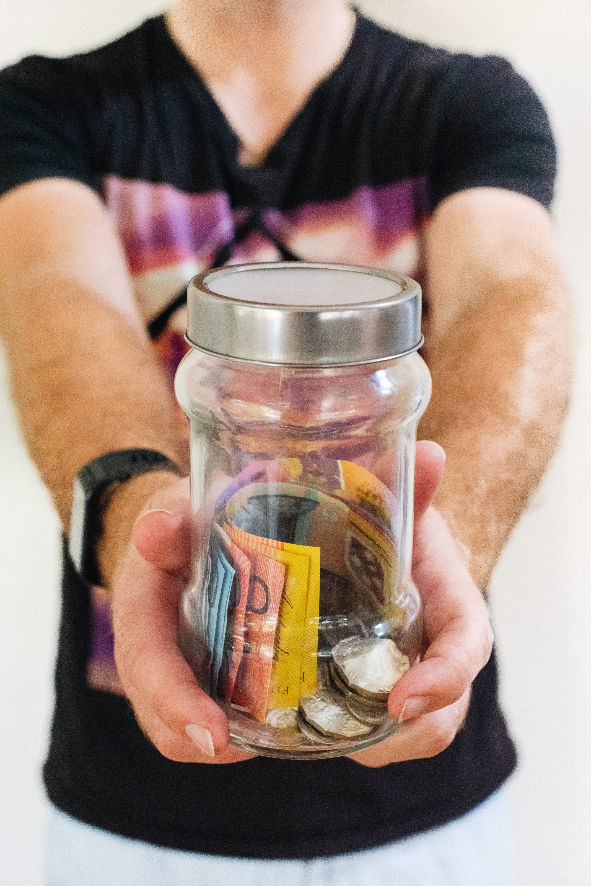
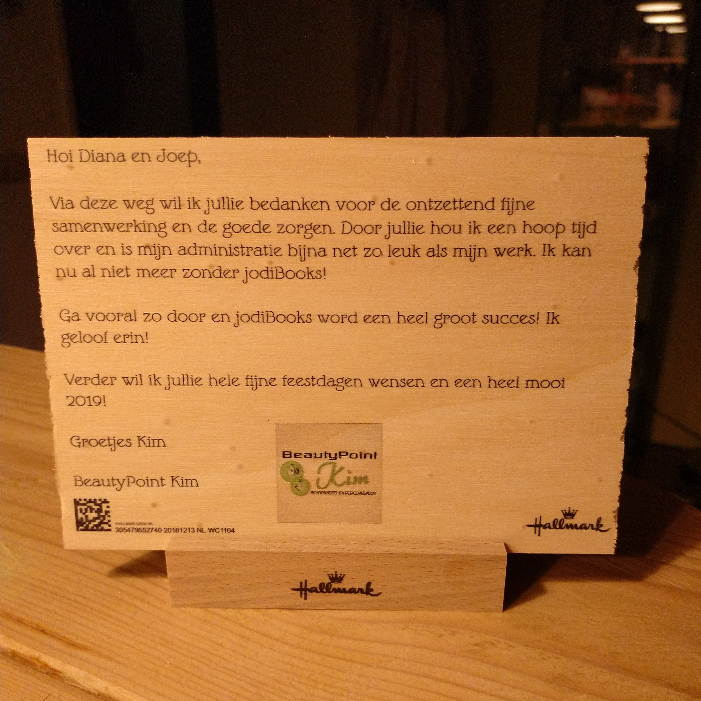

Have you ever bought something, received it, were busy with something else, forgot about it, eventually did use it and were disappointed? Well, I had a few weeks ago. So, what does a normal person do when he or she is not happy? Right, they contact customer service and complain or ask or... well, I don't know, because I never do that.

I'm not the guy to complain. Especially now that I initially forgot about the product and was fully aware, I missed my window of 30 days to try and return it. I'd rather suck it up and take the loss than speak my mind. I have a million reasons not to contact whatever customer service. It's probably my fault, they won't help me anyway, it's a waste of time, I can use my time more efficiently, I hate calling, etc.

But I have to learn to speak up for myself. I have to be more assertive, to put my own interest forward and quite simply to just ask. Without even asking, I'll never get anything. Even if it's my fault and the company has the right to deny my request, why not ask? Nothing ventured, nothing gained.

## To rant or not to rant

After my latest adventure with a customer service, I was kind of frustrated. Although they were rationally and legally completely right, it just felt stupid. So I thought let's use this for a blog post. Just write down how you feel and why. That week I was composing a post in my head and it turned into a full-blown rant about customer service.

I think ranting is fine, but it should have a purpose. It shouldn't only be a release of frustration and anger. There should be a lesson in it. So, while I was ranting in my head, I postponed this post and wrote three others first: [this](/my-priorities/), [this](/intermittent-fasting/) and [this](/keep-asking-why-a-letter-to-my-niece-and-nephew/). I think that worked, because the reason why bad or, even worst, acceptable customer service bothers me became clear.

## What happened

Before I go into that, let me tell you what happened, so you can determine if [I'm an asshole](https://www.reddit.com/r/AmItheAsshole/) for making a fuss.

In front of my apartment was a nice open field. But, when I moved in here, the housing corporation told me there were plans to build another apartment block on there. Now, 6 years later, they have finally started building. We got a letter explaining the works and possible disturbances. So I bought [earplugs](https://www.flareaudio.com/products/sleeep-flex) online, received them and forgot about them (we had nice quite construction workers).

Five weeks went by and then they turned on a huge generator. The wavy yet monotone sound bothered me so much, I couldn't sleep. But wait, didn't I buy earplugs just for this? After digging them up, putting them in it was quiet... for 1 minute. Then they popped out of my ear and all noise poured back in.

So the day after I contacted customer service. I explained the story and asked if they could help me out. They started with a link to a YouTube video on how to use the plugs, asked for my ordering number and said they couldn't do anything, because the official 30-day trial period had expired.

So far, everything was kind of fine. I didn't think it was right to ask for it straight away, yet I had hoped they would be accommodating and offer a refund anyway. Instead they asked if they could help me with something else and if I would rate their service. It might be completely irrational, but by asking that they hit a nerve.

Just as an aside, I also emailed the construction company and asked if they could switch of the generator when they go home. They replied they will do that and apologized for the noise: **just ask!**

## How I classify and thus rate service

### The bad

Now, I think you can classify customer service as either bad, acceptable or good. Everybody knows when customer service is bad. It's when they keep you waiting forever, they are rude, they treat you like a number (and don't even hide it), they make you feel powerless yet dependent and they simply refuse to help you.

It's all those companies you don't ever want to do business with again. For me a great example is the "MediaMarkt". I bought a pack of the wrong rechargeable batteries. My charger's manual explicitly said to not charge them. So I wanted to exchange them for the correct type. I sat at their service desk for 45 minutes, while other people who came in later were being served (they needed paid repairs). I walked out, send them an email instead, but never got any reply.

There are also those companies that know you don't have a choice (government). The Dutch tax revenue service is one of those examples. They literally refuse to help you, but you just have to suck it up (or emigrate). We wanted to know how to properly file our personal investment into our own company so that we would not get in trouble with them later. The only answer we got: "get an accountant".

### The good

The good category is also straight forward. It's when you hang up the phone, close their emailed response close the chat window and just feel good. It's when they offer you something you know they shouldn't have. When they take a loss without making you feel guilty about it. And when they all do that without asking any questions. It's when you think: "I'll go back there even if they are more expensive, further away or if they don't have the perfect product."

For me there are three companies that stand out: AH, Coolblue and Amazon. You can skip to the next paragraph if you'd like. I just need to recognize these three companies. However flawed they all might be, their customers service is excellent.

AH (Albert Heijn) is the biggest Dutch supermarket chain. If you don't like going there or if you don't have the time, you can do your shopping online. They will collect all your groceries and you can pick them up at a designated time. Over the years we've experienced missing groceries, incorrect items and even things that had gone bad. Very inconvenient but call them or send them a message and they apologize nicely and give you your money back, absolutely no questions asked.

### Good examples

With Coolblue I have the same experience. I, and let me be clear about that, **I** bought the wrong car radio set. I bought one that didn't fit into my car. How stupid is that. Well, I told them and they replaced it with one that did fit. I even got money **back** because that one was cheaper! All that without asking why I bought the wrong one. I could even ship the wrong one back for free.

I bought a phone on Amazon. Now, you have to know that Amazon wasn't officially selling in the Netherlands back then. I had to use the German website. Despite that, I really wanted that phone and took the risk. When it got in, the phone wasn't working properly. It was slow, it got really hot, and was rebooting randomly. Shit! I send them a message and without asking I got a new phone with instructions how to send the broken one back. Read that again: I got the new phone before I had even sent the old one back!

After 1.5 years the replacement also died. The battery swell up, breaking the casing. As that phone wasn't available anymore, they gave me a **full** refund. So not an arbitrary "current value". No, the same amount I paid for it.

### The acceptable

Businesses in the good category are often referred to as having "excellent" customer service. I think that's a bit overstated. Yes their customer service is great, but excellent? I would argue that customer service is excellent when your product is so good, you don't need a customer service department. Well, that's just utopia. No product or service can and will be perfect.

The term excellent has been introduced out of necessity. It's needed to differentiate the good from the acceptable, who call themselves "good". A lot of companies think they deliver good customer service, but in reality it's just acceptable. You can recognize them immediately if you know what to look for. And once you know, you'll see it everywhere.

Have you ever wondered why companies ask you to review them? I used to think it was just marketing. If you get a lot of good reviews, other people can see you can be trusted. That's part of it, but there's more. It came to me when I stopped ranting and started analyzing instead. Businesses with acceptable customer service actually believe these numbers are the truth and use them against dissatisfied customers.

## Work for numbers

They don't work to satisfy their customers. They work to satisfy the person valuating the numbers. Looking back it has happened to me a lot, even just the past year. It's only just now that I start seeing what is actually going on. Let me explain that with an example.

When I heard I didn't get any refund for my earplugs, I was disappointed, but it was fair. But then they (their computer) asked me, literally, if I was satisfied with their service. I said "no". Another person started talking to me, asking what he could do to make me change my mind (he meant review). He explained he couldn't offer a refund, as that would be unfair, and that they were not liable for the construction noise. Really?! He kept trying to convince me to change my opinion and started offering discounts (isn't that unfair too?). Anyway, you can read my review and their reply [here](https://www.trustpilot.com/reviews/5d25989642fa560af4343381).

I have had similar experiences with Oura and the IT department in my last job. When you rate their service as below average, they will respond immediately. The IT manager asked me what they needed to do for me to change the 2 stars into 5. Oura's responses were so slow. I had to remind them each week. Only after I reviewed them as slow did I started getting a response within a day (they still haven't fixed my initial issue, from May 13).

## Why it bothers me

It shouldn't have to bother me, I can just ignore those businesses in the future, right? Well yes, but when I buy something from a company I don't know yet, how can I know how good the customer service of a business is when I actually need it? The first thing I have is reviews. And that bothers me. Because more and more businesses start acting to optimize their reviews, instead of actually providing service.

It's the problem of this age. Everything has to be measured, but the reality is some things just cannot be measured. It's not only fairness, politeness and a fast response that make up a good customer service experience. Good customer service is also an emotional investment. You show empathy towards the customer, not towards the review. You come up with an actual solution, not one that will boost your metrics.

I don't know if this is indeed true, but I think a good customer service department doesn't ask for a review by the customer. They make sure the customer is happy. A happy customer will eventually pay them back with a voluntary review or by doing new business. They also don't boast about it on their websites. Have you ever seen Amazon say: "look at how many 5 star reviews we got"? No, they focus on actual giving that service instead of wasting time and energy boasting about it.

## Yet it motivates me too

Although it started out as a rant (it still is a little) there is more to it. It also made me think about what I believe customer service should be. Why do I feel some companies actually provide good service, while others just merely are acceptable? What is it that makes good customer service excellent?

I have my own business and want my customers to feel they get the best service. So all these questions are not only personal, it's also business. I experience service and give it. My company is still very small and I know every customer personally. That makes it easy to help them. But I want to grow, so this is the time to learn from the big boys. If Amazon as the [biggest company in the world](https://www.cnbc.com/2019/01/07/amazon-passes-microsoft-market-value-becomes-largest.html) can give good service, anyone can.

All of that is linked to how I want to [help 2 billion people](/my-goals-a-little-more-context-part-2/). Bringing this whole thing back to where this blog started. I believe that if something annoys you, frustrates you, angers you, you're on to something. If you see why something is bad and how you can make it better, and if you put in the time and effort, you will be rewarded. Giving people really good service will probably be more expensive and might hurt your growth in the short term. But I passionately believe that it will be more gratifying and fulfilling in the long term.

