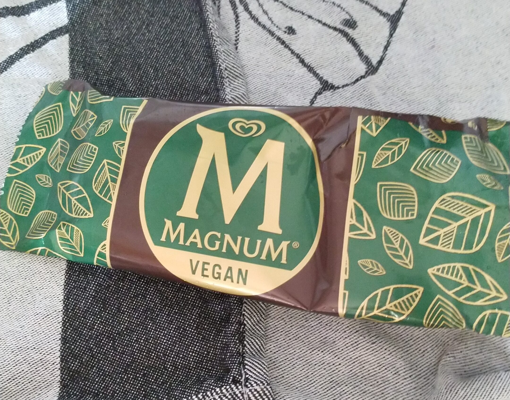

Do I have a sugar intolerance? Well, probably not. But a sugar-related incident did change the way I think about my relation with sugar. As far as I know I don’t have any allergies and I don’t know any foods that make me feel bad. Apart from an occasional hangover and stomach cramps after drinking too much alcohol. But I don’t think that counts as intolerance to alcohol, that’s just stupidity.

## So what was the sugar incident? What happened?

I’m trying to [eat more healthy](/whats-the-right-diet-for-me/). So I try to eat more vegetables, less meat, more fibrous and prebiotic foods, less sugar. Fruit is still hard though. I never liked fruit and i didn’t know why. Everybody else seems to like it. The only fruit I do eat is blueberries in my morning yogurt and very rarely a banana, some strawberries and freshly squeezed orange, lime and grapefruit juice. (are avocado’s fruit? If yes, forget I don’t eat fruit).

I also started to do [intermittent fasting](/intermittent-fasting/) and I’m an [avid runner](/running-for-me/). Although it’s not recommended to combine the two, you can run on a fasting day as long as you [time it right](https://www.healthline.com/health/how-to-exercise-safely-intermittent-fasting#4): eat right after the workout or workout after your first meal. So I did change the moment from running before my first meal of the day, to running after eating "breakfast".

After such a "fasted run" (also a fast run by the way), I felt a little woozy. So I thought I could "use" some sugar. I opted for a vegan Magnum, which is delicious by the way, because I knew it contained a lot of sugar: 28%, ~20 gram ([5 sugar cubes](https://en.wikipedia.org/wiki/Sugar#Forms_and_uses)). That was my goal right. I enjoyed it, but within 30 minutes I felt like shit.

I have never felt so awful just from eating something. My body and mind didn’t want to do anything, it was sheer lethargy and misery, which I normally only have when I’m sick or hungover. And with that, I think a hangover and being sick actually felt less bad. It was such a depressing feeling. When I’m sick or hungover at least I know it will pass. I couldn’t see that this time.

## What did I learn

### First thing: I definitely should not eat that much sugar after running on a fasting day. 

I don’t know if it was the sugar in itself, the fasting, the run or a combination of (some of) them. And I know that you should always be careful not to confuse [correlation with causation](https://towardsdatascience.com/why-correlation-does-not-imply-causation-5b99790df07e). In this case there were at least 3 [confounding factors](https://en.wikipedia.org/wiki/Confounding): fasting, exercise, sugar. Probably even more like what did I eat the day before, how much did I drink and how well did I sleep.

So I need to learn (test) a lot more about it. For example, today I did a run on a non-fasting day and without the ice-cream, yet I do feel a bit weak. So the run definitely had some influence. Yet not enough to make me feel lethargic.

### Second thing: I actually never really liked sugar anyway. Maybe that’s a way my body tells me it can’t process the sugar well?

I never buy candy or sweets. Not on purpose because I told myself they are bad or something. It just never occurs to me that it’s an option. My body simply doesn’t "want" candy or ice-cream. And quite frankly, I find them **too sweet**. I did drink apple or orange juice now and then, but I only liked it when there is something acidic like lime or bitter like grapefruit added. Sourness conceals the sweetness somehow. I found an article about that once, but lost it.

As I started eating more healthy, I also weened myself of the sweet drinks. By doing that I think I have become more sensitive to the sweet taste of sugar or artificial sweeteners. I used to love a cuba libre, but the last time I just couldn’t drink it. I started adding more and more lime and rum to counter the sweet taste of the diet coke. But in the end I threw it away, as it didn’t work. So maybe my body got used to low amounts of sugar.

### Some help from Google and Peter

Peter Attia posted a nice picture on [his blog](https://peterattiamd.com/is-sugar-toxic/) plotting himself and his wife on what he calls the sugar toxicity scale. He argues that sugar is not acutely toxic, but (very) probably chronically through all sorts of related diseases. And the toxic dose is different for everyone, i.e. some people can process sugar better than others. I like that theory.

I’m very probably not sugar intolerant and definitely not diabetic. But there is a chance I’m slightly more insulin resistant, making it harder for my body to absorb the sugar from my bloodstream, making the [sugar crash](https://en.wikipedia.org/wiki/Reactive_hypoglycemia) more intense. Although to know for sure, I have to measure it.

## My theory so far

In the end I do think the combination of fasting, running and sugar was the biggest issue. By fasting, technically I’m just doing time-restricted feeding, your body gets a little more insulin resistant. That means that if sugar gets into the blood more insulin than usual is needed to get it out again. But, during (intense) exercise, [insulin levels actually go down](https://www.researchgate.net/post/How_do_insulin_concentrations_change_during_exercise). Blood sugar should go to the muscles not into fat tissue.

So, I fast and blood sugar will be low. When I break my fast by eating, my blood sugar spikes (depending on what food I eat) and due to the higher insulin resistance, the "spike" will be relatively more pronounced. That’s why you should limit sugar and carbs after fasting. Now I’m going for a run and I drain all the sugar in my blood. My body doesn’t need insulin, so those levels will be very low as well.

Imagine I’m now throwing in a lot of sugar at once. There is almost no insulin and when it arrives, it’s not enough (as my body is still used to my normal non-fasted resistance level). By the time the extra insulin arrives, sugar levels are almost back to normal and the extra insulin makes it dip too far. It overshoots, making me crash.

## What do I know

I never liked sweet things. Candy, ice-cream, soda, juices, fruit even. In hindsight I also remember (or [think I remember](https://en.wikipedia.org/wiki/Confirmation_bias)) that sugar made me feel bad. So very probably my body or microbes don’t like sugar.

Other carbohydrates are no problem. I can eat rice, grains (pasta, bread), corn, potatoes without that crash afterwards. It’s all qualitative self-reporting though, so take it with a grain of salt (not sugar).

I can eat minor amounts of sugar without a problem. Dark chocolate (85%) and all the sugars added to other food items these days don’t trigger a crash or dip. That might also be because I eat them together with fat and/or fibers.

And I know way too little to actually proof my theory. There is so much research to sift through about sugar, exercise and fasting. I just don’t have the time to do that now. Hopefully someday I will be able to do it, or even better someone else figures it all out.

## More to learn

So I’m not diabetic, and I don’t think I have a sugar intolerance, but to know for sure I have to measure. I would love to quantify my body’s response to sugar and other foods with a CGM (continuous glucose monitor). That would once and for all show what foods trigger a blood glucose spike and what the effect of fasting and exercise is.

Concluding: I’m limiting sugar, it’s just not worth the trouble. No more ice-cream for me. As [Daniel Amen wisely put it](https://impacttheory.com/episode/daniel-amen/): "I don’t love food that doesn’t love me back." Rephrasing his words a little: sugar (ice cream) is like a bad relationship for me. I can love the ice-cream, but what good is it if it doesn’t love me back. Who wants to be in such a relationship.