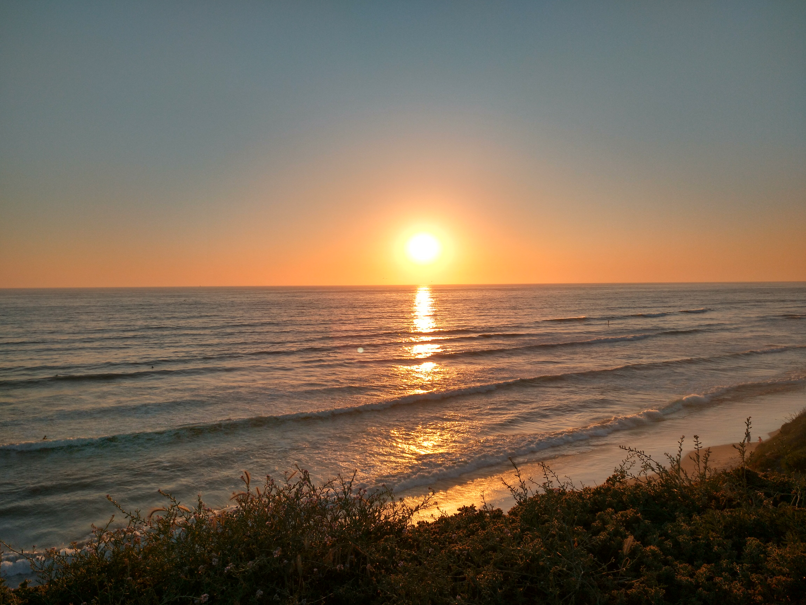
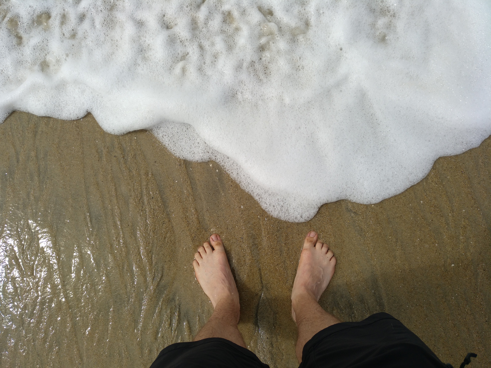

*Originally posted on [Medium](https://medium.com/joeplaa/i-love-the-beach-fdbfabf114b2) on May 11, 2018.*

Beaches always remind me of warmth, sunshine and a general feeling of freedom. That might be because I am too conditioned by our collective, highly curated image of what 'a beach' should look like. While only some of us are lucky enough to live near a beach and can go whenever they like, most of us only go to the beach on their holidays, when they don't have to work. So when we have to plan for it, we might as well go in the spring or summer when it's warm and sunny.

Beaches are also great places to (not) do stuff. Go to a random beach on a sunny day and you mostly see people walking or just lying on their towels, doing absolutely nothing. I'm one of those people in the first group. I have to do things like running, having a walk or kite. I get too restless sitting or lying all day.

## Hassle

But all of them are not the reason I love the beach. Let's be clear on this first. I don't like *going to* the beach. I don't even like the beach itself specifically.

The main reason for that is I'm not the only one who goes to the beach on warm and sunny days. Too many people “have to” go to the beach as soon as the weather forecast predicts a sunny and mildly warm day. I don't mind that, but when people go the beach, they bring their dogs and kids. And well, I don't like both. I'm very bad with animals, I just don't have a clue what they are up to. So as soon as a dog arrives, I'm anxious. Will it jump on me? Will it bite? (I don't like both...) And for the kids...why do they have to be so loud? All the time?

And ow, have you ever tried kiting on a beach when it's the first sunny day of the season? I don't know why, but people, especially elderly, always need the full beach to walk. If you have a 100 meter wide beach, why walk in the 15 meters I need for my kite? I know I'm the one who has to make sure it's safe for everyone, but that's really hard when you come from behind me and walk right “into” my kite.

Anyway, it's not only other people, who make going to the beach a hassle. I'm overly anxious about my stuff. Something I probably 'learned' from my mom. She always wanted to have someone with the bags. What if someone took our stuff? Your wallet **will get** stolen if you leave it unattended. Till this day, I can't leave anything on the beach while I go for a swim. I have to keep an eye on my stuff or someone has to promise me, they won't leave it unattended. It's really annoying, because I can't go for a swim together (or when I'm alone). Luckily I found [these](https://www.overboard.eu/waterproof-cases/waterproof-multipurpose-cases.html) last year.

 cases... awesome!")

About swimming in the sea. I like swimming, especially when it's hot. But not necessarily in the sea. I mostly can't see what's in there. Do I step on seaweeds or are there animals below my feet? What if they touch me? Do they bite? Probably not (I'm not talking about sharks here), but I have this irrational fear of animals.

By the way, did I already mention there will be sand everywhere when you get home? In your bag, phone, wallet, car, shoes, clothes, shower.

## The power and the tranquility of the surf

There is one thing though that keeps pulling me back to the beach. I love the surf. It doesn't matter if it's on a sandy or a rocky beach. The crashing waves can have to power to destroy everything (over time), but you can stand in them at the same time. This paradox fascinates me.

As a young boy I always wanted to build castles in the sand. Being an engineer, I checked with my dad if the tide was receding or coming in, so I could determine where to start building. I needed enough time to build a strong castle with canals and high walls to 'protect' it from the sea. Actually, I didn't care about the castle itself, that was something my brother and sister liked to build, at least I think. My only goal was to protect it from the incoming tide as long as possible. I then had to watch the castle be destroyed by the waves, I wouldn't go home any earlier. My mom still tells the story of her leaving my dad with me on the beach, knowing the tide would only come in hours from then. Sorry about that...

I've grown up since then. And although I still have the urge to build canals, dikes and castles, I don't do it anymore. I guess I feel too old for that now. I replaced that with a deeper understanding and curiosity of what is happening at the edge between water and land.

Now, instead of building things in the surf, I love standing there, slowly sinking my feet into the sand, while thinking of what's actually happening. Yes I'm an engineer, so I can almost never stop thinking about how stuff and nature works. However, staring to the incoming waves, predicting how big the surf will be, I get this incredible feeling of tranquility. The sound of the crashing waves is mesmerizing and I completely lose any idea of time. My mind starts blocking all outside noises and I'm just there. It's amazing.

## Totally worth it

Eventually though I have to pee, or the people I came with want to go home or have at least some interaction with me. So I'm back between the shouting kids, running dogs and dirty feet. Have you ever left the beach without sandy feet? Well, all the hassle is totally worth it though 🙂