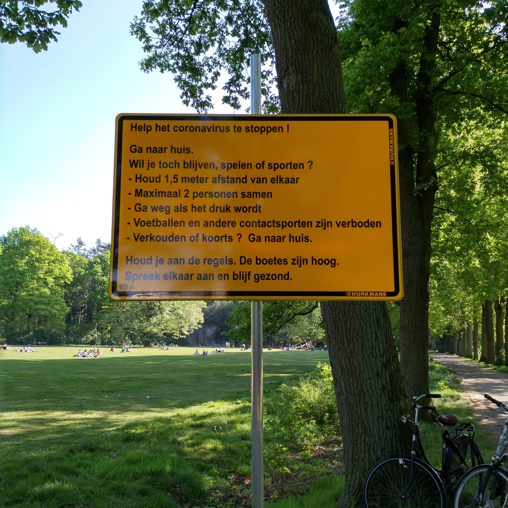

I'm on edge and I don't know why exactly. I do have some theories, but I don't have the full picture yet. Normally that would be a reason to not share the story. I hate it when people just shout stuff without a thinking things through. You have to have a proper understanding of what you're proposing or saying.

Well, I'm not there yet either. I discussed my current low-grade anxiety with my girlfriend a lot, which helped to figure out some parts. But I need to write it down to dig deeper. To find more words and connect the wires, which is very hard for me as I can't see the full picture yet.

It's hard to explain, but let's say you have one of those connect-the-dots drawings. The ones where you have a lot of numbered dots on a piece of paper and you just draw lines (connect the dots) from 1 to 2, 2 to 3, and so on. Now imagine such a cloud of dots, but this time there are no numbers and the dots are not on a piece of paper, but floating in 3D space. To make matters even worse, the dots are not fixed in space, but moving as time passes.

## Enter Covid-19

I've never fully understood the general obsession with this particular virus. I can understand doctors and scientists to be interested and intrigued, but I'm flabbergasted by the media coverage and even more by the cries for governments to protect us. I'm not blind to the fear and I can sympathize with that, but I don't feel it myself. And I'm pretty sure (epidemiologists should confirm that) the government can't protect us.

Which brings me to the current affairs with all the Covid-19 measures being taken all around the world. I don't know exactly what the rulings are in other countries, but generally we are all told to stay at home and if we have to leave the house, keep 1.5 m or 5 feet distance from each other. So far it doesn't seem that bad. But this is just the start.

In The Netherlands we are relatively lucky. We are under **voluntary** house arrest, where in Spain, for example, people are under actual house arrest. Voluntary in this case means we are "instructed" to only leave the house when absolutely necessary, but we aren't prosecuted if we do go outside. However, in some locations you can get fined if you get together with more than two people. Did you know in California you can get [fined $1000 for watching the sunset in your car](https://www.albiontimes.co.uk/us-police-fine-citizens-1000-for-sitting-alone-in-their-cars-watching-the-sunset/)!

But that isn't enough. The government also forces businesses to close. Which is a rude intrusion into somebodies privacy and freedom. The government has no right to decide how somebody runs their business and life. If a business-owner thinks it's worth the risk, he should be able to take it. That's what having a business is all about. If you don't (want to) take risks, you're just an employee or bureaucrat.

This is off course more nuanced than that. How do you protect an employee who doesn't want to take that risk? Should the employer be forced to pay the employee who is not coming in for work? Or should the employer have the right to only pay the employee for the actual hours and should the government compensate the others?

In the end I don't think the government can and should do anything about this virus. You can't stop a virus and you can't practically protect people from it. The government shouldn't offer and force on us fake protection. What we actually need is a grown-up who tells us it is okay the be scared, anxious and confused. We need a grown-up who tells us we will eventually find a solution, but that it will take some time. The government should tell us what we as individuals can do to protect ourselves, but leave it to us to decide ([thanks Sweden for setting the example](https://en.wikipedia.org/wiki/2020_coronavirus_pandemic_in_Sweden#Government_policy)). Instead, we let our governments take our freedom away and let them herd us like kettle to the slaughterhouse.

## Never felt free

I've always been "afraid" or at least wary of the police and other institutions like the tax office. I always calmed myself down, saying it was irrational to be afraid. I also didn't want to be seen as paranoid or a conspiracy theorist. But this fear seems to become more rational every day.

I might be overly sensitive to this. For me freedom and the feeling of being actually free is very fragile. I'm 35 years old and I very rarely feel and have felt completely safe and free. I'm always on edge and on guard. Always ready, waiting for someone to a attack me.

Mind you, I'm not afraid to be physically attacked. I'm afraid to be emotionally and psychologically harassed. Someone will eventually say or do something to humiliate me. They will say I'm stupid, my emotions are wrong, my opinions don't matter, I don't matter. I will be called "weird" and be laughed at.

Is this irrational? Yes it is, but it is deeply ingrained in my brain. I can't just switch it off and not feel it, not act to it. These pathways have been carved deep in my brain throughout my childhood and adolescence. [That is what being raised by autistic parents does to you](/living-under-autism/).

You end up never feeling free, because everything you say can and will be used against you. So you're always tip-toeing, avoiding the inevitable booby-trap you're going to trigger. You're always **not** saying or doing what you want to say or do, but instead always something that won't trigger them. Or you just simply say or do nothing at all and even that will backfire.

## It is back

Today I feel this fear again. This fear of not being able to say what I want to say. It's a constant feeling of nervousness which I described to my girlfriend as having an exam in an hour. My sister actually described it as the feeling you have a job interview.

Again it's a lack of freedom to say and do what I think and want. We can't talk about the overreach of government. We can't do what we want, that would be selfish. What about the people actually dying? Or the healthcare workers "on the frontline"? Don't we think their lives matter?

So instead of talking about our fears, about rational solutions, about the choice each of us wants to make between freedom and security, we lock ourselves up **voluntarily**. It's ridiculous, especially given the fact that we don't know if it is this bad. We don't know how many people die of Covid-19 and we don't know how many have had the disease and didn't die or get (seriously) ill. Heck, we don't even know who has the virus and how many of us.

I'm not saying our healthcare workers are doing the wrong thing or our ICU's aren't under-equipped and under-staffed. That's definitely the case. It is a choice we (through our governments) all made in previous years. That is something you can blame yourself for. What I am saying is we give up our freedom way too easily to get a false sense of security.

This is a very big mistake. We can all laugh about it now. Finally we have time to binge watch all those shows on Netflix, see all those movies on our watch-list or do all those chores in and around the house. Yes, the air is cleaner now that we travel and manufacture less. But we are on the edge of losing the freedom to enjoy it all. Without freedom we can't make movies and shows. We will run out of chores to do and will never travel again. We will be completely bored in our isolation.

## What would I want

Instead of focusing on ways to "contain" the virus, we should focus on how this virus works. The thought alone, containing an invisible virus that is specialized in spreading. Anyway, why don't we even know what is the exact mechanism of the disease? Why don't we know who is at (higher) risk and why? That is what we should be looking into.

Obviously we don't know what we don't know, but what do we know? The disease interferes with the absorption of oxygen somehow. People who have the disease suffocate or die of a resulting bacterial infection their bodies can't clean up because it is exhausted from fighting the virus. So what's causing the body to not absorb the oxygen it needs?

### 5G

You can't talk about Covid-19 causes without mentioning 5G, so I'll start with that one. 5G is said to interfere with the cells in your body in some way. The radio waves will cause cells to malfunction and die, which in turn make you sick and die. This has not been proven and the theory on why people would use technology that would kill people so far is only a (conspiracy) theory.

If you say [5G interferes with the absorption of oxygen in the blood](https://londonreal.tv/guest/david-icke/), you have to proof it. I couldn't find such proof, but I also couldn't find proof it's tested to be safe though. The [only paper I could find](https://www.ncbi.nlm.nih.gov/pmc/articles/PMC6765906/) that says something interesting says:

"*The available studies do not provide adequate and sufficient information for a meaningful safety assessment, or for the question about non-thermal effects. There is a need for research regarding local heat developments on small surfaces, e.g., skin or the eye, and on any environmental impact. Our quality analysis shows that for future studies to be useful for safety assessment, design and implementation need to be significantly improved.*"

What this __does not__ say is that 5G is harmful, but it also __does not__ say it is safe. It only says the research done is not enough and not done sufficiently well to prove or disprove anything. The fact that all these papers are behind paywalls and you can't find any on the official government websites obviously feeds the conspiracy. The solution is not to silence these worried people, but to share the knowledge we do have.

If, to just take one of their (the anti-5G-ers) arguments, 5G is designed to kill people, or at least deliberately not tested to be safe for humans. And if it is actually harmful. Why is it only killing some people and not everybody in a 5G area? That would suggest some people are (more) vulnerable, or at risk. Why are these people at risk and not others? Which brings us back to the original question. So this 5G theory doesn't bring us any further.

### Underlying disease

I think we should look much more closely at which people are actually at risk, instead of locking up everybody. If a virus infects your lungs and interferes with absorption of oxygen, it should sound totally obvious to make a list of other diseases or conditions that also interfere with this.

#### Respiratory

The first thing that comes to mind would be smoking. Are smokers really at more risk? I would not be surprised. Especially as people who live in areas where the air is polluted and thus breath in more particles probably are ([1](https://www.hsph.harvard.edu/news/hsph-in-the-news/air-pollution-linked-with-higher-covid-19-death-rates/), [2](https://www.sciencedaily.com/releases/2020/04/200406100824.htm), [3](https://www.theguardian.com/environment/2020/apr/20/air-pollution-may-be-key-contributor-to-covid-19-deaths-study)).

What about asthma? Sounds like a probable risk to me and [doctors](https://www.webmd.com/lung/covid-19-asthma#1). Also, some people who seem [perfectly healthy can have asthma](https://impacttheory.com/episode/chris-kresser/) (*Chris discusses the connection between pre-existing conditions and COVID-19 mortality [10:44]*) and not even know it. Does that ring a bell? "He/she was perfectly healthy and now this virus made her seriously ill...".

One more thing which I don't understand. I've seen multiple posts on Facebook about doctors alarming us with quotes like: "I've never seen anything like this", with a picture of a diseased lung. But how do you know that this is due to Covid? You just have a single snapshot of a sick lung, you don't have a before, during and after. What if the lungs already were that bad due to smoking, dirty air, bad nutrition or other diseases?

#### Diabetes (&amp; too much sugar in general)

One I didn't think of, but is very interesting is the link between our nutrition and our risk of getting seriously ill from the disease. In this video Chris Kresser explains the theory that diabetes or pre-diabetes (chronic high blood sugar levels) interferes with taking up oxygen. When you have high blood glucose levels, the blood cells responsible for the transport of oxygen are being [glycated](https://en.wikipedia.org/wiki/Glycated_hemoglobin). This means the cell transports sugar instead of oxygen.

<YouTube youTubeId="QztQm5NBwP0" />

In our current diets we eat (too) much glucose in the form of sugar and refined starches (white flour, white bread, white rice, white pasta,...), increasing the risk and amount of glycated hemoglobin, which causes high blood pressure, inflammation and plaque formation in your arteries. All of these increases your risk of serious complications when you get a viral infection.

Did you know stress increases the amount of blood sugar? I didn't, but apparently, cortisol raises the amount of glucose in the blood, so your body has the energy available to fight or run away. Very useful, but probably not when your blood sugar is already (too) high.

And what happens when you get administered to the ICU with a Covid infection? You'll probably be put on a [drip containing a salt and sugar solution](https://en.wikipedia.org/wiki/Parenteral_nutrition). I'm not saying sick people don't need it, they probably do. It's just very conspicuous, like have we ever taken that into account?

#### Anemia and age

Another factor in nutrition is the lack in the right nutrients resulting in some form of nutrient deficiency. If you're a vegetarian/vegan or only eat cheap meat, it is more likely that you for example don't get enough B12 and iron. Both can cause forms of anemia, not enough or "sick" red blood cells. The ones you need to carry oxygen around.

Obviously age plays a role, but why? Is it because older people are less active? Or is something in their physiology different? Or is it because they have more illness already?

### Models

The last thing I would focus on much more is the models we are using. All of the decisions our governments make are based on experts and their models. The problem is that those models are [currently really bad](https://peterattiamd.com/covid-19-whats-wrong-with-the-models/). They can't predict anything with any confidence ("*[Imperial College scientist who predicted 500K coronavirus deaths in UK adjusts figure to 20K or fewer](https://www.washingtonexaminer.com/news/imperial-college-scientist-who-predicted-500k-coronavirus-deaths-in-uk-revises-to-20k-or-less)*"). Please read [this article](https://peterattiamd.com/covid-19-whats-wrong-with-the-models/) which explains this very clearly. It also gives pointers to what we should be doing to make these models better. Like more testing of all people, sick and healthy.

I don't know how this is in other countries, but the worst thing about these models is the secrecy. In The Netherlands the government [doesn't tell us what models they are using and how they relate to their policies](https://nos.nl/nieuwsuur/artikel/2331727-wetenschappers-bekritiseren-gebrek-aan-openheid-corona-adviezen.html). The government is advised by the [Outbreak Management Team](https://nl.wikipedia.org/wiki/Outbreak_Management_Team), but everything that is discussed is kept strictly confidential. Next to that, all members have signed non-disclosure agreements!

This means that as a citizen I can't check if my government makes the right or wrong decision, because everything is kept strictly confidential. I can't even get it through an official request for information. They treat is as some sort of war secrets. Apparently, we need another [whistle-blower](https://wikileaks.org/) to get this information.

## Where does that leave me

Covid-19 exposes our wrong lifestyle choices and our resulting decadence. Instead of focusing on what everyone can do for themselves, we are pleading the government to save us. We have become so detached from nature and reality that we forgot that we are part of it. There have been many viruses before and there are many more to come.

As a species we have achieved a lot, but we are not masters of nature yet. We have to accept that death is part of life. And without freedom we are not really alive. We are a very resilient and adaptive species that can be here for a long time if we learn to cope with uncertainty again.

Going back to the lifestyle and decadence, I can handle the former. I can take full responsibility for my own health by eating the right foods, be active, work out regularly and avoid toxins as much as possible (like smoking, alcohol and polluted air). And I fully accept anyone's choice to do it differently.

What I can't cope with is the latter and I think that is why I'm so nervous lately, it started when all kinds of business were force closed here. I can't control how other people choose to react to uncertainty and I'm very afraid we will again choose the easy way out: lock everybody up and stalk and persecute them when they don't comply. I'm afraid 50.1% will choose this (sense of) safety over freedom and the other 49.9% have to comply.