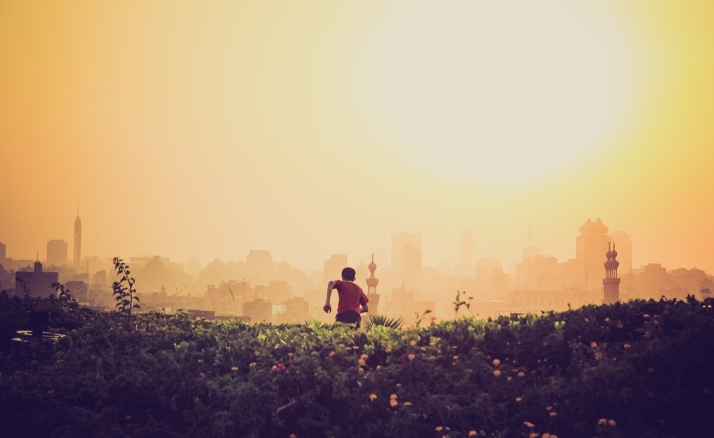

This year I read and heard about (intermittent) fasting for your health multiple times. The message mostly came from charismatic people working on their own health, but also from doctors and researchers. It wasn't completely new, as I saw [a film about it on the BBC](https://www.bbc.co.uk/programmes/b01lxyzc). Looking back that was in 2012 already. Wow, way longer than I thought.

Anyway, it intrigued me, but I never had the courage to do it myself. Excuses were too easily found. You don't want to be hungry at work. You don't want to be hungry when exercising. You're not fat, you don't need to do it. You had a lot of stress, take it easy. My [lizard brain](https://facilethings.com/blog/en/lizard-brain) at work. I also thought I already mentioned fasting in a previous post, but I couldn't find it. I guess that's also a form of an excuse. If you don't write it down, nobody will know and nobody will ask.

## What is intermittent fasting

I would describe fasting as deliberately not eating (or drinking for that matter) for a certain period of time. If food is scarce or not available at all (when there is a famine or not enough money), I would call it [famish](https://www.dictionary.com/browse/famish) or starving.

Fasting used to be something spiritual. You would fast because of your religion and your believes. I'm not religious, so I don't know the exact reasons religious people fast. I think it's because it brings you closer to God by strengthening your character. I like that idea.

Nowadays however, fasting, specifically intermittent fasting, has been hijacked by the health community and slowly science is catching up. Though scientifically we still know little about the effects of fasting on our body, the first signs tend to show it's good for us ([Why Your Gut Microbes Love Intermittent Fasting](https://medium.com/lifeomic/why-your-gut-microbes-love-intermittent-fasting-5716948281a3)). Unfortunately, most of this is only tested on animals, so applicability in humans still needs to be proven. This however does not stop the health community from making huge claims, which I won't echo here.

Back to the intermittent bit. It's very hard to fast 'completely', for example a full week. Some people do it, but it's much easier to fast for one or two days a week. This was what I saw in the [BBC film](https://www.bbc.co.uk/programmes/b01lxyzc). But, we can make it even easier.

The available science so far, says you don't need to fast for a full day or longer. If you just restrict your "feeding window" it works just as well. And because you don't eat when you sleep, most of the time you aren't "allowed" to eat, you don't feel it. This is called [Time-restricted feeding](https://medium.com/lifeomic/time-restricted-feeding-how-and-when-you-break-your-fast-matters-f241d40950f3). Follow the link if you want to dive deeper into the science.

## Why does it intrigue me

As mentioned, I first heard about intermittent fasting in 2012. It was in a documentary film on the BBC. Then it was mostly thought of and presented as a "cure" or exercise to combat [visceral fat](https://en.wikipedia.org/wiki/Abdominal_obesity) and obesity. I'm not fat at all and, when watching, I was 27 years old. Not the age you worry about belly fat. So at the time it was something to keep in mind for when I did get fat. My dad was very lean (according to my mom), but started to gain weight when he was around 40 years old.

Then in the beginning of this year I read [this book](/books/own-the-day-own-your-life/) by Aubrey Marcus (one of the charismatic people). He explained that fasting is not only healthy for "fat people", but for everybody. Breakfast is a very recent phenomenon, and we actually don't need it. It's definitely not the [most important meal of the day](http://us15.campaign-archive.com/?u=21bc5f75235505c27ce465f90&id=6dc29f6b24).

### It's good for my health

I have a science mindset, so I don't believe everything somebody says, because he is charismatic. So I took notice and started investigating (well, reading) more. First there was [a book](/books/the-diet-myth/) about food, microbes and the gut by Tim Spector. And right after I read "[The mind-gut connection](https://www.goodreads.com/book/show/28837738-the-mind-gut-connection)" by Emeran Mayer. Both explained why fasting is good for your gut and overall health.

I won't go into the details here, but will quote from another blog post: '[Why Your Gut Microbes Love Intermittent Fasting](https://medium.com/lifeomic/why-your-gut-microbes-love-intermittent-fasting-5716948281a3)', which explains the current scientific knowledge on intermittent fasting and time-restricted feeding.

<Quote 
    quote="From recent scientific work, we've learned that not only what we eat, but *when* we eat, can impact our health, potentially by changing the microbial communities in our guts. Intermittent fasting and other forms of dietary restriction, together with intake of fiber and other gut microbe enhancing foods, can theoretically increase insulin sensitivity, reduce inflammation, enhance immune tolerance and tissue repair, boost mitochondrial function, rid the body of damaged senescence cells and ultimately increase health and longevity." 
    href="https://medium.com/lifeomic/why-your-gut-microbes-love-intermittent-fasting-5716948281a3"
    source="Why Your Gut Microbes Love Intermittent Fasting"
    name="Paige Brown Jarreau"
    profile="https://medium.com/@fromthelabbench" />

#### It's good for my character

Apart from being good for my health and possibly making me live longer, I like the spiritual part of fasting. Fasting is not easy, especially in our western societies. Food is everywhere and so easy to get. To be able to actually fast, you have to be mentally strong enough to resist food and drinks (water is fine, even advised). It's also a physical challenge as your body will make you feel hungry as you're used to eat at specific times. You really have to challenge yourself

From my first fast I also learned it can be an emotional ride as well. Which depending on the actual emotions and your reaction to them can help you. In the end you determine what you do with those emotions. Do you listen to them and cave in or do you ride them out. It's an intermittent fast after all, it's only 13-18 hours. You really need a mindset that encourages you. Everybody can do it, but not everybody has the character to pull it off.

You're asking yourself to do something that is not easy. You know it might cause you discomfort or even anguish. You might regret it, while doing it. But when you succeed, you learned something new about yourself. You learned how your brain and body react to you not eating. That's the spiritual part of fasting. You are your body and mind, but you're also not. You can make your body do things your brain doesn't want you to do. And you can acknowledge your emotions while at the same time ignoring them.

## First thoughts

As I'm writing this blog, I did three fasts. I chose to start with time-restricted feeding. In my case, I eat my last meal before 7 pm. After that I don't eat or drink anything, apart from water. I then skip breakfast and wait for lunch at around 12:30 pm.

 The first time I walked to the kitchen multiple without thinking about it. I stood in the kitchen, thinking: "why am I here?" Probably, because my brain shouted: "eat something you idiot". I didn't and instead went for a run. It didn't occur to me until the end of the run, that it might not be wise to do an intense workout on no food. Indeed, [it seems better to take it easy](https://www.healthline.com/health/how-to-exercise-safely-intermittent-fasting#5), and I did feel a little woozy the second time (yes, this idiot went on another run on his second fast).

Anyway, at the end of the first fast, after a workout and a shower, I felt extremely happy and proud. Like yeah, I did this and it wasn't even hard. It actually was much easier than I imagined. Another example of my lizard brain being overly protective.

So the second time I went in confident. This is something I can do. Maybe because of that I felt no special feelings, no special happiness or pride. Too bad, you can't have it all, so let's just move on to the next one and see where this adventure will take me.

