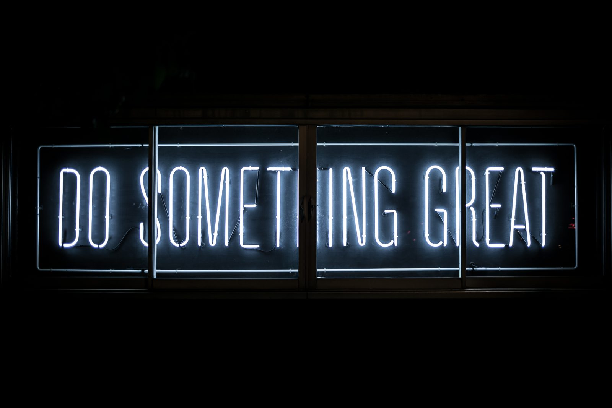
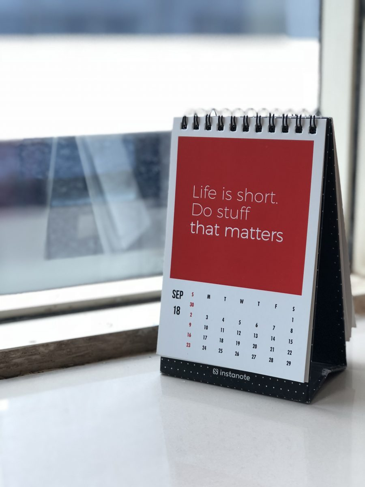
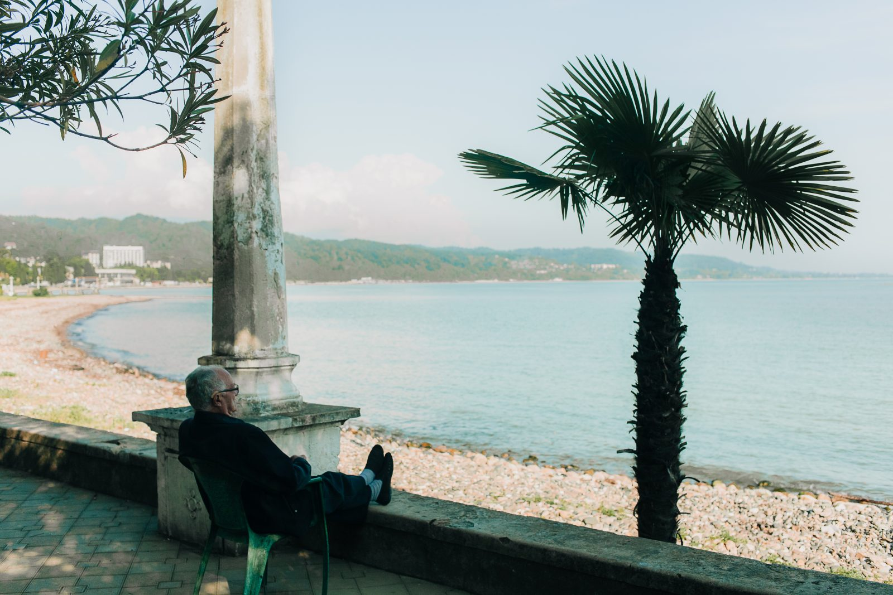
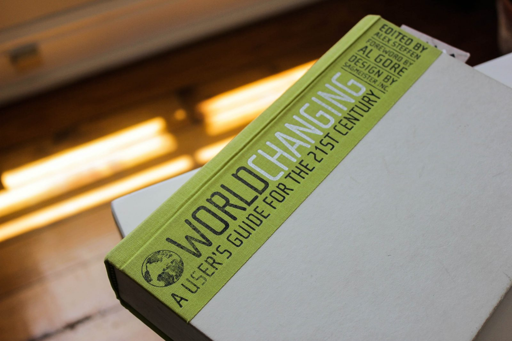
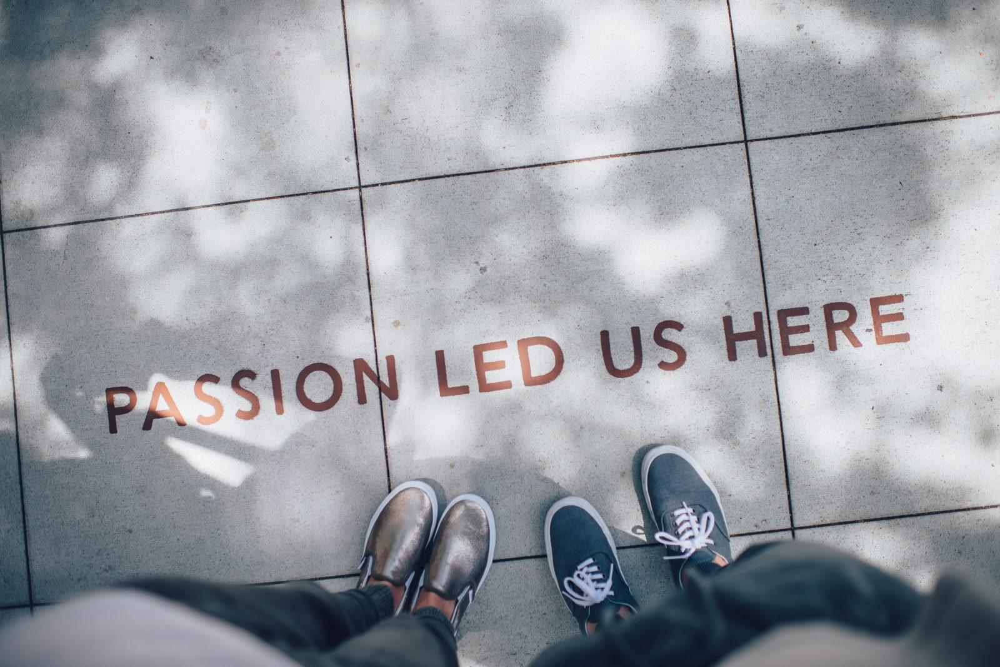

## Why set goals?

[Goal setting](https://en.wikipedia.org/wiki/Goal_setting) is a hot item. Everybody should have goals in their personal life, in their career and for their loved ones. Unfortunately, along the way, we all lost the (real) reason why you should goals for yourself. And with that I really mean only for **yourself**. Yes, your boss will give you targets to reach each year, but those aren't really goals. It's just your job. And yes, you hope your kids, spouse, family will do good, but that's not a goal, is it? That's common sense. So let's start with what I mean by goals.

1. Let's start with the first and most important thing when setting a goal. __You want to achieve something.__ This something can be anything. It can be small or big, easy or hard, slow or quick.
2. Second: throw [SMART](https://en.wikipedia.org/wiki/SMART_criteria) out of the window. __You decide how you describe your goal.__ Heck, you might not even know what you have to do to reach your goal. Just set a goal however ambitious.
3. Third, while trying to reach your goal, __you have to get better or learn something__, however small that might be.

### Learning, grow

With that we basically already talked about one reason why you should set goals: __they will make you better__. A better engineer, a better spouse, a better parent, a better tennis player, a better gamer, a better cook, a better craftsman, a better photographer, whatever you choose.

### Motivation

The second reason is that having __a goal will motivate you__. It will help you focus your energy, time and effort into that one thing (or a few) that you really want. Everything else is secondary.

### Choice overload

For me the learning part is actually sort of the other way around. I always want to absorb new knowledge, but I just can't choose. There are so many interesting things out there. Knowing my lifetime is limited, I can only do two things:

1. Learn a little bit about a lot
2. Learn a lot about a little bit

I don't have an answer to this dilemma (yet). And I just don't know what I want or need to learn first. So I'm stuck. I want to learn, but what's most important? So I thought of a lifetime goal for me that would put everything else in perspective.

## Goal 1: Live at least past the year 2100 in good health.

### Background

The first goal is kind of selfish, it is purely aimed at myself. This goal might sound ridiculous for everybody born 20 years earlier than me and completely feasible for everybody 20 years younger. Let me explain that.

I was born on January 14 in the year 1985, which means I will be 2 weeks shy of 115 years old when I reach my goal. Something completely foreign to someone a generation older. But, with the current medical knowledge and the exponential rise in healthcare technology, for people younger than me, getting 115 years old should be the new 80.

### Why?

But why do I set such an ambitious goal that is so far away in the future? As explained earlier, for me it puts everything in perspective. I can focus everything I do for the rest of my life (or hopefully 115 is only the first bit) to this one goal. And I don't have to think of a new goal soon.

### How?

So what does this goal practically mean? First I have to figure out what I need to do and what I have to limit or even avoid to optimize my chances to reach my goal. Below are the things that I think (now) are important. I'm going to figure them out and will explore them on this blog. I know it's a lot, and I haven't written much yet, so please be patient.

#### Physical health

- Get enough exercise, but not too much
- Keep moving, don't sit too much
- Get enough sunshine, get outdoors
- Expose my body to cold and heat shocks (cold shower/pool and sauna)
- Get enough good sleep
- Go into nature

#### Mental health

All of the above plus:

- Accept and love myself the way I am
- Know that emotions will pass
- Be emotionally resilient
- Don't let other people's opinions and expectations define me
- Find meaning and fulfillment in what I do
- 

#### The food I eat

- Currently eating low amounts of carbs seems to be the healthiest choice
- Getting the right minerals and the right quantities
- Getting the right vitamins and the right quantities
- Eating healthy fats and the right quantities
- Just as limiting carbs, limiting gluten seems to be beneficial
- Avoid eating anti-nutrients
- Eat less, fast (regularly)
- And, the kicker: no, or a minimal amount of, sugar

#### Work

- When working, try to stand and move as much as possible: i.e. use a standing desk and exercise equipment
- Schedule a workday around the natural rhythms of people (planning meetings in the afternoon when most people are least creative vs. creative sessions in the morning, etc.)
- Make sure my workplace is quiet. An open office is fine as long as everybody doesn't talk (often and loud)
- Have enough plants in the office
- Have good food for lunch and take the time to enjoy it
- Find work where I can strive for mastery, purpose and autonomy

#### Being green

##### Minimize resource use by:

- Limiting plastics to the absolutely necessary only
- Limiting food waste to zero
- Reuse stuff
- Sell the car and walk, bike, use public transportation
- Collect water that would normally be "thrown" away
- Use a sweater and blanket before turning on the heating

##### DIY greenness/sustainability:

- Generate my own energy
- Grow my own food
- Have as many plants in my surroundings as possible

#### Become an android

If needed I would definitely consider replacing parts of me. Or adding things to make me regain lost abilities.

## Goal 2: Help two billion people make sense of "difficult" things, while trying to reach goal 1.

### Why?

As stated in the mental health section in goal #1, having a purpose or finding meaning seems to an essential part of getting to 2100. So, what gives my life meaning? Where do I find fulfillment?

In general, I want to have a positive impact on the world. That sounds really vague and it is, so what gives me fulfillment? I don't have a definitive answer yet. For what I know now, I love the feeling I get when I help others. So why not set the bar high and aim for helping as many people as Facebook currently has users: 2 billion.

### How?

I have no fricking idea. I hope [jodiBooks](https://jodibooks.com) will be at least a first step. Diana and I have so many ideas, so let's see where it takes us. And how far it gets me to that 2 billion people.

