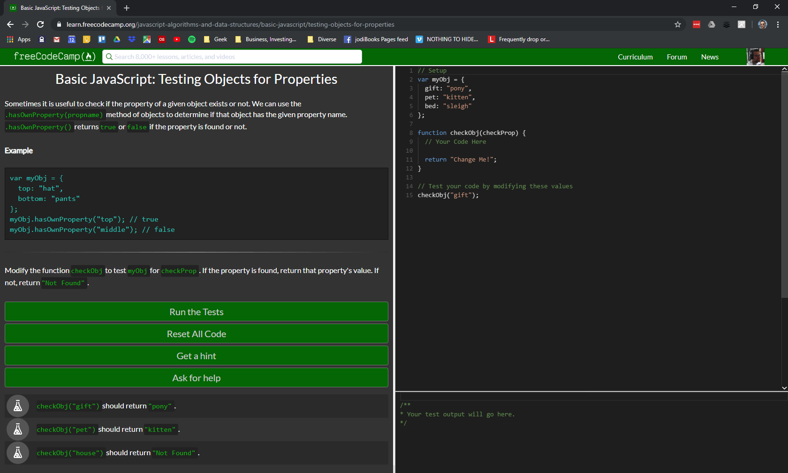
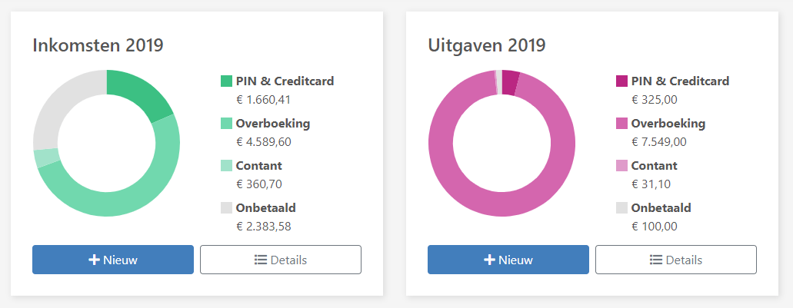

This post is titled: learning to code. So you might expect to read about why, how and when I did a programming course and what I learned from that. Well that is partly correct, and also a sign you understand [my goal](my-goals-a-little-more-context-part-2/) and that [learning](what-i-learned-this-year/) should be an integral part of reaching it. However, mostly this is a post about frustration, communication and solving the *real* issues.

As you might or might not know, I have my own company: [jodiBooks](https://jodibooks.com). To be precise, Diana and I have our own company. We share ownership, management, daily operation as well as an apartment, two cats and a bed. This can make things complicated sometimes. We are "partners and partners" as someone described it lately.

## Work-life balance

Let's make one thing very clear before we go any further though. If you have your own business, there is **no** work-life balance. You don't start up your computer at 8:30 and shut it down at 17:00. If you have an idea on Sunday, you discuss is on Sunday. You don't table it for next Tuesday at 10. You don't ask a customer to call you back later, because you're chilling on the couch.

No, you are your company. There are no clear boundaries between when you are your company and when you're not. It's not black and white. It's the package deal you chose when you became an entrepreneur. That means there can't be a balance because there is just one single thing. And you can't balance one thing. If you want a private life where leisure time is actually leisure time, get a job.

It might be more extreme for us, because we both own and work for the same company. So also our meetings are with, well us. When are you having a meeting and when are you having a "normal" private conversation? We are talking about jodiBooks all the time. And because we have a personal (yes, I "do" the CEO) and a professional (we are colleagues) relationship, it's hard to separate and label emotions.

## Frustration

You don't need to be in a romantic relationship with a colleague to get annoyed or frustrated with her. If you collaborate in a team, there will be certain expectations. Not all of them will be stated explicitly, but if some expectation is not met and you are affected by that, you will be bummed at the very least, because now you can't deliver on your commitments.

That is exactly what happened here. We planned on shipping the first version of the jodiBooks Beauty app in September. It was only when we were in the last sprint (2 weeks) before releasing that we had to face the truth: it would be impossible to release properly in September. That put me in the awkward situation of not be able to deliver on my promise to our customers. I felt extremely annoyed and blamed Diana for not telling me earlier (to be fair, I didn't want to hear it earlier).

## Communication

We learned over the past 2 years that communication is key. Yes, it's a cliche, but it's a cliche for a reason: it's true and it works most of the times. So, we sat down and got serious. We both told how we felt at that exact moment (both shitty).

Now that the emotions were out, and we got to see what the other person was feeling, we started analyzing. Why do I feel this? I can see your point of view and it's completely fair. I would have done the same. That means we (or I, as I was the one frustrated) have to look for the real problem somewhere else.

Once the emotions were out of my system and I related to Diana's point of view, I started seeing what the actual problem was. It was not that Diana didn't work hard enough or that she didn't update me sufficiently about her progress. That would be completely unfair, seeing what she build from scratch and despite illness over the last 2 years. I'm very very proud of her for that.

It actually was that **I** was lacking some essential skills. **I** couldn't program so **I** was unable to help Diana out and just kept piling work on her desk. And as **I** didn't program, **I** couldn't relate to any estimate she gave for the amount of work necessary.

## Choices

It's easy to say someone else is holding you back. It's much harder to admit you're the one holding yourself back. But, when you do, you are back in control and that really is a relief. Instead of being dependent on Diana, I could now solve my own problem. I opened a door to a variety of solutions, that weren't even on the table before our conversation.

<Quote 
    quote="Complaining has no value, let your actions dictate, instead of sitting there and feeling like you're not in control."
    name="Gary Vaynerchuk" />

If I can't program and Diana doesn't have enough time we can do three things immediately:

1. Lower my expectations, slow down and wait.
2. Outsource some of the work.
3. Learn to do the work myself.

**Option 1** is not a sustainable solution. It is something we tried several times and I always fail. I slow down for about a month or 2 and I'm back into enthusiasm mode. I can't not be excited about jodiBooks and not get a lot of cool ideas. Then I get Diana excited, I forget to be realistic about it and Diana hates to disappoint me. Aaanndd we're back where we started.

**Option 2** would be the easy way out. I would use (part of) my savings to hire an app developer, so we would get an app quickly. That would not solve the issue though. Yes I would have an app, but next time I again would not be able to help Diana. And my savings would be depleted.

<Quote quote="Give a man a fish and you feed him for a day; teach a man to fish and you feed him for a lifetime." />

So, **option 3** it would be. I would need to learn how to make an app myself. That meant learning how to program using JavaScript and learning how to actually use it in frameworks like [Bootstrap](https://getbootstrap.com/), [React-Native](https://facebook.github.io/react-native/) and [Redux](https://redux.js.org/). With that knowledge and skill, I could in theory make the jodiBooks app myself.

## Owning it

Without talking about my frustration first, I would have never reached this conclusion. And therefor, I would not have had the motivation to actually start learning to code. I also would have stopped the moment it got tough. Now that it was my own conclusion and my own decision, I could really own it and get the perseverance to keep going when the learning got tough.

That's another thing that's worth pointing out here. I read and heard about it a lot, but never fully incorporated the message. Rationally I fully understood and agreed, but only now do I emotionally and spiritually feel it. Only if you fully own your decisions, do you keep true to them when it gets hard.

I always thought people who relapsed after they had quit were soft, unmotivated and weak. Come on, how hard can it be? Just say no to yourself. Nobody forces you to smoke, only you. Maybe that is partly true, but I think most people quit for someone else. Their parents or kids are worried about their health. Their partner thinks it's disgusting. They get a bonus from their boss for quitting. All of those reasons are not sufficient, because the quitter didn't own the decision to quit.

## Learning to code

Back to the problem at hand. Learning to code in effect means learning another language. It's called a programming language for a reason. For me learning other languages doesn't come naturally. As a Dutchman I can speak English pretty well and understand German, but that's it.

So every time I tried to learn to code, it was bound to get tough, and always I gave up quickly. In the last 18 year I tried Basic, Pascal, Python, Matlab and Excel VB and I never got passed writing functions. I learned the syntax for using conditional logic, some loops and storing data in arrays, but when functions came along, I always ran away. I lost interest immediately, it just seemed *too* hard, as if I didn't have the right genes to do it.

This time again everything went smoothly until I got into the "Functional Programming" part. I hated it and complained to Diana a lot: "The instructions aren't clear", "They can't explain things", "I just don't get it", "I hate it", "Why would you ever program this way?". I just couldn't map it onto my existing thought patterns (I now finally understand the map() function and actually use it as a metaphor for mapping programming onto my brain… I'm such a nerd).

. I only started my course on August 24th, that's 8 days ago as I'm writing this.

As everything else in life, I need to practice practice practice. So, Diana and I made a deal. She will focus on the back end of jodiBooks, while I try to make a beautiful and intuitive front end: the app and our web dashboard. That should give me all the practice I need and I have an experienced [sr. software engineer](http://dianakoenraadt.nl) to guide me through it, thanks honey.

## Wrapping up

If you'd also like to learn how to make a website or app (from scratch), go to [freeCodeCamp.org](http://freecodecamp.org). They make learning to code really accessible. I'm not being paid to say this, I really think it's awesome that they learn you how to make a responsive website and app for free! You can give them a donation if you'd like off course.

I [raced through](https://www.freecodecamp.org/joeplaa) their lessons (first three parts) in just a week. I'm not recommending you'd do the same as it can get tough (and I had some expert help from Diana). The further you get, the less helpful the explanations get. They still have some work to do, but if you don't skip the assignments/projects at the end of each "*certification*", you have your own app when you finish. Which is pretty cool.

For me, jodiBooks is my "*Project*", so I skipped the projects and focused on learning how to use JavaScript and the frameworks: Bootstrap, jQuery, React and Redux. I will also look into D3 later, as our super cool charts are made using that framework.

