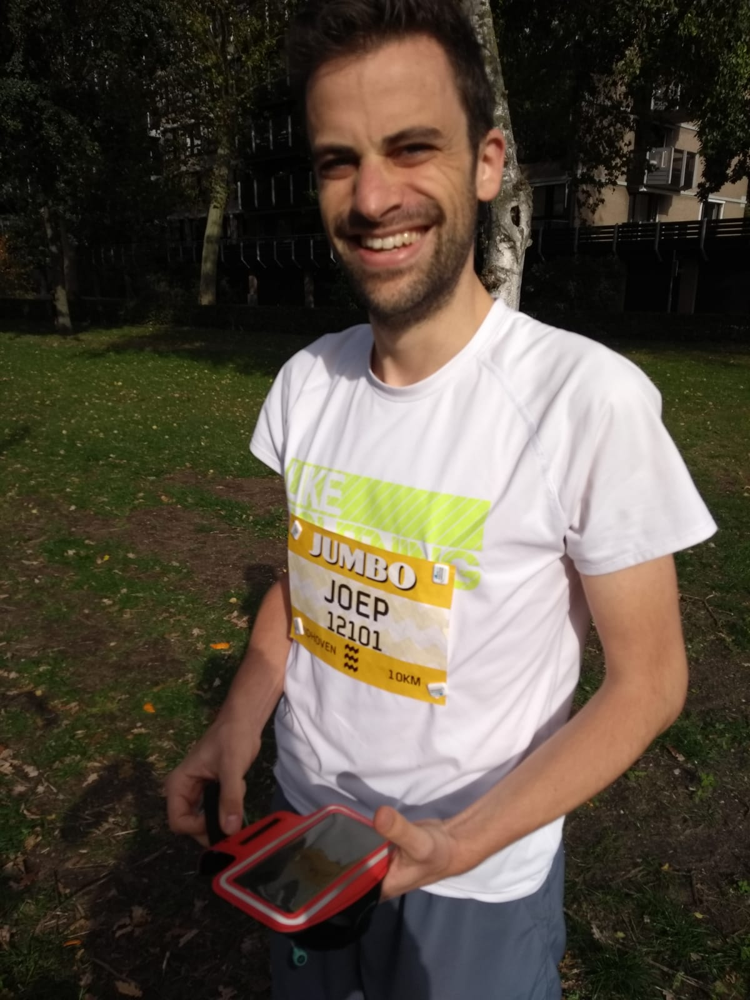
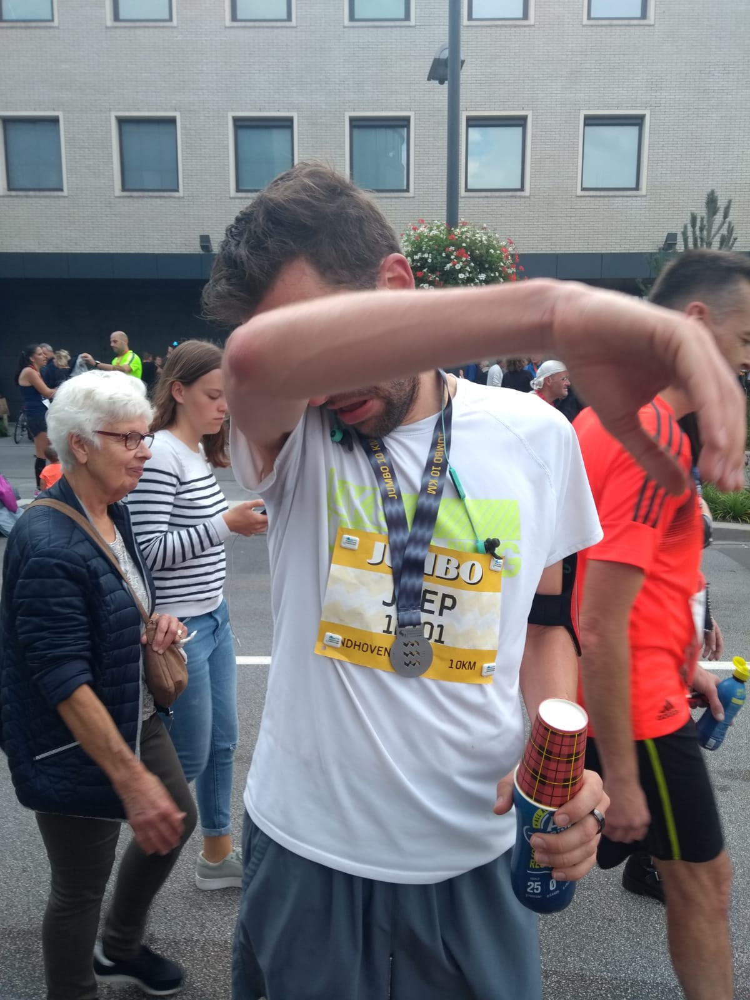

Last Sunday I ran a 10k (km) race. I trained for it for the entire year, but especially after I quit my job and had the freedom to go whenever I wanted, I **really** trained for it. On race day itself, the sun was shining and with a nice 22 degrees Celsius it was a beautiful autumn day, a little windy perhaps, but a nice day for a run.

Despite having slept poorly, I felt as ready as I could be. I was very confident after all the training I had done. I did a 10k under 40 minutes 3 times and had multiple training rounds where I was very close. Normally on race day, I'm even faster as I can run with someone who's just a little bit faster and the adrenaline helps too.

## The race

It turned out it wasn't my day. The start was 15 minutes late, because the course wasn't cleared of traffic in time (amateurs). The start was messy and I had to zigzag around a lot of slower runners (I even had to come to a full stop once). On top of that, I just ran too fast in the first 5 km, although it wasn't much faster than during training.

The second half was even more awful. My stomach started cramping and I had to walk for a minute **twice**. I really considered quitting when all of my abs, left-to-right started tightening up. It hurt and I couldn't run properly, let alone keep my pace.

The second half is also the part where the 10k course converges with the (half) marathon. So from that moment you are constantly overtaking slower runners. And thus mostly running on the side of the road, close to the curb. This is where the crowd is, who don't always know when they are blocking the runners. I actually had to push a few people aside.

I did make it across the finish line and this is what I wrote that evening: “Nothing to be ashamed of. Heck, it's my fastest official time for a 10k. And finishing as #40 out of 2088 isn't bad either. So I'm very proud of that.” Did I mean it? Hell no. I was fucking disappointed. I failed to reach my goal.

<Instagram instagramId="B3kMXELAg1k" />

## Realization

With that post on [Facebook](https://www.facebook.com/joeplaa/posts/512644956192147) and [Instagram](https://www.instagram.com/p/B3kMXELAg1k) I really tried to cheer myself up. I posted my time and wrote what happened. I wrote about all the things I could complain about, but that I should look at what I did wrong myself. Focus on what you can control instead of complaining.

I really do believe in that and I hoped it would do something. But no. I was still disappointed. No matter how many friends and family liked my post.

As I said earlier, I don't run for other people and to show off my times. I [run for me](running-for-me/). And I knew I could do better than I did. I had all my training runs to show that. And posting that time proofed me right. No matter who or how many people encouraged or congratulated me, I still felt like crap.

That night however, while not able to fall asleep, it hit me. Despite all the setbacks and all the bad luck. With everything I could (justly or not) complain about. Despite all of that, I still ran a personal record. Like, imagine what I'm capable of when there are less setbacks and I have a bit more luck.

I could have well reached my goal of running the race in under 40 minutes. And with that, my personal record would have been even better. But it's OK to not win perfectly all the time. Yes my expectations were higher, but you can [never be perfect](the-struggle-for-perfection/). I realized: man, I'm capable of so much more. Just because this one day wasn't my best, doesn't mean next time I won't reach my goal.

## The price of setting goals

It's so cool when you realize something and with that other pieces start to click into place. Feeling bad when you fail to reach your (own) goal, it's a personal failure. You failed because of you and that's the price you pay for setting those goals in the first place. When you set goals, there is a possibility you don't reach them. And that sucks.

So you can also never set any goal and thus you will never be disappointed by yourself. But you will also will never reach something bigger than yourself. You won't grow.

Yes, it's fucking disappointing when you don't reach your goals. It has happened to me multiple times this year alone. But you're not done at that moment. You can try again. Take the loss, learn from it and continue.

## Reaching goals

The same goes for [jodiBooks](https://jodibooks.com). Yes I can be utterly disappointed when we don't reach a milestone. Which admittedly were always formulated too vague. But we learned to take a deep breath and dive back in. We analyze what went wrong, be disappointed, angry, frustrated. But than we make a new plan with what we learned and move on.

It's for good reason I only posted twice on this blog in the last 2,5 months. I was working my ass off trying to [finish our app](https://blog.jodibooks.com/2019/10/app-beta-release-v0-1-0/). We still didn't make our own deadline and we still have a lot to do. But when you look back, it's so satisfying to see what you accomplished. Maybe we didn't reach our initial goals, but we did other important things along the way.

This is my lesson: Don't focus too long on a goal you missed. On that particular failure. Look at it, learn from it and move on. I always thought these were just nice words from all those motivational speakers. But gone through it myself multiple times now, I start to recognize the truth in them.

I don't expect other people to instantly understand that. I didn't. It all sounds good, but as long as you haven't felt it, it's just words. To use a cliche: it's like learning to ride a bike. People can tell you how to do it and how it feels, but only you can learn how to actually do it.