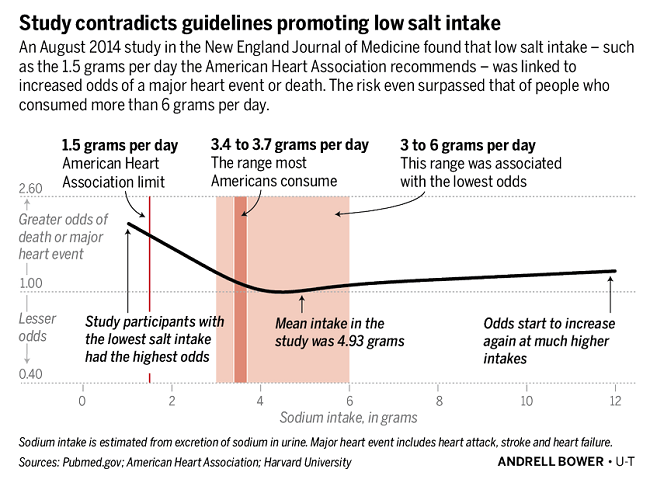

I want to share something quickly. This has been on my mind for some time now and then it came up in a conversation I had this week. I haven’t read the full article (yet), but this image imprinted itself in my brain when I first saw it. The full article is linked at the bottom of this post.

I always assumed salt was bad for you and you should limit or even avoid eating it. Then, about a year ago I saw these video’s about salt. In it the maker explains salt isn’t that bad at all. It’s even necessary for your body to function properly.

He goes into explaining what the “real”, or at least more probable, reason is for hypertension and high blood pressure. It’s not salt, it’s sugar! Obviously it’s more nuanced and complicated than that, but I invite you to watch the video’s yourself.

What struck me the most was this graph from an article in the New England Journal of Medicine. It shows that eating too little (left) salt is actually more dangerous than eating “too much” (right) salt. In fact the recommendations from the WHO (less than 2 grams) and American Heart Association (less than 2.3 grams) are dangerously low.

<YouTube youTubeId="amJ-ev8Ial8" />

<YouTube youTubeId="0bNdhM4vt4I" />

<YouTube youTubeId="-ygExIZm7Wo" />

## Sources

- Urinary Sodium and Potassium Excretion, Mortality, and Cardiovascular Events: [https://www.nejm.org/doi/full/10.1056/NEJMoa1311889](https://www.nejm.org/doi/full/10.1056/NEJMoa1311889)
- WHO recommendation: [https://www.who.int/news-room/fact-sheets/detail/salt-reduction](https://www.who.int/news-room/fact-sheets/detail/salt-reduction)
- American Hearth Association recommendation: [https://www.heart.org/en/health-topics/high-blood-pressure/changes-you-can-make-to-manage-high-blood-pressure/shaking-the-salt-habit-to-lower-high-blood-pressure](https://www.heart.org/en/health-topics/high-blood-pressure/changes-you-can-make-to-manage-high-blood-pressure/shaking-the-salt-habit-to-lower-high-blood-pressure)