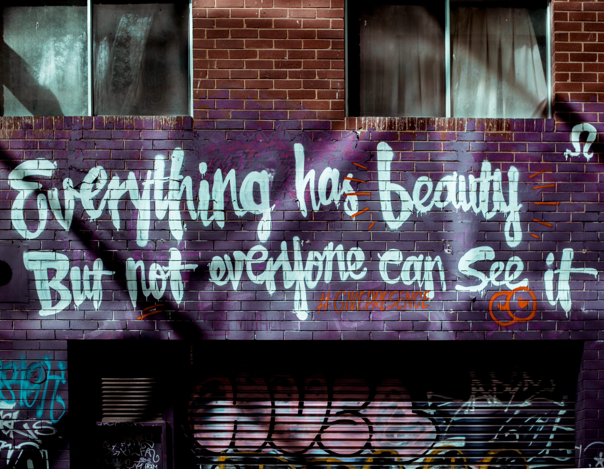
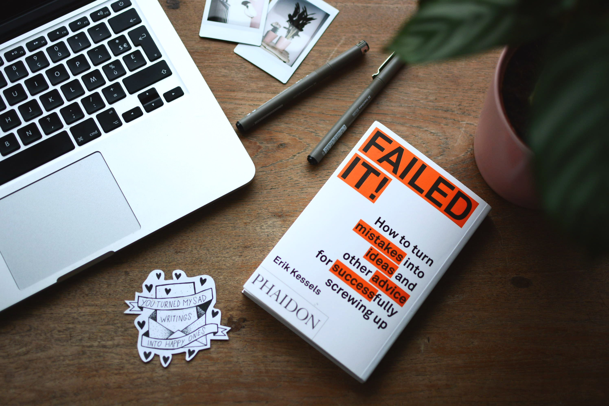

I love quotes. OK, not all obviously. But generally quotes have the ability to confer emotions, wisdom or both in just a few words. I love the compactness and memorability of them. Although I often can't recite them exactly (probably a bug in my programming) they do evoke the emotion when I think of them or read them.

I was looking for a way to share them. I could have shared a quote every day or week, but as they are not my own, that feels fake. Also, enough people already do that. So I thought to share them in a single post. Which gave me a different headache: a list is just a list, but categorizing is always awkward.

Still, a list it will be. But a list of quotes is just a list of quotes. And I'm not going to let you guess why I like them. So I will try to explain with each quote why it is on my favorite quotes list.

## 1. Your abilities and skill set are not fixed

I used to have a closed mindset. The skills and abilities I had at that moment were, as far as I was concerned, the abilities I would have for the rest of my life. It's an easy way to live, because you can always take the easy way out. Just don't do stuff that's hard, because you're just not meant to do it. And than complain obviously.

Slowly I changed my view to work hard to exploit what you're good at and have somebody else do the things you're suck at. To you can do anything if you want to. The former will be more efficient when you're working in a group, but if you have to do it alone, you just have to learn the skills you lack. You might not become the best, but who knows.

So, the first quotes are all related to that: your mindset about what you can do.

<Quote 
    quote="You have a choice! I don't say it will be easy, but you have a choice."
    href="https://youtu.be/2R_BKlb_Y8k"
    source="an interview on Impact Theory"
    name="Aubrey Marcus" />

You can choose to do something that is hard, or you don't. It doesn't matter if you want to go back to school after work, if you are physically ill or have a mental disorder like ADHD or anxiety and want to get rid of it (or limit it's grip on your life). You might want to have your own blog or business or want to become the best at something like sports or politics. If you want something, you can choose to get it. It might not be easy, it probably won't be, but you have a choice! That's the beauty of being human, we can choose.

<Quote 
    quote="The secret to doing anything is believing that you can do it."
    name="Bob Ross"
    source="The joy of painting (TV-series)" />

Who doesn't love Bob Ross. His painting technique was very cool, but most of all, I loved his tranquility and little words of wisdom. He made painting look really easy when he did another one in under 30 minutes. But more importantly he made sure his audience knew they could do that too. This was not only true for painting, but for everything as long as you believed you could do it.

## 2. You decide how you treat life and how life treats you

Some people say life is all about luck and privileges. Rich and successful people are just lucky. Sick and poor people just had bad luck. They also extend that into the lucky people are keeping the unlucky ones down. This is a mindset that puts every responsibility outside of yourself and I was one of the believers. It was how I was raised.

It wasn't until a few years ago that I started to feel trapped and helpless. And I was, because l was waiting for someone or something else to fix things for me. You know, the win the lottery or get that perfect job (which doesn't exist) kind of thing. So first I decided that the world wasn't against me, I just had to use what was available. This is far easier said than done, but I will cover the full story in another post.

<Quote 
    quote="The most important decision we make is whether we believe we live in a friendly or hostile universe."
    name="Albert Einstein"
    source="(I got it from Tom Bilyeu in one (actually multiple) of his keynotes)" />

This one speaks for itself I guess. Are you, well do you decide to be, an optimist or a pessimist? Do you blame yourself or others, be it people, God or the universe, for your current situation? And extending that thought: Will you actively work on your fortune, luck and happiness or do you passively wait for it? There will always be opportunities to improve your situation, but you won't see them when you're passively waiting. You have to actively grab them.

<Quote 
    quote="He who has a why to live for can bear with almost any how"
    href="https://www.goodreads.com/book/show/4069.Man_s_Search_for_Meaning"
    source="Man's search for meaning"
    name="Viktor Frankl" />

A golden oldie. If you know or find your reason to live, if you have a goal or a purpose, it doesn't matter what people, life, God or the universe throw at you. You will find a way. I don't have an example from my life that illustrates this, but it just feels right.

Viktor Frankl actually paraphrases a quote by Nietzsche, who originallty said:

<Quote 
    quote="If we have our own why in life, we shall get along with almost any how."
    href="https://www.goodreads.com/book/show/851994.Twilight_of_the_Idols"
    source="Twilight of the Idols"
    name="Friedrich Nietzsche" />

I think the way Viktor rephrased it is more compelling though. Anyway, you should read Viktor Frankl's '[Man's search for meaning](https://www.goodreads.com/book/show/4069.Man_s_Search_for_Meaning)' in which he describes his own accounts of his time in the German concentration camps. If you had something to live for you had a chance to survive, if you didn't have that **why** you would die. That is so much more powerful than anything I (might) have experienced.

The beauty here is: You can choose your **why**. You have a choice! Although it might not be easy too live it.

## 3. If you want something you have to work for it

This part is not for the lazy ones. If you know your why, you decided you live in a friendly universe and you made your choice, you have to bring it into practice. That means work work work, also when you don't feel like it. Without doing anything, you will not achieve your goals.

Your mind doesn't want you to work, it wants you to chill. It will try to do anything for you to not work. So it distracts you when you try to work. It will say you'll have more inspiration tomorrow. That it's okay to take it easy today, because you didn't sleep well enough last night. You have worked so hard lately, you deserve a break. And I know, because I'm so easily distracted and can be a master procrastinator.

So I really need these quotes. They are essential to keep me going. For example, I didn't feel like writing this post. I have stared at the construction work outside. Brought Diana more tea than usual. Postponed starting with writing for two days, because it was too hot and "when I'm tired I'm not creative". So today I forced myself to write. Actually, I force myself to write a post every week. If I don't I won't write at all, and my blog will just wither away.

<Quote 
    quote="Eat shit for a while and double down on your efforts."
    name="Gary Vaynerchuk"
    source="one of his keynotes on Youtube" />

I love Gary. He's the first to tell "me" to work. It's the core of his message. Get self-aware, so you know what you're good at and where you're weak. Then decide what you want to achieve and work. It often won't be pretty. You'll probably work in a shitty job to pay rent, while you build your dream (blog, business, vlog, website, whatever). Or you're broke all the time. You'll skip (a lot of) parties and work weekends. That's the sacrifice you (are willing to) make to achieve your goal.

So, I have to eat shit for a while. I hate selling [jodiBooks](https://www.jodibooks.com) to people, but I have to do it, otherwise nobody will buy it. I hate sitting behind my computer all day, but without doing that, I won't write this blog or build jodiBooks. So I have to double down on my efforts (easier said than done), so in the end I don't have to do these things anymore.

<Quote 
    quote="Talent is a pursued interest. Anything that you're willing to practice, you can do."
    name="Bob Ross"
    source="The joy of painting (TV-series)" />

There he is again. Have I already said I love Bob? This one blends Aubrey's "You have a choice" with Gary's work ethic. You can choose to do anything and you will be able do anything, as long as you put in the work. Some people might be better in marketing than me now. And some people might have more (initial) talent for selling stuff and talking to people, now. But that doesn't mean I can't learn it. I might suck at it in the beginning, but I can learn and practice. Maybe I'll never be a top salesman, but do I need to be? As long as I learn to have enough talent to just sell, that's enough. And [good enough is also good](/the-struggle-for-perfection/).

<Quote 
    quote="If you don't aim too high, you aim too low."
    href="https://youtu.be/1vInvtJ3WxE"
    source="his song January 28th on his 2014 album 'Forest Hill Drive'"
    name="J. Cole" />

Before I start on this one, let's make sure we agree: everybody loves hip-hop. You might not like the clothes, but you may love the art (graffiti anyone?). You may not like some hip-hop music style, but you might love another. So, you might hate the titty and bitches rap(pers), but you have to love what other rappers have to say. I'm not going to list them here, I'll just cherry pick one: J. Cole.

This line resonated because I wrote down something very similar years ago. Even before I started my journey. If you aim too low, your **why** is too easy to achieve. If you can achieve it tomorrow, you can also do it the day after, etc. It will also not be satisfying enough, you didn't really sacrifice something. And if you don't sacrifice something for your goal, your goal isn't any better than what you have already.

Yes, the other side of the coin is aiming too high and never reaching it. That might also not be satisfying, but what will you have gained along the way. Obviously you shouldn't sacrifice everything, if you don't aim high you will never get high.

## 4. How to deal with other peoples opinions

I think this is a big one. We all value what other people think of us, if we want to or not. That's just how we are wired, we're social animals who don't want to be at the bottom of the picking order, or even worst, outcasts. That would have meant you were very probably doomed. However, nowadays, especially in the rich parts of the world, we can choose to be outcasts or where we want to be on the picking order. As long as you are willing to work for it.

So, we don't need to listen to everybody's opinion anymore. In fact, we shouldn't, because that will probably hold us back and keep us normal and average. Other people don't want you to grow and achieve your goals. That will only make them look lazy and will invalidate their worldview. They chose to live in the wrong universe and nobody wants to be wrong.

The next two quotes are very fresh (for me). I just happened to see them this week in fact, but they are so powerful. I just know I will need them in the future.

<Quote 
    quote="The reason why people are talking behind your back is because you are standing in front of them."
    href="https://www.facebook.com/goalcast/videos/344263122920625/"
    source="a talk to, I think, high school kids"
    name="Dr. Laymon Hicks" />

The first was [part of a talk](https://www.facebook.com/goalcast/videos/344263122920625/) Laymon gives to, I think, high school kids. At first I thought the story he started with was kind of lame. One of those one in a million, there is another motivational speaker, stories. But then he suddenly switches gears and wow, I still get goosebumps when I think of it.

I don't have much to say about this one yet, as it is so fresh. It just gives such a positive twist on how to treat gossip about you. Yes, if you are working for something, others might not get it. They don't understand why you would voluntarily skip fun-time or why you haven't seen that new show on Netflix. And it is really hard to explain your point of view. But so understandable when you frame it like this: **you are in front of them**, so you see things they don't.

<Quote 
    quote="One day, the people who didn't believe in you will tell everyone how they know you."
    source="an Instagram post"
    href="https://www.instagram.com/p/BzV7m1BHlFz"
    name="Lisa Bilyeu" />

Obviously I'm not there yet. I haven't achieved the state where others would envy me. I'm still working my ass of, which obviously nobody wants to do. This one kind of follows from the fact that people want (and only see) the event. The person who is actually famous or rich or successful. They don't see that same person when he or she is putting in the work needed to actually get rich, famous or successful.

I'll just take on this one. She has struggled and worked for it. So she speaks from experience. I will find out myself someday :).

## 5. Keep learning and growing

If you aimed high enough, you probably aimed at something you're not capable of today. You have to build and learn something new. So you have to grow into a new you. I don't know how to build a business. I can't even prepare for it, how can I prepare for something I don't know? I can read books, watch videos, listen to experienced people, attend seminars, but in the end it's just like riding a bike: I can only learn by doing it.

<Quote 
    quote="Where you are is awesome, but you could be better"
    source="an interview on Impact Theory"
    href="https://youtu.be/2R_BKlb_Y8k"
    name="Aubrey Marcus" />

It's not that I dislike myself now. I can't do a lot of things I want to do and my emotions will often bother me. But, I'm happy with who I am today. Somehow I maneuvered myself into this mindset and my current skills. That's a great place to be at the start of a journey. So as a reminder I want this one in big letters on the wall of the jodiBooks office someday: "where you are is awesome but you could be better".

<Quote 
    quote="We don't make mistakes, we have happy accidents."
    source="The joy of painting (TV-series)"
    name="Bob Ross" />

As a consequence of all this learning and growing, you will inevitably find out you did something wrong, your goals are not the right goals or you are learning the wrong things, things that don't bring you closer to your goal. The trick is to learn from that, use it and move on. Failure is an option when you aim for something you don't know.

Bob Ross, yes again, said it in his own gentle and friendly way. You will inevitably make a mistake or fail at something, but you learn from it. And as learning is growing, you can turn a mistake into something that makes you better, stronger. If you look at it like that, it wasn't a mistake. You didn't mean for it to happen, so just call it a happy accident. Brilliant!

<Quote 
    quote="what does not kill me makes me stronger"
    href="https://www.goodreads.com/book/show/851994.Twilight_of_the_Idols"
    source="Twilight of the Idols"
    name="Friedrich Nietzsche" />

Nietzsche wasn't the soft, gentle soul Bob Ross was. At least, that's what people say about him. Nonetheless he did change the way we look at life and religion. In a way this quote says the same as the happy accident from Bob, but in a darker manner. It's in the same vein as the previous Nietzsche quote in that whatever people, life, God or the universe throw at you, if you survive, you will have learned from it, have grown and thus be stronger.

## 6. Knowledge and wisdom

I'm not a wise man (yet), but luckily we can learn from very wise people instead. Some people tend to say things that make you think or which resonates immediately with you, but you don't know why. You really have to let it sink in.

The next few quotes are a little bit less related. Probably because I haven't explored this "territory" yet.

<Quote 
    quote="Think of how stupid the average person is, and realize half of them are stupider than that."
    href="https://youtu.be/p59TDk8nOkc"
    source="(I got it from Richard Dawkins, quoting George)"
    name="George Carlin" />

You can hear this one and explain it in two ways I guess. Depending on your view of the universe. You can think: ow shit, humanity is stupid and doomed and there is nothing I can do against so much stupidity. And that might be true. Most of the time, this is how I see humanity. We are definitely progressing to an all time stupidity point. Not that we are stupid per se, but we are getting to spoiled and lazy to think for ourselves.

Let me give you one example. Literally across the street from my home (and office) they are preparing the plot to build 4 apartment blocks. Today they started closing of the streets and placing (semi) permanent fences (two years is not permanent, but yeah…). So, they placed the red and white tape to indicate going further is not advised. Already after one morning I saw at least 5 people ignore the tape and be completely surprised by a big hole in the street and an excavator in their way. And with completely surprised I mean, they were actually asking why this big yellow thing was on the pavement where they needed to walk (did I already say I was easily distracted?).

However, we can also see this quote in a more forgiving light. You can also say: everybody makes mistakes, everybody is stupid now and then. Who am I to claim I'm wiser than the average person. I'm probably also not the stupidest. So if I'm stupid, at least I can learn to be a little bit less stupid tomorrow and I'm definitely not the only one. So there's no shame in being stupid once in a while, as long as I learn and pass on that knowledge.

<Quote 
    quote="You need the dark in order to show the light."
    source="The joy of painting (TV series)"
    name="Bob Ross" />

It's one of the basic techniques of Bob's painting style, but is also applicable to life in general. If you never experienced anything difficult, painful, unfair or any other dark emotion, you cannot appreciate or even recognize the beautiful things in life. From my limited experience I can tell this tends to be true.

For starters I notice I get used to nice things. If everything goes well I start to take things for granted. I still want to start practicing gratitude everyday, but haven't done that yet. Any way, I have noticed in my own life that the best moments (emotionally) always came after the dark times. There are three moments I can remember of pure happiness and they all followed after something stressful or grief.

I also see it in other people. Somehow I can't have deep interesting bonds with people who never experienced anything major in their lives. They seem to lack the reference to this emotion, so you can't really connect. It's not that I think I'm better because of that. I envy them for not knowing how this darkness feels. And you can only know how it feels when you have experienced it yourself.

<Quote 
    quote="I never learned anything when I was talking."
    href="https://youtu.be/CxB8rQyQ2qU"
    source="interview with Dave Rubin"
    name="Larry King" />

This means a lot coming from maybe the greatest interviewer ever. The person you expect to steer a conversation and try to have his guests say certain things. I never looked at it this way, but I think he's right. When you listen, people will tell you more than when you start probing and pushing them.

I have never been a talker and I've always been interested in how other people think and feel. It's hard for me to describe how I feel, so I always hoped to learn the words and way of describing that by listening to others. Somehow that worked… People tell me things that I never asked for. Sometimes things I didn't wanted to know.

I see it as a compliment. Apparently I'm a good listener and people find me trustworthy (enough), so they feel comfortable enough to talk. Talking is the best way to structure your own thoughts. So I hope I helped them all and they resolved at least one thing that was bothering them.

## 7. Your health

The lower we go, the more fragmented the quotes become. You read a lot by now, so I'm going to keep this one short.

<Quote 
    quote="Eat food. Not too much. Mostly plants."
    href="https://www.goodreads.com/book/show/7015635-food-rules"
    source="Food Rules: An Eater's Manual"
    name="Michael Pollan" />

As I discussed in my [previous post](/whats-the-right-diet-for-me/), there are numerous diets out there. Also science knows surprisingly little about food. So eating the right food can be very tricky and cumbersome. Luckily Michael Pollan sums up the current science in just 7 words. If you are in doubt, skip the meat and animal produce and go for plants (grains, soy, vegetables, fruit, etc.) instead. It doesn't mean meat is bad, just limit it.

<Quote 
    quote="Sleep when you're dead? You literally die when you don't sleep."
    href="/books/why-we-sleep"
    source="Why We Sleep: Unlocking the Power of Sleep and Dreams"
    name="Matthew Walker" />

There is this persistent myth that you don't need sleep, that it's a waste of time. If you sleep less, you can work more, even live more. That's just not true. Why would you body crave sleep if you didn't need it? Matthew Walker has very little patience with this idea. "Sleep is natures best attempt at immortality, without it you would die very quickly."

## 8. You and other people

The previous parts have mostly been targeted at the individual. How can you improve **your life**. The next are focused on being there for the other person. The one from Larry King could have been placed here too. As I said categorizing is hard.

You don't live alone in this world. Eventually you need to discuss some things, as you need feedback on your ideas. You will never know if your ideas make sense, without other people at least listening to them. Talking about the things that are in your mind makes it concrete. Writing a blog can help too, but only to a certain degree, as it doesn't ask you questions.

To be able to have people to talk to, you first need to have people who are willing to listen to you. People will only do that if you take care of their needs too. Unless you're talking to a monk or priest maybe. Anyway, take care of other people and they will take care of you in return.

<Quote 
    quote="2 minutes is the average!"
    href="https://youtu.be/814eR5K7KD8"
    source="Laugh your way to a better marriage"
    name="Marc Gungor" />

This one definitely needs some clarification. If you don't know Marc Gungor, please [watch this](https://youtu.be/814eR5K7KD8), preferably with your partner. He talks about the differences between men and women in a relationship. It's hilarious, but also very enlightening.

One of the things he discusses is the effort an average man takes to please his woman in bed: 2 minutes. And that's the average! It's similar to the average stupid person, but I can't give this a positive twist. When you don't respect the needs of your woman, why would you deserve something back?

<Quote 
    quote="The best parties are in the kitchen."
    name="Me" />

I had to put this one in. Not that I'm particularly proud of it, although I am a little. This one isn't about food, although that's another good thing coming out of a kitchen. This one goes back to Larry Kings' "I never learned anything when I was talking" and Bob Ross' "You need the dark to show the light".

I never liked (and still don't) parties where everybody is in the same room. We Dutchies have an awful tradition, where everybody sits in a circle in the same room. It's just … no words. In this setting you cannot have a serious conversation, as the person you want to talk to sits to far away, other people interrupt or people don't want to hear seriousness, it's a party for crying out loud, everybody should be happy.

So I always migrated to the kitchen "to grab a beer". And then just stayed there. Only people who actually want to talk to you will come and stay. In the kitchen (or a balcony) you can have the quiet, deep conversations where you can actually listen to and learn from the other person. It's where you can have the conversations about the darkness without people interrupting, because that's not a party conversation topic.

So my best parties have always been in the kitchen.

<Quote 
    quote="I met a girl, I knew she was the right one, 'cause everytime we touch, the light comes on."
    href="https://www.youtube.com/watch?v=-fXdCCzqjLY"
    source="the song 'Lights' on the album 'Supernova'"
    name="Cloud 9+" />

We have actually arrived at the last one. This one is special, because it's actually two. They come from the same song and actually say the same thing, but a little differently and I couldn't choose.

For me this quote, or line means two things, both of which give me goosebumps. If you're in love and just dating, the light almost literally goes on when you touch. It's the exciting feeling when you're still not sure if the other person really likes you, and if you accidentally touch, you can almost feel the hormones rushing through you. Everything about the world instantly feels good, as if a light inside you goes on.

The other thing might be less obvious, it's not this immediate feeling of pure joy and happiness. It's more subtle. I have only felt it with Diana. Maybe it is because we are together longer than I have ever been in a relationship before, maybe it is because it's Diana. I don't know the answer, but I think, I feel it's both. Because I'm with Diana for this time now, we have gotten to know each other pretty deeply. Although we are both still struggling with ourselves, we know each others strengths and flaws. We know where we lack things and where we need to improve. Not only ourselves or the other person, but also our relationship.

Anyway, it's this feeling that when we touch, physically, mentally or spiritually everything is fine. When you have disagreed on something or someone is feeling unhappy and then without specifically saying something you touch and everything is okay. It's pure magic.

<Quote 
    quote="We give light to the world, every time we collide."
    href="https://www.youtube.com/watch?v=-fXdCCzqjLY"
    source="the song 'Lights' on the album 'Supernova'"
    name="Cloud 9+" />