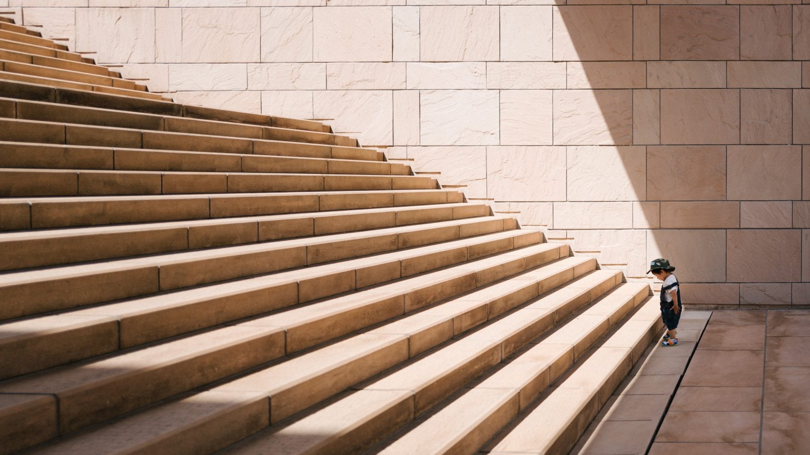
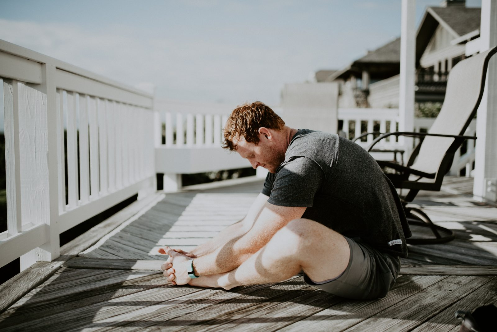
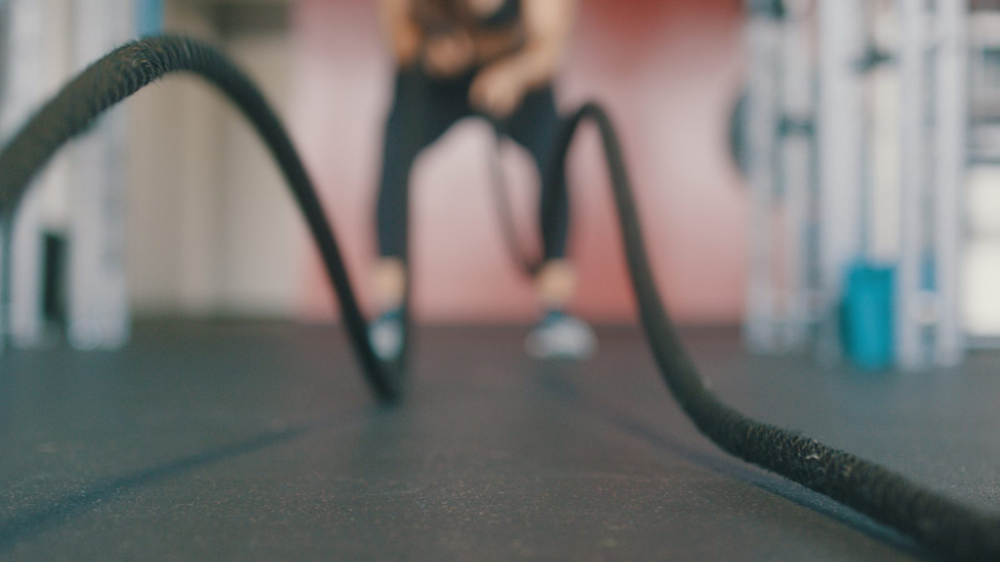
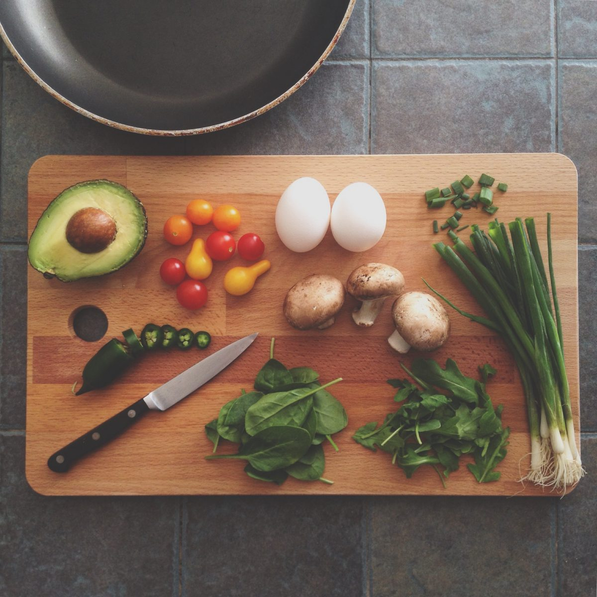
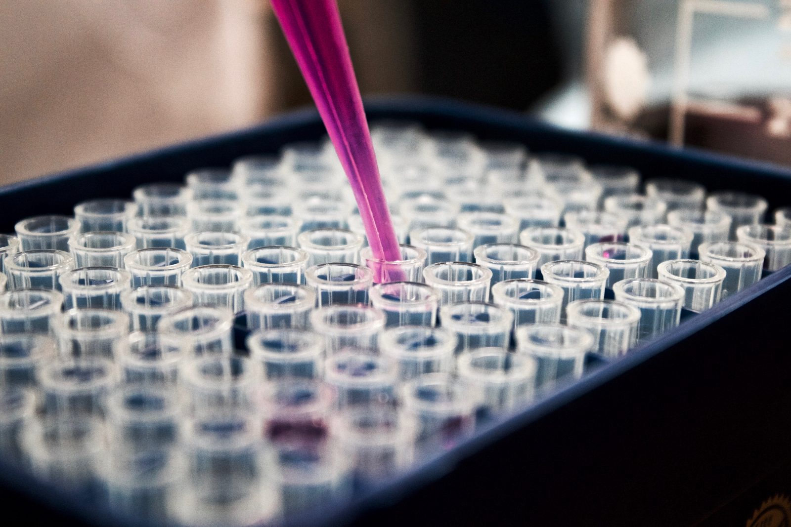
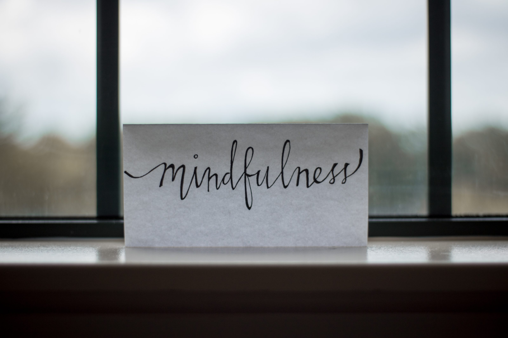

In my [last post](/joeps-goals/) I explained that I have two goals:

1. Live at least past the year 2100 in good health.
2. Help two billion people make sense of "difficult" things, while trying to reach goal 1.

I explained why I think having goals is important, in general, but also for myself specifically. Now, the goals I stated for myself might seem far-fetched and maybe a little dreamy even. Well, maybe you're right, so let me put them into perspective. Let me give you some context and explain how these goals were formulated. Let's see if I can explain what I mean exactly and what I'm planning to do to reach my goals.

Initially I was planning to write about this in a single post, but as I was writing I noticed I had way more to tell, or I really have to learn to be more concise. Anyway, I decided to split this post into two parts ([part 2](/my-goals-a-little-more-context-part-2/)).

## First things first

I know I won't reach these goals tomorrow or this year. Maybe I will never reach them. There is a loooong road in front of me, countless steps still to take. To be honest, I don't even know what I have to do and what will be the best path, but I'm just going to start and see. I'll climb one step at a time, until I reach the top (or at least grow while trying).

### Science based

Before we dive a little deeper into what I think will be on my path, I have to explain how I will be looking for answers. For me getting scientific data, knowledge and proof is key. I'm going to dive deep into everything I'll be implementing on my journey. The information I'm looking for and at should be scientific papers, data and proof.

I want to really understand why sugar is bad or why you need omega 3. I want to know why some exercises keep you flexible while other ruin your joints.

There is a lot of anecdotal evidence about how you should live, what you should eat and how to work out for example. But that is not necessarily true for me. On the other hand, I only have 1 chance to test it, so my findings and results will not necessarily work for others (N=1).

In the beginning a lot of things I find, read about, listen to and discuss here will be anecdotal. Most, but not all, will come from scientists themselves, but without the actual papers and data that's not sufficient. Searching and getting all the science together will take a lot of time, so please be patient. And if you have a good source, please do share.

## Goal #1: live in good health past 2100

Starting with the first goal: I want to live in good health at least to see another century. In other words, I want to get old, but who doesn't?

As an aside, some people actually don't want to get old or older. Obviously there are people who are clinically depressed or have another mental illness that actively or passively makes them think seriously about suicide or even go through with it. But more curious are people who say their life is "done" or "completed" as in "there is nothing left they can do or offer". Something I think is understandable yet really strange, but that's something for another time.

## Why?

It's a tough question to answer actually. I don't know why, but I wrote the heading "Why?" and then quickly moved on to "How?". It kind of surprised me that it was so hard to answer. Somehow it just feels right to grow old, while staying healthy. But that's kind of obvious.

I think for me it has to do with choices. There is sooooo much I would like to learn, do, develop and improve. So I better live as long and healthy as possible. The longer I live, the more time I have to do and learn stuff. As said in my [previous post](/joeps-goals/) it also puts everything in perspective. I can focus everything I do for the rest of my life to this one goal.

Also having this particular goal helps me put my own health and wellbeing first. I like to help others, but I often neglect what I need myself. Do I want to spend my time helping this particular person with this particular goal? Sometimes they are really pleased with it, while I don't see the point. Having this goal reminds me of my limited time. It helps me decide which people to help: only if it fits in my bigger picture (see goal #2).

## How?

### Physical health

Being old is one thing, being conscious about my surroundings and able to actually enjoy the year 2100 is another. When I'm old, I want to be able to do stuff with my body. Like tying my shoes, picking things up from the ground, reaching for stuff on shelves above my head, walk around at a relatively fast pace (not shuffling one foot in front of the other).

So my physical health should be something I have to work on. To stay fit I have to get the right amount of exercise and the right type. But also need to recover and work on my mobility. At least for what I know now.

### Mobility

The main question I have here is: "What mobility exercises should I be doing to stay mobile and flexible well into old age?" Should I always stretch before my workout? Or after? Or both? Should I do this every day? Is yoga ok, or should I focus more on something more scientific?

Really, I have a lot of questions and unknowns. Since I started thinking about my goal, I came across two resources with regard to stretching.

1. In his book "[Can't hurt me](/books/cant-hurt-me/)" [David Goggins](https://davidgoggins.com/) explains he started stretching way too late, but it helped him tremendously when he couldn't run anymore. He refers to [Joe Hippensteel](https://video.ultimatehumanperformance.com/#meet_us) as his mentor, who developed the "[Ultimate Human Performance](https://video.ultimatehumanperformance.com/)" routine.
2. I saw an interview with [Peter Attia](https://peterattiamd.com/) on YouTube, where he explains what I'm trying to do here, but waaay better. Check it out on [Health Theory](https://www.youtube.com/watch?v=YY-_ux4ZXp4) (video embedded below). He also put together a routine of stretch or mobility exercises on his own website. Check his posts about that [here](https://peterattiamd.com/move-defines-live/) and [here](https://peterattiamd.com/move-defines-live-part-ii/).

Last year I started doing some form of stretching after my runs. I kept hurting myself (with running) and stretching provided some relief, but I still have no idea what I'm doing. For now, I scheduled to dive deeper into this after I get my diet under control. So I would say in 2020.

<YouTube youTubeId="YY-_ux4ZXp4" />

### Exercise

You can be mobile and extremely flexible, but if you have no strength and stamina, you still don't get very far. When you get older, both tend to decline. So what should I do to stop or at least limit that? What is a good ratio between cardio and strength exercises? And what is too much exercise?

#### Cardio

I love cardio. So this one should be easy for me. I run once or twice a week, but I would do it more often if I could (if I really prioritized it). This year I also started walking to the next train station, instead of taking the train for this bit, every morning. I walk during my lunch break. I love to swim. So for me, if I would really prioritize this part of my goal, I would not only need to find out what is the right amount of exercise, but also what is too much.

#### Strength

This is the hard part for me. I hate gyms. I don't like it that other people can see me struggle with weights and machines. And I don't like the machines themselves, they really look like torture devices to me. Also I find it kind of strange that you isolate one (group of) muscles with every machine. It sounds counterproductive and unnatural to me. But, I'm below novice in this realm, so I might be completely wrong.

What works better for me at this moment is doing bodyweight exercises. I can do them at home and I don't need weird machines. I might upgrade to some equipment that simulates more natural motions (if I have the space to store and use them). [Aubrey Marcus](https://www.aubreymarcus.com/) describes some of these exercises and equipment in the book "[Own the Day, Own Your Life](/books/own-the-day-own-your-life)": kettlebells, battle ropes, sand bags, ballistic medicine balls, maces. At least he makes it sound cool...

### My diet

The exercise questions too will be postponed till 2020. Because the most interesting for me at this moment is my diet. What do I have to eat to stay healthy? This is what I'll be answering this year. Well, at least the most obvious ones. There is so much to learn and so much still unknown, that I doubt I will be able to finish everything this year.

1. I want to find out which nutrients* are good for you and which ones are bad. What are these nutrients? How many do you need? What do they do or stated otherwise why do you need them? How can you best take them?
2. Do I need supplements? Or can I get everything from my regular food?
3. What does my gut biome look like and what does it do and need?
4. What is bad for me personally? And what good?

*Nutrients = vitamins, minerals, fats, carbs, protein, (pro)biotics. Basically everything you eat.

#### Diet-diet

I'm not debating here about what particular "diet-diet" is best. That misses my point completely. Every diet has something right. But none are perfect. The thing most have in common is that they cut out the worst foods.

For me it's also not about weight loss or gain. I want to eat the foods that make me healthy and help me survive to 2100. Going into cutting-edge research, that means knowing what the composition of my gut biome is. Those microbes process the food I eat into something my body can actually use. Eating the wrong stuff, upsets them and thus me.

I just tried a lame version of the Keto diet. Meaning I tried to eat almost no carbs, but failed often (I stopped when I started losing too much weight). Carbohydrates are linked to a lot of issues, including blood sugar spikes and insulin resistance, inflammation and mental issues. I haven't read any paper yet, so I don't know if this is true. Also everybody reacts differently to 'carbs'. Some people's blood sugar spikes when eating rice, others don't.

The one thing this diet does for me, more importantly than cutting carbs, is forcing me to eat more vegetables, cut sugar completely and be hyperconscious about what I eat. As I learn more about the research I can adapt this diet to one perfect for me.

#### Measuring

This however means I have to know me. So I have to start measuring what I eat and what effect it has on me, physically and mentally. I started with a food diary ([Lifesum](https://lifesum.com/)), so I at least have a sense of what went in. Then the measuring starts. Well, it should, but I don't have the equipment (yet) to do that.

I do measure my heart rate with an [Oura](https://ouraring.com/) ring. The Oura app than calculates how well I slept and rested. First finding: don't eat a heavy meal, beef stew burrito in my case, late at night. My sleep was awful.

What I would love to measure is my blood glucose levels, continuously (something like [this](https://www.dexcom.com/)). That way I can see what foods make my blood sugar spike and i.e. give my insulin system a punch in the teeth. I don't believe all carbs are bad, but until I know which ones are nice for me and which ones aren't, I'm limiting the quantities I eat.

Another thing I would like to do is measure my gut biome. That would also tell me a lot about what I can eat and what my gut can't process well. There are several freely available tests out there that will basically measure your stool. Some are more [advanced](https://atlasbiomed.com/) than [others](https://www.prescan.nl/onderzoek/ontlastingsonderzoeken/darmflora.html), but they can give you a good indication of what your current gut can process and also what you can do to improve it.

More controversial are DNA test to determine your health risks. The best know of them is probably [23andme](https://www.23andme.com), but there are many others. I'm intrigued by [helix.com](https://www.helix.com) who seem to offer a lot of specific tests for health, lifestyle and food. I will probably dive deeper into those later.

### Mental health

#### Illness

My family isn't the most mentally healthy (suicide twice, ASD at least once, BSD once, Alzheimer's or dementia once). So what do I carry in my genes? And what can pop up when I grow older? I know I don't have anything weird (now). But what could happen if I don't take care of myself mentally? For me, I learned I <u>**have**</u> to talk about stuff, otherwise it keeps me awake at night (which isn't good, see sleep). And that what I eat can (heavily) influence how I feel (later). I haven't linked it all together yet, but it also links back to the gut biome and DNA tests.

#### Stress

Obviously I don't want to get Alzheimer's or another decline of my cognitive abilities. But I also need to build up and keep a healthy amount of emotional resilience, so I don't stress myself out. Talking about stress, I definitely have to reduce that and keep it low. A little stress now and then isn't bad, it can also tell you you're doing the right thing (more on that another time). Having stress regularly (every day, all the time) isn't ok.

The research has to wait, I think I probably dive into it after the food physical health and sleep parts. Stress will be something I'll be trying to limit as much as possible all the time. So I'll be doing that in parallel to researching the other topics. The same goes for the next items: positivity and gratefulness.

#### Positivity

One of the things that stresses me out is negative people. I am an optimistic person. A dreamer even. I want to move forward, do things that make the world a nicer place to live in. Not everybody has that mindset. It's ok to be realistic about schedules, implications and possibilities, but you shouldn't throw up roadblocks before you even got started.

It stresses me out if people start pointing out why dreams or big goals are not possible, before they even considered the full picture. Dream big and then make a reasonable plan to get there, in which you list as many obstacles as possible, but also how to overcome them. That way you learn and grow. Not by not even starting because something 'seems' impossible.

#### Gratitude

I need to learn to express that I'm grateful for everything I have and the opportunities I get. I take so much for granted, so I need to make it (what I'm grateful for) explicit. I have to put it into words so I see that it's not all negativity around me. If you stop looking and listening to conservative people, you start to see how many people have a positive mindset. That's really encouraging.

#### Meditation

One step further there is mindfulness and meditation (or is that the same?). It seems to come in many forms of which I know virtually nothing. It might even be the same for what I know now. So a lot to learn here. What I do know is that it should help with getting your mind and body in a more relaxed state. Which on its turn should help get me to 2100.

I'm reading a book about the science of mindfulness. Let's see what I learn from that. I'm not planning on going deep into meditation this year. What I am planning though is to put together a preliminary morning routine somewhere this year. This routine should probably include some exercise, stretching, cold exposure, gratitude and mindfulness/meditation.

## Sleep

It seems to be the mother of all health, longevity and performance related things. If you don't sleep well and enough, your physical and mental health will suffer as well as your ability to choose and digest food properly. This topic warrants a whole section alone, so for now I'll leave you with a recommendation for a book about the science of sleep. I thought it was absolutely fascinating: [Why we sleep](/books/why-we-sleep) by Matthew Walker. There is so much to learn from this single book, but there are three things I've implemented so far already:

1. Respect my circadian rhythm. I'm a morning lark, so I go to bed between 9 and 10 pm and wake up without an alarm between 6 and 7 am.
2. Have regular bedtimes every single day, also in the weekends.
3. Avoid screens 1-2 hours before going to bed. So my phone goes on airplane mode at 7:30 pm. And I turn of my computer/TV at 8:30 max. I then read a book or just talk.

## Recap

Wow, already I have such a long list of things to research and learn. It will be a huge amount of work and it will probably only grow bigger. It seems daunting to be honest, so to keep it manageable, I'm planning to go through them one by one. Some might be possible to implement in parallel, but for now almost every item I mentioned is unchecked (scientifically). At this moment I have to believe the scientists who tell me what works and what's best.

To sum things up a list of what I plan to investigate, roughly in chronological order. I'll probably skip back and forth between topics as I find some interesting information, but I'll try to stay focused.

1. **Physical health**
  1. Diet
  2. Measuring
  3. Mobility
  4. Exercise
2. **Sleep**
  1. Sleep hygiene
  2. Measuring
3. **Mental health**
  1. Stress
  2. Positivity/gratitude
  3. Meditation
  4. Illness

