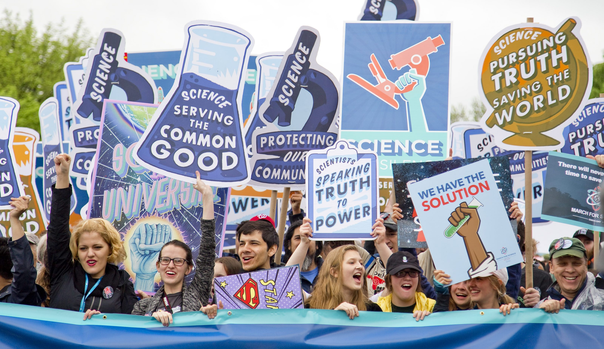

In an [earlier post](/joeps-goals/) I explained that I have two goals:

1. Live at least past the year 2100 in good health.
2. Help two billion people make sense of "difficult" things, while trying to reach goal 1.

I explained why I think having goals is important, in general, but also for myself specifically. Now, the goals I stated for myself might seem far-fetched and maybe a little dreamy even. Well, maybe you're right, so let me put them into perspective. Let me give you some context and explain how these goals were formulated. Let's see if I can explain what I mean exactly and what I'm planning to do to reach my goals.

As explained in [part 1](/my-goals-a-little-more-context-part-1/), I decided to split up this post in two parts. In the first part you can read back that I'll be approaching everything as scientifically as possible. I'll try to back up everything I write about by science. Also, I know it will be a long journey. I won't have all the answers tomorrow or even this year. It is very probable I have to change my opinions as I learn new thing so let's take it all one step at a time.

## Goal #2: help 2 billion people

This is a typical stretch goal, or [BHAG](https://en.wikipedia.org/wiki/Big_Hairy_Audacious_Goal), right? It's far beyond what I'm capable of doing today, but it's not impossible. It just requires a lot of work and commitment. Ok, before you say anything, I'm not going to count every person I'll help. Adding the number just makes the impact and scale of the issue clear.

The number, 2 billion, also isn't just chosen at random. The thought is this: "Facebook has 2 billion users and helps them communicate and share their lives, thoughts and believes every day. If Facebook (i.e. one man, [Mark Zuckerberg](https://en.wikipedia.org/wiki/Mark_Zuckerberg)) can help 2 billion people, regardless if you agree with their methods or not, why can't I."

## Why?

The lame answer: "What's wrong with helping people? So why not?" There actually are 3 main reasons why I want to do this. All the others are secondary or a result of these 3.

### 1: I don't want a job anymore

I'm done being someone I'm not. In every job I had so far, I couldn't be myself. I always had to improve myself, but my ideas for self-improvement were not what was meant by that. What I actually had to do was to further fit into their mold.

As I said, I'm a dreamer and I always look at the bigger picture. I don't only want to know what the company vision and mission is, I also want to know why and be involved in shaping it. To get there in the corporate world, you have to have a lot of patience. I don't have that patience anymore and I don't want to feel stuck until I get there.

I don't feel free in a job anymore. I want to work on my own terms. So I have to see how I build my own business. In my (at the moment humble) opinion, you can only make enough money with a business by ripping people of or by actually helping them. I choose for the latter and I will do anything to help people solve their problems.

### 2: Information is presented poorly

In general information is presented and shared extremely poorly. There are so little people who can actually explain things properly. And then there is the internet.

It doesn't really matter if the website is from random people, businesses, governments or NGOs. The information displayed is often too limited so you don't learn or find what you actually need. Or it's too extensive and impossible to comprehend without a degree in data-analysis.

Also a lot of information seems to be purposely hidden. Why? Or even more annoying, there is so much jargon it's impossible to read without a degree in that particular field.

I want to change that. I want to make information accessible and the software needed to do that intuitively comprehensible. Everybody should be able to find and comprehend the information they need.

### 3: I love helping people

I haven't really thought this one through yet. It just feels good if I help someone. Especially if it's appreciated. Not everyone can see in the moment that I helped them and how, but as long as I see it, it's fine.

## How?

Two billion is a lot. I'm not delusional. I know I can't help 2 billion people personally, so I plan on making the tools to do that. Also information is a really broad and vague term. So, I narrowed it down to two very specific subjects:

1. Business administration for sole proprietors in the beauty industry .
2. Nutrition to get 100 years old (and older off course).

### jodiBooks

To address the first subject, [Diana](https://www.telodelic.com/) and I have founded [jodiBooks](http://www.jodibooks.com). With jodiBooks we want to help small business "forget" about their administration. Not literally, but for most people doing their administration is a big burden.

We are going to make it so easy to keep track of all of the administration (finance, agenda and bookings, marketing) that they will think it's actually fun. Almost as fun as their job, which is their passion.

To get there, we first started with a basic website tool, also conveniently called jodiBooks. In this tool users enter their revenue and expenses, which they then export to a single file to send to their bookkeeper. No single bookkeeping term is used and no bookkeeping knowledge is needed.

We're going to expand this tool with an app and agenda this year, slowly trying to help these sole proprietors with their complete administration.

Next to helping them "forget" about administration, we are also gathering and organizing information regarded to business administration. If people do want to know how it works, we will be there to help them. Somehow the finance world is notorious for making simple things really hard to understand. They are masters in using jargon and not explaining how things work. We are going to change that.

### joeplaa.com

This website is a personal endeavour. The main purpose will be to document my journey in getting to my goals. With that I hope I can inspire people and hopefully also present information in an easy to digest way.

I hope it will grow into a place where we can find scientifically supported information about nutrition and lifestyle. I think it's very strange that the science that explains the things you do (or should do) each day is not being shared.

There are a lot of people promoting their views, but I haven't found a single one who compares different diets or exercise regimes in a scientifically correct way.

Next to those guru's, there should be a scientific community that would tell us what's right and wrong, what's known and what's not. Unfortunately the scientific community is too conservative and too slow. They can't keep up with all the trends and they don't share the knowledge they do have. Ever tried to download a paper?

### After that...

Making jodiBooks successful is my main priority. I hope jodiBooks will grow into a company that not only helps sole proprietors in the beauty industry, but people in all industries. The end goal with jodiBooks should be a AI that does all of the administration for you.

Having turned jodiBooks into a successful business it's time to move on to the next domain. What that will be I don't know. It will very probably be a domain I'm completely frustrated by. Something that could be done or presented much easier, but is purposely or unknowingly kept as difficult and vague as it is. On to the 2 billion.

## Being green

Last but not least, being good for the planet. Without a green planet that supports life, there are no goals for me. If we destroy our ecosystem, my goal wouldn't be ‘get to 2100', but ‘stay alive'.

I'll try to do what I can to minimize my negative impact on the planet. What I do now might be insignificant, but if 2 billion people do something insignificant it will be huge. First I'm trying to minimize the resources I use. That's hard, because some things are just so good (cheeeeese).

Being green can have many forms and we're trying to fit some practices into our lives, like eating less meat. I'll expand on that in another post.

## In short

Imagine what could happen if 2 billion people could access and understand the information they actually need.

What if 2 billion people could eat the food their bodies actually need, instead of what's good for an average person. No-one is average, so everybody is eating the wrong food. Imagine that, by eating the right food, all of them would have energy to spare to help other people, or build something for others.

What if 2 billion people could actually find the information that would help them form their ideas or help them turn their idea into reality. With this information they could improve an existing product or theory or even build something.

What if 2 billion people could share their ideas with scientists. What if all of them could read up on science and validate it.

What if 2 billion people cared a little bit more about the planet. Cleaned up just a bit more. Throw a little bit less food away. Get on their bikes instead of taking the car once a week.

That's the ultimate WHY of this goal. 2 billion people can really change the world for the better.

