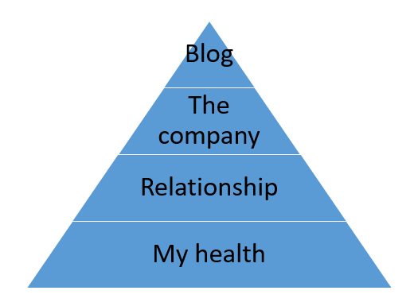

When starting the newsletter for this blog, I set myself a goal: write at least one post each week. I have three reasons for doing this, which I will explore in a minute. But already in the fourth week, I failed. I still stand by my initial three reasons, but I have to put this blog into perspective: It's not my main priority, it's just one of my multiple priorities.

## Reasons

Let's start with explaining what the reasons are for writing a blog every week.

### #1 anti-procrastination

I have lots of ideas to write about. There are more drafts with some scribbles than actual posts. But, it's always really hard to actually begin writing. The first lines are always the hardest. I can look at an empty screen for hours. Also, I always overthink it. There are so many ways to tell something and I can never pick one. So, with a self-imposed deadline, I have to write. I also have to finish, publish and distribute something even if I don't 100% like it. I need that pressure, because [I'm a perfectionist](/the-struggle-for-perfection/).

### #2: marketing

I'm not a marketing professional. Although I have to do it for my business, [jodiBooks](https://jodibooks.com), I can't say I **know** what I'm doing. I'm following advice and use some common sense to figure out what I should do. As I'm not a professional, I'm not interested in numbers, clicks, views, and conversions. Yes, I want people to use our product, but I don't believe you can measure that. And if you could, I don't think it's fair to manipulate people into buying your stuff. They should actually need it and it should give them value.

Long story short, apparently (they say) it's good to be predictable. My readers know what they can expect: a story every week on Monday. I think that's true, because I like it myself. I know I'm going to get a certain [newsletter](https://us8.campaign-archive.com/home/?u=774472413517d3a3ffb52312e&id=13079ac9e8) on Friday, and I look forward to it, also because it provides actual value.

### #3: practice

Writing doesn't come naturally. My mind races all over the place and I always have a lot of (vague) ideas about what I want to say. But for writing you need words… in a certain order. It's hard to “crystallize” those ideas into words. It's like I have a sense, a feeling about the idea, but not the actual matter to make it real. To give you an idea, on average I need a day to write one post. So by forcing myself to write a post every week, I practice. And as they say, practice makes perfect. Hmm, maybe I shouldn't use that word.

## What are my priorities

Skipping the post last week, wasn't because I didn't want to write or didn't have inspiration (something only procrastinators say). I had to think about why that didn't bother me as much as I thought it should. When you want something to be successful, you have to work for it. Not skip it and don't feel bad about skipping. So I had to be honest with myself, why didn't it bother me?

Well, to be fair it's not my main priority. The blog is important to me and I hope it will bring value to others, but it only comes in at number 4. I hadn't thought about it before, so this time I made a list of the things that are important to me now. I think this is one of the most important lists I ever made:

1. my health
2. relationship(s)
3. the company
4. my blog (and other hobbies)

## What does it mean

I think having your priorities in the right order (which can be any order) gives you clarity. If you ever need to chose, you can go back to your list and pick the highest one. So when I had to chose last weekend, between writing a blog and supporting my girlfriend, I chose the latter.

The order of my priorities isn't at random either. I thought about really carefully and in the end it also feels right. I thing of my priorities as if they represent a building or pyramid. You need a strong base or foundation, so I have to be healthy first. If I'm healthy I can be the patient and resilient person, who is able to build, maintain and improve his relationships. If my relationship is strong, I can take risks and work hard on my company. And if my business is successful, I have the time and resources to work on this blog.

If only it would be that simple. So far it seemed such a clean solution. But as my blog is on health and business (a little on relationship), it feeds back into the other priorities. Basically what I learn in priorities 1, 2 and 3, I write down when I make time for priority 4. Writing clears my mind so I can start anew and grow again in prio 1, 2 and 3. And repeat.

It gets even worse. I'm also blogging for my company, so in prio 3 I learn stuff for prio 4. And I co-own the company with my girlfriend, so relationship and company also often blend. A lot of quality blends into conversations about work. It's something we're trying to improve as we go. We now scheduled 1 hour each week, in which we can talk about anything we're struggling with. It really helps us explain what we feel and understand how our actions make the other person feel.

## Practically

I'm always working on my health. Trying to exercise enough, get enough sleep, eat the right foods. In that process I learn a lot, which I try to write down here. I do want to dig way deeper into all of this, but I need way more time. For now, I know [what works for me](/whats-the-right-diet-for-me/) at this moment. That's enough for now.

I will spend as much time as needed supporting, listening to and talking with Diana. We had a rough year so far. We climbed out of the deepest hole, but we aren't out of it yet. This means skipping parties and limiting travelling and family time. I know (or hope) people miss me, but don't worry, you'll see me again. Better and stronger than ever.

And then there is the business. We both hate selling, but we need customers to make jodiBooks profitable and survive. So I need to spend all of my energy selling and promoting jodiBooks. For that I need to get out of my comfort zone and push myself to talk to strangers, something I'm not comfortable with as an introvert.