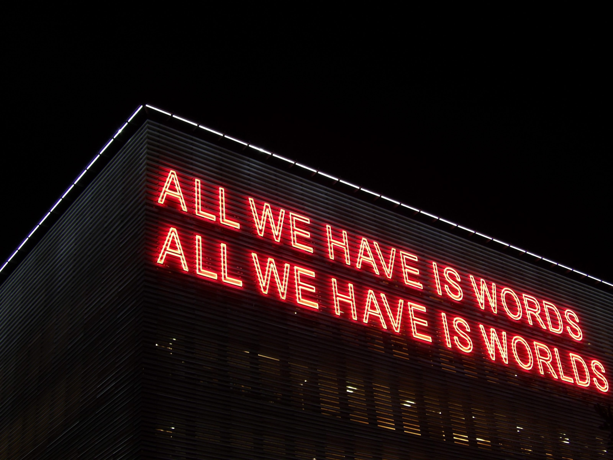
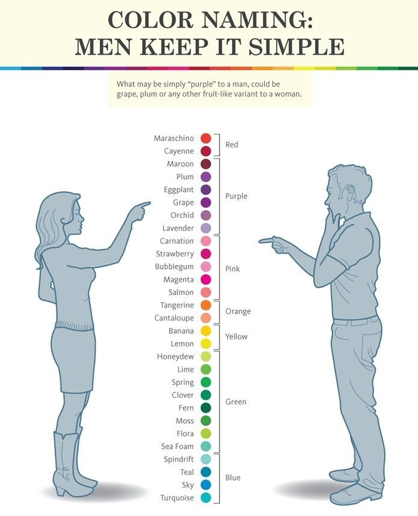
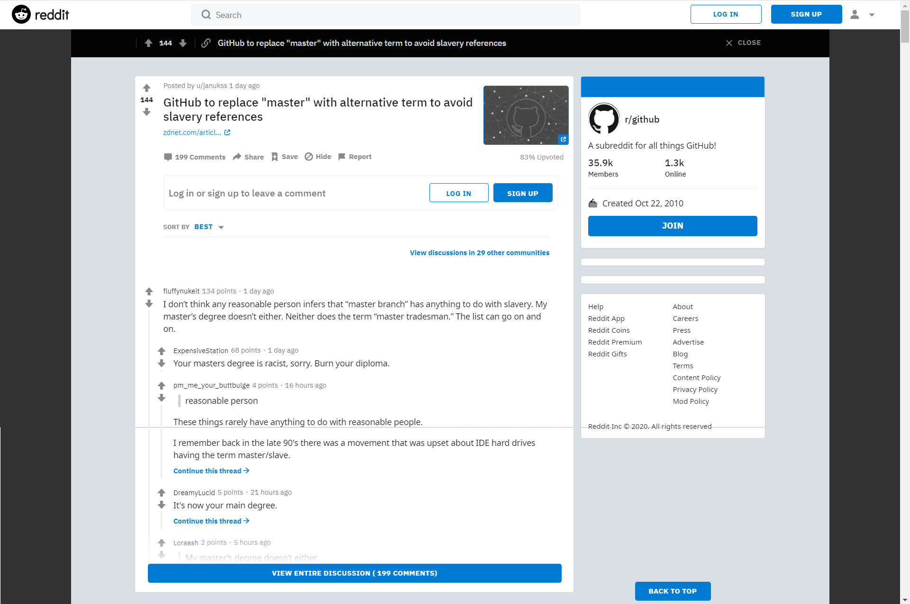
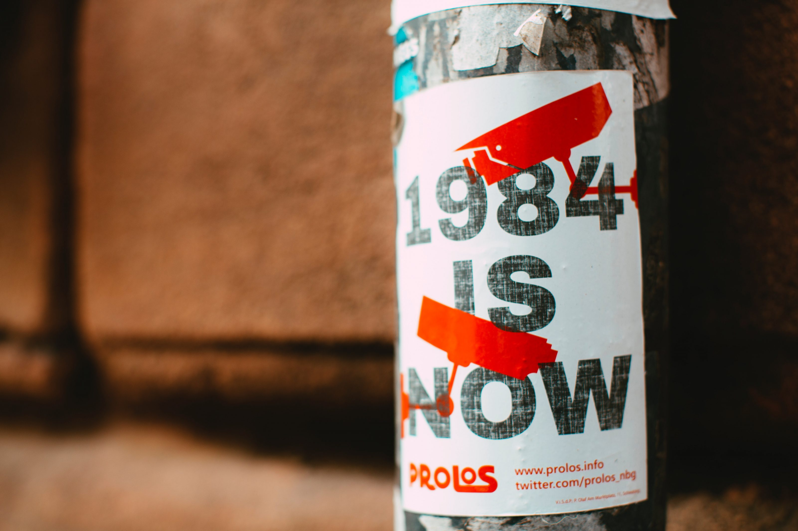

I'm following the events as of lately with a certain unease. I think the reaction is extremely out of proportion, but as long as people protest peacefully, I won't deny them their freedom to express the issues they see. As a straight, white man it is extremely dangerous nowadays to even touch topics like race, gender or sexuality. And as I don't want to be caught in fights where I have to defend my white male-ism, I usually keep quiet.

As I mentioned multiple times before, I'm a fan of Dave Rubins show '[The Rubin Report](https://www.youtube.com/rubinreport)'. He has invited guests that totally blew my mind. They made me see that the ideas about race, gender and sexuality are not fixed. I somehow felt it deep down, but I thought I couldn't talk about these issues as they weren't "mine". If however black people denounce white privilege, transgenders talk about the issues of allowing children to use puberty-blockers and gay people say they love Trump, why aren't I allowed to have the same opinions?

## Don't tell me what to think

But let's get to the reason why I wanted to write this post. Yesterday I read that [Github](https://github.com) (a company owned by Microsoft) wants to change the word "master" to "main" as the use is being seen as offence by the black lives matter community. I think it's an outrage that one of the biggest companies in the world bows to such a ridiculous demand. And it's in fact very dangerous. The whole matter grips me as with this it is creeping into my personal life. The fact that I couldn't sleep last night proves it is something that I deeply care about. But I need way more words than fit in a Facebook post or Instagram story to explain why I think that is.

Before I do that, let me be very clear that the issue is not that I'm too lazy, against change or that I'm want to be offensive on purpose. I really don't care if you're white, black, gay, trans, straight, male, female, poor, rich, left, right, liberal or conservative. What I do care about is that other people are telling me what I can and cannot say and thus what I can and cannot think. We still live in free societies (apart from the current Covid measures) and have the right to free speech. That means everyone of us is allowed to say or think what they want. And everyone else is allowed to find that offensive or not.

## The issue with words

Let's look at the word in question "master". The word master has 25 meanings, with a lot of overlap, according to [Merriam-Websters dictionary](https://www.merriam-webster.com/dictionary/master). Only one of them describes the master-slave relation that is now called problematic: noun 2. d. 2., *"an owner especially of a slave or animal"*. Although I agree slavery is unjust and immoral, we shouldn't remove it from our dictionaries and languages. Disallowing certain words, removing them from our speech and forbidding their use has two problems:

1. You lose the "good" meaning(s) of the same word
2. You lose the ability to conceptualize the "bad" meaning

Before we dive into those, let us first discuss and agree on what a word actually is. What does it mean that we have words for things, feelings and actions? Why do we do that and what is actually happening when we name things. Diana and I have had multiple discussions about this very idea. It seems so basic that we use language (words) that we actually never think about it.

Diana's idea is that we divide the world into two when we use words, when we name things. Before we do the world is one, but as soon as we use a word (in speech or thought) we split the world in what is and what isn't. Something is a stone, something else isn't. Someone is being racist, someone else isn't. One moment I feel sad, the other I don't. As humans we thus have the ability to see the world as what is and what isn't, what could be and what shouldn't, we try to divide the world into black and white, known and unknown and ultimately into safety and potential danger.

## Efficiency

If everybody would use different words for things that are known to be safe and things that are known to be dangerous, we wouldn't be here now. At least not in the relative safety and prosperity we have in the west. Every time we would communicate we would first need to negotiate about what the sounds meant that we were using. Imagine everybody speaking a different language that would change depending on the time of day and mood of the person.

By agreeing on sharing the same, or at least a similar language, we can skip this tedious negotiation and go straight to the gathering of food, the protection of our families and caring for our children. But, language is messy. Language hasn't been invented once, but has originated countless times, grown and merged. Eventually it evolved into what we now call English, Dutch, Swahili, Arabic or Chinese.

This has let to words having multiple meanings or being used in totally different concepts. This in its turn can lead to words, and thus the meaning of the other person, being misinterpreted. This even goes so far as that people actually see the world differently based on the words have and meaning they attach to that word. Have you ever asked a man to distinguish between shades of a color? And then asked the same question to a woman?

:::note Image source
[When it comes to color, men and women aren't seeing eye to eye](https://www.psychologytoday.com/us/blog/brain-babble/201504/when-it-comes-color-men-women-arent-seeing-eye-eye)
:::

## Words and thought

Language is not only used to communicate with other people. You also need words to form and shape your thoughts. You actually talk to yourself when you think. Everybody knows that. Do you notice that you're talking to yourself right now while you're reading this? You are not only seeing the words, you are "pronouncing" them in your head. If you would only "see" them, they wouldn't mean anything. It would be like reading Chinese (for people not being Chinese obviously), old Egyptian hieroglyphs or strange magic runes. So you need words to describe to yourself what you're feeling and thinking.

I know that all too well. 10 years ago, I only had "I feel bad" or "I feel good". I didn't have more words to describe how I felt. I knew there were more, because other people used them, but I couldn't map them onto my feelings. When I started talking about them and needed words to describe what I felt, those archetypal feelings (good and bad) broke up into a multitude of feelings and emotions. I learned there are multiple ways to feel good or bad. I can feel angry, frustrated, sad, anxious, resentful or alone. But I can also feel happiness, pride, accomplishment, joy and love.

By learning new and more words to describe my feelings my world got bigger. Before I didn't understood why people were so "obsessed" with describing and talking about how they felt. Why not just say good or bad? Isn't that enough? By knowing there are multiple ways to feel bad, I can now better empathize with other people. I've become a better listener and can see much more perspectives.

## Issue #1: losing "good" meanings

Now, by saying the word "master" is offensive because it is related to slavery, and by demanding it is removed from our language, you effectively say that I am not allowed to use it. And with that you're thus also saying I'm not allowed to think about the word. If I need that word to formulate my idea, and the word is prohibited, I cannot formulate my idea and I cannot share it with other people. You can say that some ideas should never be allowed into the world at all, but let's park that for now. We'll dive into that with the next issue.

I agree that it is problematic, unjust and immoral to engage in slavery, now and in the past. But we have to remember that we live in completely different times and circumstances. We have the privilege to look back at our ancestors, learn from their mistakes and do things differently, better. We can make sure we abolish slavery everywhere (it still exists) and do everything we can to never let it return.

Banning the use of a word that is related to slavery, however, is not one of the things we should do. It shrinks our vocabulary, making it harder to formulate our thoughts. More importantly, because we have to find synonyms for 24 uses, it makes communication much less efficient. If we have to learn which words are problematic and thus prohibited and which synonym we have to use from now on, we have to update all our written communication. Every government, institution, company has to update their procedures and documentation, internal and external.

Changing our language, our dictionary, would be a massive task. Why would we even consider it? And who is going to decide which word is offensive and problematic? Is my masters degree in engineering offensive now? It says I "mastered" my field of study. Instead of changing "master" to "main", can't we better focus on getting rid of poverty, hunger, sickness and (if you like) climate change?

:::note Image source
[Reddit thread](https://www.reddit.com/r/github/comments/h8u7fo/github_to_replace_master_with_alternative_term_to/)
:::

## Issue #2: losing the ability to conceptualize "bad"

The first issue might be annoying and causes a lot of inefficiency and work, but it is still not very different from learning a new language. If, however, we start banning words, we will also lose the ability to properly formulate our thoughts and opinions. We lose the ability to communicate those ideas properly and when that happens, we lose the ability to talk with one another. We will alienate each other purely because we feel differently about something which we, due to lack of words, cannot explain.

The main problem of not talking with one another is that we don't learn form each-others mistakes. This also means if we do not "talk with history" we cannot learn from it. As soon as we start prohibiting the use of the word "master" in the context of slavery, we cannot discuss the very concept of slavery itself anymore. How can we denounce slavery if we cannot discuss it? If I as a white male am not allowed to speak of slavery, I also cannot say I don't want it to ever happen again.

We need to be able to express all thoughts, also the bad ones. By being free from prosecution and shame you can explore them and find the reasons why it's indeed a bad idea. If you're not allowed, you'll never find those reasons and keep the bad idea or concept in your mind. By being able to use all the words there are you have the greatest chance of seeing the truth. By being able and allowed to discuss ideas we can show and proof to others why some ideas are good or bad.

We should also not confuse the use of a "pure" concept with the actual implementation. We should never use slavery among humans, but why is the use of the master-slave concept in computing a problem? Aren't computers machines? Machines that we are master over? And what if we use a master copy and several slave copies? It has nothing to do with human slavery. If we, from an engineering perspective, would need to find a different concept, it would again reduce our efficiency in communicating what we mean to build.

## Offense

So can't words be offensive? Sure they can. I think a lot of words can be offensive, but most of the time it is the circumstance, the context in which they are used that make them offensive. For example: if I say the word "nigger", for me it's just a word. For many others of us it is deeply offensive, but only when a white person says it. So it isn't the word itself, but the context.

I know I shouldn't use the word and I generally don't (apart from just yet and when I'm repeating rap lyrics in my head). Not because someone else forbids it, nobody can do that and nobody should ever be allowed to do it. I don't use the word, because I try to respect other peoples feelings, but more so because this particular word has no value to me. It cannot be used in any other way than describing or addressing a black person. I don't lose anything from not using it.

Words that have such a specific meaning are the only ones I can empathize with not using. I still think we should not ban, forbid or forget these words as they still teach us something valuable. That every person is a person, no matter their skin color.

In the end, changing a word like "master" to "main" (or as in the case with the [GRAMMYs "Urban" to "Progressive"](https://www.grammy.com/grammys/news/recording-academy-announces-changes-63rd-annual-grammys-releases-rules-and-guidelines)) doesn't change anything. The underlying structure is still the same. It only shows how hypocritical and arbitrary the new rules are. I am not allowed to complain, because "master" and "urban" are "just" words that can just as well be replaced. But if they are "just" words, why do you insist on changing them?

It all boils down to the fact that some people take offense about certain words and as I'm not offended by the same words, I'm against change and I don't respect other peoples feelings, by being ignorant and difficult. I now have no ground on which I can express my views. I always thought that if you think somebody is offending you, you would first ask what he actually means.

I'm personally offended by the fact that I'm being called privileged, just for being white and male. Two things I didn't choose to be or cannot do anything about. I worked hard for where I am today and if anyone thinks that was easy, they clearly lack empathy. Saying I didn't earn it, but had it handed to me is deeply offending. However, you have the right to have that view.

## Win-win

These discussions quickly run into a right/wrong game, which I'm not interested in playing. I don't want or mean to offend anyone, but if the rules keep changing it is hard not to. I respect everybody's right to be treated fairly and equally, but society is a big animal. It doesn't and can't change course over night. People need the time to change and to incorporate new norms and values.

It's just 56 years since the [24th amendment](https://en.wikipedia.org/wiki/Twenty-fourth_Amendment_to_the_United_States_Constitution) in the US constitution, practically giving [black people equal rights](https://en.wikipedia.org/wiki/Civil_rights_movement). Just 4 years ago the US had a president who had [campaigned against gay marriage](https://www.theguardian.com/us-news/2015/feb/10/obama-frustrated-same-sex-marriage-david-axelrod-book)!

I'm for equality among all people. I just don't agree with the tactics and the way it is forced upon society at the moment. Currently people are divided into the oppressed and the oppressors. The ones that have and the ones that haven't. And sure there is inequality, but it's lower than ever. Every year more and more people are "included".

So instead of striving to bring the people who have down by taking their mostly hard-earned success, money and freedoms away, why not bring all who haven't up? Give everybody the same freedoms and opportunities. We're not living in a win-lose world. We can all win and we can all have the same freedoms.

## 1949

I'm going to leave you with an excerpt from the famous book ["1984" by George Orwell](https://en.wikipedia.org/wiki/Nineteen_Eighty-Four). He wrote it in 1947-1948 and it was published in 1949. In it he describes a world in which speech and thought are highly regulated by a central government. This government, led by the archetypal leader Big Brother, tries to control it's peoples minds and thoughts by erasing and heavily editing the past and inventing a new language "Newspeak". This new language should make the thought police obsolete, as with this new language people cannot even think the wrong thoughts. The words simply don't exist anymore. It is a dystopian vision that is becoming eerily true.

<Quote 
    quote="The purpose of Newspeak was not to only provide a medium of expression for the world-view and mental habits proper to the devotees of Ingsoc, but to make all other modes of thought impossible. It was intended that when Newspeak had been adopted once and for all and Oldspeak forgotten, a heretical thought –that is, a thought diverging from the principles of Ingsoc– should be literally unthinkable, at least as so far as thought is dependent on words. It's vocabulary was so constructed as to give exact and often very subtle expression to every meaning that a Party member could properly wish to express, while excluding all other meanings and also the possibility of arriving at them by indirect methods. This was partly done by the invention of new words, but chiefly by eliminating undesirable words and by stripping such words as remained of unorthodox meanings, and so far as possible of all secondary meanings whatever."
    href="https://www.goodreads.com/book/show/40961427-1984"
    source="1984"
    name="George Orwell" />

