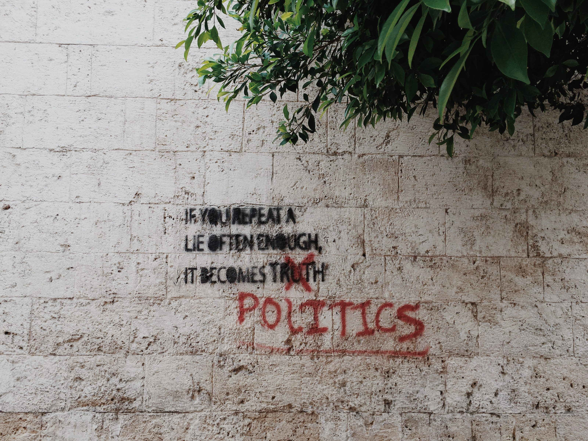
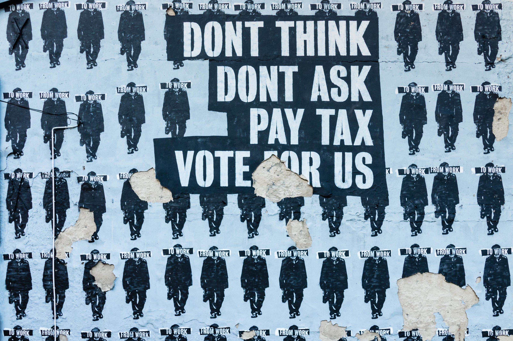

As I wrote in previous posts ([1](/tearing-down-the-house/), [2](/im-on-edge/)), last year was not fun, but very revealing. A lot of (perceived) knowledge, views and held beliefs were proven ineffective or plain wrong. It was hard, but I can say the most brutal part is behind me now. I'm learning who I am and why I am that person ([3](/living-under-autism/)). But most of all, now that my base seems to be relatively stable again, I'm learning to figure out what I really stand for.

Last year my eyes have been opened to a lot. Some would call it "taking the red pill”, after the famous quote from the Matrix. Ever since I let go of my old, non-working beliefs and started looking for the truth (supported by facts) everything looks very different. Together Diana and I are figuring out what it all means and we keep poking holes in everything we touch.

We've sort of theoretically dealt with family and friends, not that we know how to bring that into practice, but now we're "attacking” the almost sacred view of the (benign) institution. Why is a doctor always "good”? Why can't we say we don't trust an institution like a hospital? Why do we have institutions at all? And why do they become less human and more machine the longer they exist?

Our current, far from complete answer: institutions are living things. They want to survive no matter what. If they reached their purpose, instead of "dying” they evolve and take on a new purpose. Even if that means they have to start treating the people they were supposed to help as mere puppets. Going back to the Matrix metaphor, institutions become rogue programs who fight against deletion, even if that means that by doing that they destroy the Matrix that supports them.

Our views and thoughts on this are far from well thought through, but there seems to be a pattern. Luckily we all stand on the shoulder of giants, so we can use the analogies and metaphors from movies and books, and we can read books by people who did think a great deal longer about it. Books like '[The origin of political order](https://www.goodreads.com/book/show/11422770-the-origins-of-political-order)' and '[Political order and political decay](https://www.goodreads.com/book/show/27280433-political-order-and-political-decay)' by Francis Fukuyama. If you want a lighter and less dense read I would very much recommend '[The dictators handbook](/books/the-dictators-handbook)' by Bruce Bueno de Mesquita and Alastair Smith.

## Politics

When you're figuring out who you are and what you stand for, sooner or later you run into politics. It starts small when dealing with family and friends. But when you start talking about institutions, you really can't go around it any longer.

:::note Definition
**Politics** (from [Greek](https://en.wikipedia.org/wiki/Greek_language): *Πολιτικά*, *politiká*, 'affairs of the cities') is the set of activities that are associated with [making decisions](https://en.wikipedia.org/wiki/Decision-making) in groups, or other forms of [power relations](https://en.wikipedia.org/wiki/Power_(social_and_political)) between individuals, such as the distribution of [resources](https://en.wikipedia.org/wiki/Resource).

[https://en.wikipedia.org/wiki/Politics](https://en.wikipedia.org/wiki/Politics)
:::

Most institutions we instinctively think of are political themselves, governed by politics or (highly) regulated by the government. Institutions like the government itself, the police and military. But there are also the ones we might not readily see as political, such as our general practitioner, the family, hospitals and the healthcare system, schools, universities and our education system and the church. Where in fact they are all political.

For me it really helped to see them all through the same lens. By acknowledging they are all institutions, you can really start to be consistent and true to yourself and your beliefs. Now that I know an institution will do everything it can to survive, I can see how it uses people and politics to do that. By figuring out what my political view is, I found it has become much easier to put that in perspective and distinguish facts from opinions and beliefs. Although this is still work in progress.

## Political journey

I grew up in the south of The Netherlands in a family where playing the victim card was (and still is) the norm. We weren't rich because other people denied us that. There weren't many jobs in the region because the politicians "from the north” didn't care about us. And all rich people were greedy, just like politicians by the way. They only were rich because they stole from us.

It should be no surprise then that we all had very leftist, socialist ideas. Not that we were aware of that, or even knew it was called that. In fact I would say we weren't even progressive. I think my family is actually socialist-conservative. They didn't want to change, they just wanted the money the "rich” people had and were waiting for Robin Hood to fix that for them.

When I started thinking for myself, after moving out to attend university, I felt confused and just started reading somewhere. Not knowing what was left or right, between my science books, I ordered some political stuff. The ones of which the summary sounded right. Books like '[First as Tragedy, Then as Farce](https://www.goodreads.com/book/show/6636487-first-as-tragedy-then-as-farce)' by Slavoj Žižek, '[Karl Marx](https://www.goodreads.com/book/show/1215789.Karl_Marx)' by Bart Tromp and '[The Establishment: And How They Get Away with It](https://www.goodreads.com/book/show/25053272-the-establishment)' by Owen Jones.

Later, just 2 years ago, I read books ([1](https://www.goodreads.com/book/show/25760876-de-economie-zoals-uitgelegd-aan-zijn-dochter), [2](https://www.goodreads.com/book/show/24886497-and-the-weak-suffer-what-they-must-europe-s-crisis-and-america-s-econo), [3](https://www.goodreads.com/book/show/34673467-adults-in-the-room)) by Yanis Varoufakis, the former Greek finance minister, Rutger Bregman ([1](https://www.goodreads.com/book/show/33652563-utopia-for-realists)), the [Dutch Robin Hood](https://youtu.be/paaen3b44XY), and Naomi Klein ([1](https://www.goodreads.com/book/show/23289196-this-changes-everything)). They all said things that instantly felt good and sounded right. Which person in their right mind would be against getting money? And it sounds perfectly reasonable to take that money from people who have lots of it, right. It's not fair they have more than we do.

Al of these authors and thinkers fitted perfectly in the mold I was given growing up. Their words sounded "right” as they confirmed the beliefs I was taught. However they were never really **my** beliefs. Somehow they felt wrong, incorrect. I couldn't see what that feeling was and why I had it. I just took it as the price everyone pays for being fair and equal.

## Thinking fast and slow

Although I did read some books by people who had different views, it was difficult to get out of my bubble and stop twisting their words to fit the leftist narrative I was used to. I couldn't change that view until my foundation crumbled. I took the red pill, so to speak, and saw that I had a choice. There were facts and I could build my worldview, my politics around that.

With that opened mind I re-evaluated some books I read earlier. Books from authors like Amitai Etzioni, Francis Fukuyama and the earlier mentioned Dictators handbook. Why was it that they felt "right” to me (no pun intended). It wasn't until I coupled it with Daniel Kahneman's '[Thinking, Fast and Slow](https://www.goodreads.com/book/show/14062004-thinking-fast-and-slow)', that it started to fit together.

The leftist views I held all triggered the fast thinking part of my brain. They didn't need any deliberate thought, they just felt right. I'm not alone in that at all. I believe (I can't proof it) that every human being has the same tendency to be socialist. Sharing was the best strategy for survival when we were still roaming the fields of Africa. It was better to share your food in exchange for acceptance and protection of the group. Hence, we evolved to be altruistic and share.

But, nowadays we live in the protection of cities and through agriculture we have more than enough food (most of the world). Living in these enormous groups is not what our (fast thinking) brain is capable of comprehending. The web of interpersonal relations (the matrix) is just too huge for our brain to solve. We can't see which actions causes which reactions and we start seeing causalities where there aren't any.

This is where the slow thinking part of the brain comes in. We need to pause, stop and consciously think about it. We need to unravel pieces of the whole to study them separately, which is exactly what science does. For science, rationality and reason we need to ignore the fast thinking, highly efficient, lazy part of our brain. We need to control our impulses and be skeptical about our initial feelings and emotions. Only after we employed the slow thinking, rational part of the brain and we identified the actual (or most probable) relation between cause and effect, can we form a political policy.

## Left to right

Last year and a half I watched a lot of episodes of the [Rubin Report](https://rubinreport.com/). Dave Rubin, the host, had a similar political "awakening” and interviews people from left to right. It gave me the words to describe what I was feeling and the courage to explore it. I can now say I definitely moved right (or maybe I finally accepted that I was already there), but as Rubin also notes, that isn't a single moment or decision.

After my eyes were opened, about 14-15 months ago, it still took me till last month to cancel my donations to organizations like [Avaaz](https://secure.avaaz.org/page/en/) and [Diem25](https://diem25.org/). Organizations I used to fully support for their efforts to make the world (Avaaz) and Europe (Diem25) a better and fairer place. It sounds weird to say that, even now. In fact I still want the world to be a better and fairer place, but not in the way they want to achieve it. I think their methods won't work, or make it even worse.

I believe we should give every individual the same opportunities and trust them to make the right decisions for themselves. That won't be perfect and people will fail, but that's where we can help them try again. And again. And again. I don't believe in a big government handing out benefits and regulating everything. It ultimately stifles creativity and can only be(come) inefficient.

## Creativity

Creativity is the free wandering into unknown and uncharted territory. In that unknown place you find new ideas, which can transform you or the world around you. As soon as you start giving people rules to follow, by definition they are less free. They can't wander everywhere. Obviously we need some basic rules, so we don't hurt each other and so we know our possessions, our property is safe. Only if we know we're safe and we have a safe place to come back to, we dare to venture into the unknown.

There is however a fine line between the minimum number of rules and too much rules. It's personal and we have to strike a good balance. The problem is we tend to err on the side of more rules, just to be safe. However, every new rule will bring less additional protection for less people. But we never debate about cutting rules. The best we seem to do is change them.

### Institutions and rules

Institutions in a sense are just a collection of rules (Fukuyama). We invent them to help us solve a problem, but we rarely take them down again if they served their purpose. Instead we tend to give them new things they weren't really build for. That means they have to reinvent themselves and thus start adding new rules. Mostly without getting rid of the old ones. Even if institutions fail to do what they were build for, we don't tare them down.

The latest fiasco with the WHO shows that (again). One of their tasks is to monitor global health and outbreaks of disease. They shouldn't be a political organization. Yet they showed they were by failing or refusing to respond to early warnings by Taiwan. The reason is that Taiwan is not allowed to be part of the WHO by China, so the WHO ignored them. Also the EU started their own campaign to raise money to fund research for a vaccine. Shouldn't the WHO take the lead in that?

### Businesses are also institutions

Maybe that's a bad example, but I'm in uncharted territory here. What I know more about is creativity in business. A business is it's way a set of rules. Those rules should make sure everybody works on the same thing and has the same goal, mostly turning a profit. And although creativity and innovation are buzz words in business, they aren't really practiced as such.

Now that I have my own small business, I can see the difference between being creative and saying your being creative. If you work for a large business, mostly not your own, you are encouraged to be innovative and creative. But when you really do have a good idea, you first have to convince your colleagues and management that it will work and be profitable, which is a paradox. To be creative you have to go into the unknown so you don't know if it's going to work. Thus you can't proof it.

We are just the two of us, so we can swing wildly in all directions. If we want to try something new, we do. It might not work at all, but at least we know and we learned. The bigger the business you work for, the more rules there are and thus the more restrictions on true creativity. It is not allowed to "waste” time and money and thus employees are discouraged to take the giant leaps needed for the business to survive.

Now imagine if the business can't even decide what it's rules are, but the government does. How does a government control businesses? Through rules. And those rules will restrict the business, the business will restrict employees and employees can't and won't be creative anymore. And we didn't even mention patent law and copyright. Why would someone (or a business) spend hours, months, years creating something if there isn't a reward?

## Economics

### UBI

It has been given different names, [universal basic income](https://en.wikipedia.org/wiki/Basic_income) (UBI), [freedom dividend](https://en.wikipedia.org/wiki/Andrew_Yang_2020_presidential_campaign#Freedom_Dividend) or guaranteed income. Basically it comes down to giving everyone a certain amount of money, so they don't need to work anymore. I used to champion the idea as it would allow me to spend my time doing the things I really wanted to do. Not to have a job I disliked. It would allow people to explore their creative sides. This way everyone adds value while also being happy. And it's sounds awesome right: free money! But it can't be right, it just sounds too good. Something was missing in the equation and I think I found 3 things.

#### Inflation

I'm not an economist, so please let one answer this one for me. I guess people who have a business will initially get more customers as more people have money to spend, but if the demand increases without the supply side keeping up (who will want to work when they get free money?), prices will go up. I have seen or heard nobody ask (and answer) if UBI doesn't cause (massive) inflation. If you give everyone 1000 or 2000 euro/dollar/pound, wouldn't that in the end just become the new 0? Isn't the economy self-regulating in this way?

#### Most people stop working

This is a tricky one, because how can you prove this? I think most people will just stay at home all day and do nothing productive for society. Proponents of UBI like Rutger Bregman and Andrew Yang counter this with research and experiments that show the opposite is true. People tend to keep their jobs and actually don't change much. However they use the money to further educate themselves, improve their health and spent more time with friends and family.

I would counter that all of those experiments were from the beginning experiments with a very probable or even fixed end date. Most people won't quit their job when they know the "free money” is going to stop. They will just decrease the amount of hours they work to a point where they know they can pay all their necessary bills. So UBI works the other way around. Instead of paying for basic needs and working for luxuries, people work for their basic needs and use UBI for luxuries.

I know, because I did exactly that (without the UBI part). I decreased the hours I worked to the minimum to pay our bills. And if I would have gotten UBI, I wouldn't have worked so hard on my business. Why should I? The incentive (needing money to pay the bills) is gone.

####  Who will pay for it?

Lastly, who is going to pay for my basic income? If everyone is getting it, who is working for it to fund it? I guess if it works like in the utopian vision, people still work and pay taxes. But wouldn't they then work to pay their own UBI? What's the point there? In fact the number of people who work is always lower than the number of people who receive the UBI. That means that the people who work pay for the people who don't. That doesn't sound fair to me at all. And if you want to raise the money through a VAT, we're back at inflation.

### Minimum wage

Another idea that feels just right. Although slightly less rigorous as UBI, it's the same idea of getting money from the big corporations to the poor that's behind it. It again has the same problem of inflation, although probably less severe. It also takes away the incentive to look and work for a better job. Thus trapping people who need a little push to improve themselves.

But the biggest issue I have is that when you force companies to pay a minimum wage, they will just not hire that person. The big corporations might be able to pay the higher wages for some time, but will always look for ways to drive down the costs and thus automate the people away. Small companies might not even be able to hire someone in the first place. I can vouch for the last thing personally.

The Dutch government "forces” business owners to pay themselves €45.000 a year. Even owners have a minimum wage! We don't need that much money, but it also prevents us from hiring somebody. But, even then, we can't "hire” an intern or a student to help us out. They are too expensive. Minimum wage slows our growth and thus the growth of small family businesses, in favor of the big corporations.

### Taxes

Progressive taxing is unfair. There, I said it. Why are people who earn more money and thus bring more value being punished? If you have a flat tax rate everyone, no matter how much you earn will pay the same percentage. Mind that the same percentage is not the same amount. People who earn more money pay more taxes. By introducing a progressive tax, meaning the rate goes up with income, "rich” people pay even more. How is that fair?

I totally agree that tax-evasion is a bad thing. It's not fair to avoid paying your fair share. But it's in those words already. I can fully sympathize when people try to avoid paying an unfair amount. So let's make our tax system waaaay less complicated by having just one fixed rate for everybody. The easier the tax code, the less loopholes will be there to exploit.

The same goes for VAT as we have it in Europe. Cut all the different rates and just choose one. As soon as you have multiple, it is getting unfair and political. It's totally arbitrary why some goods have a low VAT rate while others are high. For example in the Netherlands a head massage by a hairdresser is taxed with 9% VAT, while the same massage at a massage salon at 21%.

### Equal opportunities not equal outcome

The best system we have devised so far is capitalism. It is far from perfect as it creates horrendous amounts of (financial) inequality, but the alternatives are even worst. Anyhow, despite that inequality, billions of people are now above the [poverty threshold](https://en.wikipedia.org/wiki/Extreme_poverty). It more than halved in the last 25 years alone (~1.8 billion in 1990 to ~800 million in 2015. And we have improved our lives significantly. Our parents didn't have the internet or smartphones. A mere century ago there was no television and phones and cars were a luxury. We couldn't even cure bacterial infections, let alone handle a virus.

The best thing in our free societies (with capitalism) is, that everyone gets the same opportunities. No matter their skin color, gender, religion or current bank balance. Sure money opens doors, but with the internet those doors have often vanished. As long as you work hard and keep your eyes open, opportunities will come. The problem isn't that you have bad luck or that the institution is keeping you down. It's mostly that you yourself believe in the institution you're in.

### Institutional racism

Which brings me to the most flammable issue: institutional racism and white male privileges. It doesn't exist! Institutions (and businesses) are things build by people. People who are imperfect, so the systems they build will also be imperfect. There is no denying that. But you can choose to believe what those institutions (or businesses/systems) tell you, or you don't. You can choose which institutions you trust and which you don't trust. But you need to slow down and look at the facts first.

I'm fortunate enough to live in a country without real big problems. We have our issues, but they don't seem to be magnified to a degree as is done in the US. In the end I'm not as well read in this at all, so I listen to what other people have to say about it. People like [Larry Elder](https://youtu.be/IFqVNPwsLNo), [Candace Owens](https://youtu.be/BSAoitd1BTQ), [David Webb](https://youtu.be/wSLiwcl1Lww) and [Brandon Tatum](https://youtu.be/k0Y35EpOiFc). Their general view is that yes, relatively more "colored” Americans are poor, under-educated and involved in crime. But that isn't the white persons fault.

Actually by saying white people are privileged, you actually are being racist. You acknowledge that just because of their skin color they are better. Which should be obviously false. More white Americans than black are poor. How is that privilege? Even worse, I think, is that by acknowledging, as a white person, that you are privileged, you implicitly state that if you're not white, you somehow need help and can't be successful on your own, which is really patronizing. By saying and believing there is a white oppressive patriarchy, we actually create it.

## Trump

Ok, maybe this is actually the most flammable. It feels weird to talk about American politics as someone who can't even vote there. But the divide between Democrats and Republicans in the US is also felt here in Europe. Wether we want it or not, we see and hear about American politics and ultimately will feel it. And it perfectly shows my political transition.

Four years ago, I couldn't see how anyone could ever vote for Trump. What kind of idiot did you have to be? The same with the Brexit vote in the UK. Watch [this documentary](https://youtu.be/afMofYie4Lc) to see some of those idiots ("[deplorables](https://en.wikipedia.org/wiki/Basket_of_deplorables)") and their perfectly valid reasons. Now I can say I would proudly vote for Trump. I can't obviously and I'm still looking for a party in the Netherlands that supports my views. They all want too much control and are too politically correct.

* * *

For a full list of books I read, check my [Goodreads page](https://www.goodreads.com/user/show/98202459-joep-van-de-laarschot)