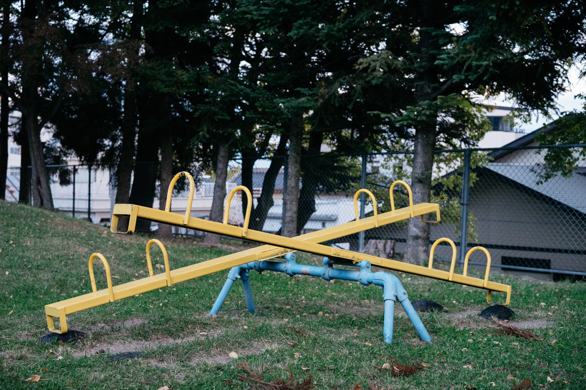

Ever since I really [started to look at me and stopped bullshitting myself](/tearing-down-the-house/) I keep finding interesting things around me. Being brutally honest with myself is tough, but it opens the door to talk about [things I'm actually ashamed of](/rule-2-treat-yourself-like-someone-you-are-responsible-for-helping/). The interesting thing though is that talking about them, makes them less potent. It sort of takes the edge of.

The more I discuss those things I'm ashamed of the more I'm learning they are either nothing to ashamed of in the first place or that I can actually fix them myself. And although talking about them is usually an emotional roller-coaster ride, not something I **am** was personally good at and something men in general are discouraged to do, the world does seem better afterwards.

## Cranky

There is a part of me that is really angry at the world in general. It doesn't really have a specific target, at least not that I'm aware of, but it can be triggered easily. It usually manifest itself in making me extremely cranky. Being hungry, tired or stressed usually helps, but mostly the other way around. If I'm not one of those things I can better control myself.

When I'm in that mood, I cannot be reasoned with. I don't really hear what people say to me and I probably be very defensive and angry. In that moment I will dump my emotions on any unfortunate bystander, a very special privilege anyone who lives with me gets.

I was very ashamed of doing that. So I tried to push it away, bury it somewhere deep in my mind. It worked for a few years, sort of. As long as I didn't have a relationship that was too long, didn't try to do difficult things and made fun of myself. However, you can't bury stuff. It will pop up somewhere else or even more intense. I used to hide that by running away. Away from the hard thing I was trying to do and away from people. So I never had the conversation with myself that I needed to have.

## No running away

When things came to a head between Diana and me last year, I could have ran away again. Instead, this time I decided to stay and fight. Not with Diana, but with myself. I owe it to people I "met" on YouTube (see below) that told me to stop running and face up to my problems ("demons") like a man.

:::note Awesome people
* [Gary Vaynerchuk](https://www.garyvaynerchuk.com/)
* [Tom Bilyeu](https://impacttheory.com/)
* [David Goggins](https://davidgoggins.com/)
* [Jordan Peterson](https://www.jordanbpeterson.com/)
:::

Looking at myself and admitting to the ugly things I do is just half the battle though. Some of them are easy to identify and fix. With that I mean that by admitting to them, admitting the shame and talking them through, the actual cause is easy to see. As long as you don't know that cause, actually fixing something is impossible.

My crankiness is a different beast though. There is so much that can trigger it and going down the rabbit hole often means coming back with more questions than answers. But that's okay. This crabbiness has held me back and still is holding me back. It prevents me from listening and learning. It clouds my view exactly at the moments when I need to think clearly.

## Trigger each other

But it doesn't just hold me back. My grumpy moods also trigger Diana. And her being triggered, triggers my grumpiness. You can probably see the problem here. This state of mutual "triggeredness" could last for hours or days. Days in which both of us tiptoed around each other avoiding to actually have to talk and search for the initial issue.

When triggered we react emotionally and just cannot have a rational, honest conversation to find the truth. The truth often hurts. And our ego doesn't want to be hurt, so it triggers another defensive emotion. If you don't confront this, your ego's defenses, you end up reacting emotionally to everything and you blame everything around you except yourself. This places the person your talking to outside of your castle and he will build his own castle opposite yours, to keep the world in balance.

This is a very short summary of hours and hours of talking the two of us have done so far. And it took us some time to go from talking about it, to seeing something, to trying to stop our ego, to understanding what was happening. We had no idea what we were doing, but eventually we started to understand it (what we were doing). We're still not in the phase of actually preventing it (mutual triggering) from happening, but we're getting better at it every time.

## The emotional seesaw

We found a perfect metaphor to describe what is actually happening when we both get triggered. We call it "the seesaw". In the middle is the steady place where you can think clearly without being tossed around. If your emotional (triggered) you move the a side of the seesaw. The more emotional you get the further you move and the bigger the swings.

This can be fun if it's positive emotions (the air rushing around you, the brief feeling of weightlessness). It's something you actually need to do sometimes to prevent being bored to death in the middle. You also learn the most about yourself at the edges. But going to the sides with negative emotions (the nausea, your painful bottom) can be really uncomfortable.

When I'm triggered, mostly because something doesn't work and I don't understand why, I get a very narrow focus. I want to fix the thing. I forget to eat or drink, I forget time and after a while I end up doing loops, trying the same thing over and over again. This obviously doesn't work, but at that time I'm not rational any more. When someone or thing ‘dares' to disturb me at that moment I get really crabby. That person (or cat) doesn't deserve it, they are probably right, but that's not what my ego tells me.

Most of the time the person who finds me on the far right side of the seesaw is Diana. She now has three options:

1. Join me on my side
2. Get to the far left side
3. Stay put in the middle

### 1. Join me on my side

The thing my ego wants is that she joins me and shares in my misery. Not literally, but she has to magically show me the solution without actually telling me. A thing that is impossible. Or she has to agree with me so we can wallow in righteous complaining together.

Whatever she does on my side, it will not result in a (rational) solution. My problem will not vanish or be solved. If your are both on the same side of the seesaw, nothing happens. Your stuck on the ground and if that is a place without a solution, you will not be able to reach one. The only way to go is back to the middle, away from the emotions, back to "safety". Not an easy thing to do when your ego and emotions scream to stay at the edge.

### 2. Get to the far left side

This is the thing that happened most often. I was at the right side of the seesaw, which triggered Diana to move to the left side. Instead of talking with each other, we talked to each other and seesaw'd up an down. When I got up, Diana got down and vice versa. We never got to a solution because a solution for me would be a sacrifice for Diana. And the solution for me was a solution now, for my current visible problem. It wasn't a long term solution that addressed the actual problem.

We noticed that this "solution" is one that is very natural to do. It happens without any effort. If you look around you carefully, you see it happen everywhere. People have an innate yearning for balance, order and fairness. "If you are triggered I can be too" and "if you can say what you want, I can say what I want". It's really easy to balance each other out this way, but it's not a nice atmosphere to live in. You constantly have to be on your guard and the real problems aren't solved.

### 3. Stay put in the middle

Just recently we found a solution to our mutual triggeredness. The best thing to do, but also the hardest thing, is to stay in the middle. Don't join in. Don't go to the same side and don't go to the opposite. Seesawing can be fun if both of you play properly, but when negative emotions are involved, playing will never be fair and fun. It will be treacherous and painful. Don never play games with people who don't want to play fair, just stay out of it.

It obviously helps when the one being triggered warns you or that you can detect it. This is the part we're struggling with right now. I can only speak for myself here, but I sometimes see it when Diana is triggered and I'm building a repertoire of things I can say at such a moment. The other way around, I'm starting to recognize it in myself. Sometimes within an hour. Sometimes even within a few minutes. That's the moment I now try to say it. Instead of being ashamed, I try to warn Diana.

If you know the other person is on one side of the seesaw or moving towards it, you can anchor yourself in the middle and extend a hand. The other person has to climb back to the middle herself, but she can try to take your helping hand. Only back in the middle can you discuss what really happened and what can be done to prevent it in the future.

## Emotions have rights too

I'm not saying that emotions are bad or have no merit. They certainly do. Emotions are early warning signals for something that might be going to happen. They are the messages from the subconscious part of your brain, the part that is not able to speak. It knows things, so you know things, you cannot consciously perceive. You can call it intuition or a gut feeling.

But your subconscious is not always correct. You have to figure out which emotion, which signal, was correct and which was a false alarm. Your subconscious has been programmed for years, by parents, teachers, friends and peers. It learned by trial and error what was approved of and what wasn't. It learned what hurt and what didn't. Your body, your mind, your ego wants to avoid pain at any cost. So it has a very good memory for everything that ever hurt you. That makes it really hard to reprogram it. And when there might be pain in the (near) future, it sounds the alarm. The bigger the pain in the past, the louder the alarm will be.

So you will probably find yourself on a side of the seesaw now and then. And that's okay. Just know it might be a false alarm that made you fled the middle. Let the people around you know where you are emotionally and retreat if necessary. When you regain control, you can start to think and talk about it. If people don't accept that or don't want to stay in the middle to help you climb back up, find other people to surround yourself with, you deserve better.