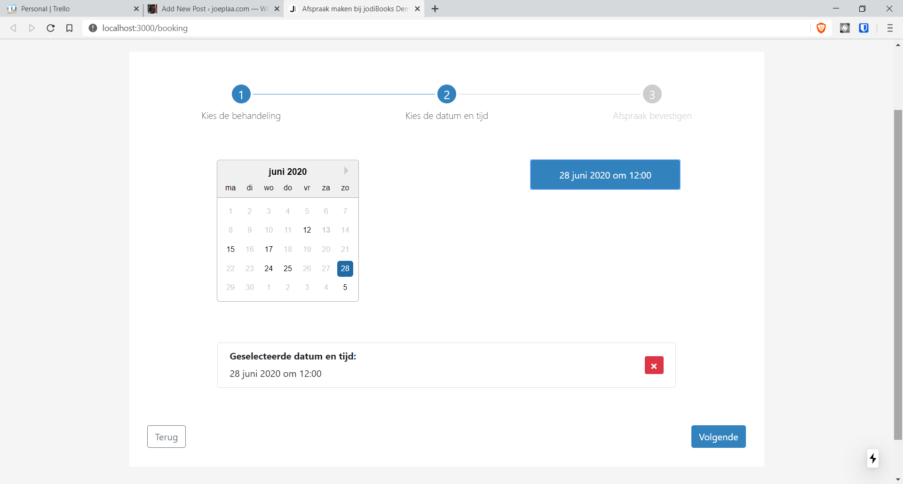
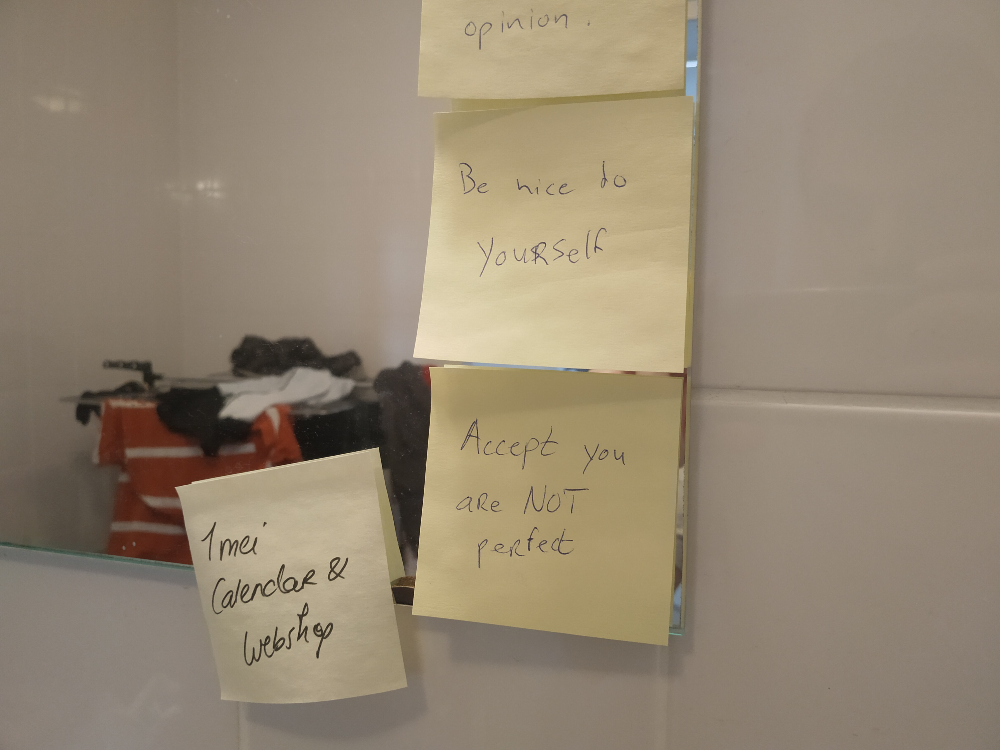

Last week I bought a painting I really liked. It might sound stupid, but it's something I'm learning to do. Whenever I buy something it has to have practical value. It's a complicated mess of multiple distorted ideas, values and rules in my mind. Every time I like something purely for its beauty, my brain says "No!". It needs a valid reason for spending the money and (just) beauty or enjoyment isn't one of them. But as a neighbor said to me: "If you enjoy it it has utility. No need to feel guilty. at. all!"

    <iframe src="https://www.facebook.com/plugins/post.php?href=https%3A%2F%2Fwww.facebook.com%2Fjoeplaa%2Fposts%2F684852842304690&width=500" width="500" height="702" style="border:none;overflow:hidden" scrolling="no" frameborder="0" allowTransparency="true" allow="encrypted-media"></iframe>

So this time, instead of being ashamed of just having the thought "I like this", I told Diana about it. She immediately encouraged me to buy it, so I did. I got in touch with the artist and the restaurant (which was exhibiting the painting). It was the first time she exhibited her art this way and I was the first one to buy one of her paintings. So she wanted to take a picture with me and the painting and we made an appointment to meet.

Because my brain was still screaming and squirming, I had done some research into the artist and the painting. I hoped that would shut it up, but there still was no "practical" reason. "We haven't even put up Diana's paintings, so why buy from a stranger? Isn't that rude to Diana?" Yes, it was looking for ammunition everywhere. Anyway, during that research I found her website and saw it was really basic and seemed not finished. So I casually offered we (Diana and I) could help her out if she ever needed help.

## Seeking order in chaos

A few days after we spoke we met at the restaurant. She immediately admitted she was really nervous. It was the first time she sold a painting to a ‘stranger'. Although I was also nervous, I never bought a painting, not even from a friend or family member. I had no idea what to expect, but somehow, her honest confession made my mind go into another alley.

I know that alley all to well and it's not a healthy one. When I take that route, I put my emotions and needs aside as less important and will try to do anything to make the other person feel better. It's the wrong reaction. Instead I should have admitted I was nervous too and own that. But, work in progress, seeing and recognizing it is half the battle.

After a while the owner arrived, invited us in and took our picture with the painting. During the conversation we had through the Facebook messenger, I asked if she would like to have a drink after taking the picture. Now that we were there, all of us were awkwardly silent. Also because we didn't know if we were "allowed" to even be there (stupid corona rules). Eventually the owner broke the ice by asking if we wanted to stay and eat something. He didn't have any other customers and we were the only ones there, but we had to make a reservation first \*facepalm.

After being seated 1,5 meter apart, we ordered our drinks and awkwardly started chatting. As an introvert talking to strangers is not one of my strong skills, but sitting that far apart made it even more awkward. Anyway, after sharing some basic pleasantries she asked what we (jodiBooks) exactly did and if how much redesigning her website would cost.

## Self-sabotage

I'm still not sure what happened and what I said exactly, but it was like a voices took over. I heard myself talk, but it was not me. I was saying things I didn't want to say. Thing like "I don't know if I can do that" and "It doesn't feel right to ask for money now" and "I'm too honest and humble". All bullshit! It wasn't a humble brag. I was gas-lighting myself.

Two years ago it would have been sort of true. Back then I could only add some text and images on a simple WordPress site. And even that was sometimes hard. But since then, I learned how to style websites with CSS and do the design of a mobile app with [React Native](https://reactnative.dev/). To be better in that I learned to code with [Javascript](/learning-to-code/). In the meantime I redid the [jodiBooks blog](https://blog.jodibooks.com) and setup my [own website](https://www.joeplaa.com).

Currently I'm making websites with [React](https://reactjs.org/) and I love doing it. Sure, I don't build them from scratch. I use frameworks, like [Docusaurus](https://docusaurus.io/), [Next.js](https://nextjs.org/), [WordPress](https://wordpress.org/), [ASP.NET](https://dotnet.microsoft.com/apps/aspnet) and [Bootstrap](https://getbootstrap.com/) that help me build them quickly and relatively efficiently. Of course I'm standing on the shoulder of giants, why wouldn't I? I don't need to know how their framework exactly works. As long as I can use it to build what I want or need, that's enough.

So yes, I made a few websites: [joeplaa.com](https://www.joeplaa.com), [jodibooks.com](https://www.jodibooks.com), [blog.jodibooks.com](https://blog.jodibooks.com), [docs.jodibooks.com](https://docs.jodibooks.com), [beauty.jodibooks.com](https://beauty.jodibooks.com) and currently I'm building a [booking plugin](https://booking.jodibeauty.com) and calendar. Ow, and I am hosting them all myself. So why do I gaslight myself and say "I don't know if I can do that"?

## Who do you think you are?

Diana and I talked about what happened and how to learn from it. We both gaslight ourselves, which makes it easier to figure out. At least for me. It helps to see someone else do it. It looks totally irrational and stupid. So recognizing I did it to myself was very painful. Seeing it in someone else is really easy and it is even easier to say "just stop doing it, I believe in you". Now that Diana laid it bare to me that I had just done it, I could see it isn't that easy. How can I <u>not</u> do it if I don't even recognize it in the moment?

In the moment someone or something else takes over. It's a voice that says: "Who am I to say I can do that. Just say they should find somebody else, so they won't find out you actually can't do it." It's an deep fear that people will find out you can't do what you promise to do. Actually it's even worse. It is a fear they find out you're not capable of things they don't even ask for. This makes it even more paralyzing. There is always something you can't do. I'm not the first and only one who struggles with this and it's called [Impostor syndrome](https://en.wikipedia.org/wiki/Impostor_syndrome).

> *"Impostor syndrome [...] is a psychological pattern in which one doubts one's accomplishments and has a persistent internalized fear of being exposed as a "fraud". Despite external evidence of their competence, those experiencing this phenomenon remain convinced that they are frauds, and do not deserve all they have achieved."*

## Rule #2

I recently decided to re-read Jordan Peterson's "[12 rules for life](/books/12-rules-for-life)". This week I read the second: "Treat yourself like someone you are responsible for helping". It might be a coincidence or maybe it "had to be" as it resonated immediately. Peterson describes why humans have the "habit" to treat others, even animals, better than themselves. Why would you give your dog (or cat) its medicine every single time, but can't you seem to be that disciplined when it comes to your own medication?

It's the second time I read it, and although the first time I thought it was true, now I felt it. We humans have the unique capability of having a conscious mind. We can look into the past and future and we ([well, most of us](/living-under-autism/)) understand that other people are also conscious. Which fuels a complicated back and forth: I know that you know that I know that you know…etc.

Because we are conscious animals we can know exactly what hurts us. Combine this with our knowledge that other people can and feel the same things and you get "evil". Only we have the ability to hurt another being just for the act of hurting. An animal only hurts another animal because it has to eat. We can do it just for the pain, which is pure malevolence.

Everybody has this evil somewhere inside of them and knows it. We all try to hide it, obviously and for good reason. If we would act it out, this world would be hell. As long as you accept this, you can live your life decently and well. If you try to ignore and hide it, it will make your life hard. You have to lie to others or yourself. You have to be an impostor.

## I see my faults

Now, my impostor syndrome might seem to be far less serious. I'm not trying to malevolently hurt or kill other people right? That might be true, but I think it uses the same brain circuitries. People don't want to be seen as evil. I don't want to be seen as someone who "hurt" someone else by making something they didn't ask for or doesn't live up to the agreed upon standards.

I know my own faults. And I know what I can and in this case especially what I cannot do. So I prematurely render myself incompetent before the other finds out. That way if they still give me the assignment, they will be responsible for taking the risk. I told them so…

Just like not owning your capability for evil, not owning my capability for making mistakes makes my life hard. I can't sell myself and my product, because I can see what they can't do. I see what still can be improved and what is still missing. That makes selling a ridiculous venture. Ever seen somebody sell that way? Why would you buy something from someone who already tells you it's flawed?

## The lesson

The message from rule #2 is to be kind to yourself. Know and accept that you're flawed and capable of bad things. But that also shouldn't stop you from trying to be a better person. Nobody is perfect, everybody is flawed, so why be so hard on yourself? If you can accept the flaws in other people, you can also accept your own flaws.

This brought it home for me. Suddenly I saw what lesson for me was in this rule. Be more realistic about yourself and accept your imperfectness. It is okay to not know everything and be fluent in the programming language or a master of the framework. You are delivering value anyway. They don't know what you don't know, they don't even care. People who ask you for help or might benefit from your products don't care if you make mistakes as long as you provide them with value.

In short: I have to start treating myself like I treat other people. I'm never that brutal and unforgiving to other people, so I have to stop beating myself up. **I have to be kind to myself**.

"

> *The 'accountability mirror' is a term coined by David Goggins in his book [Can't hurt me](/books/cant-hurt-me/).