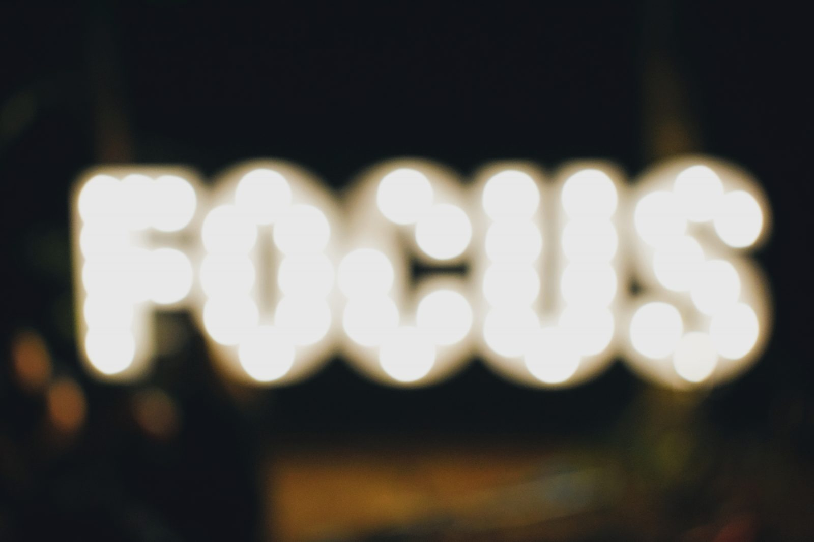
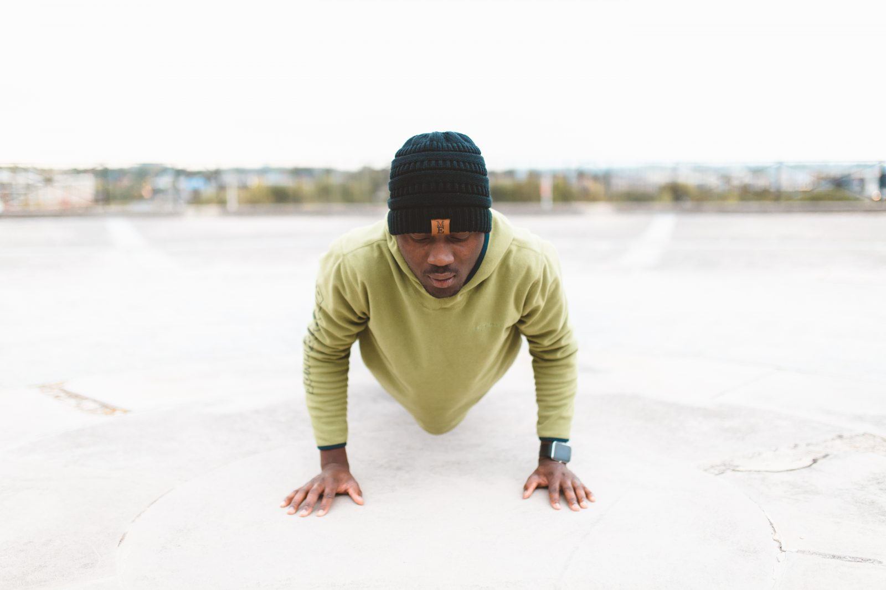
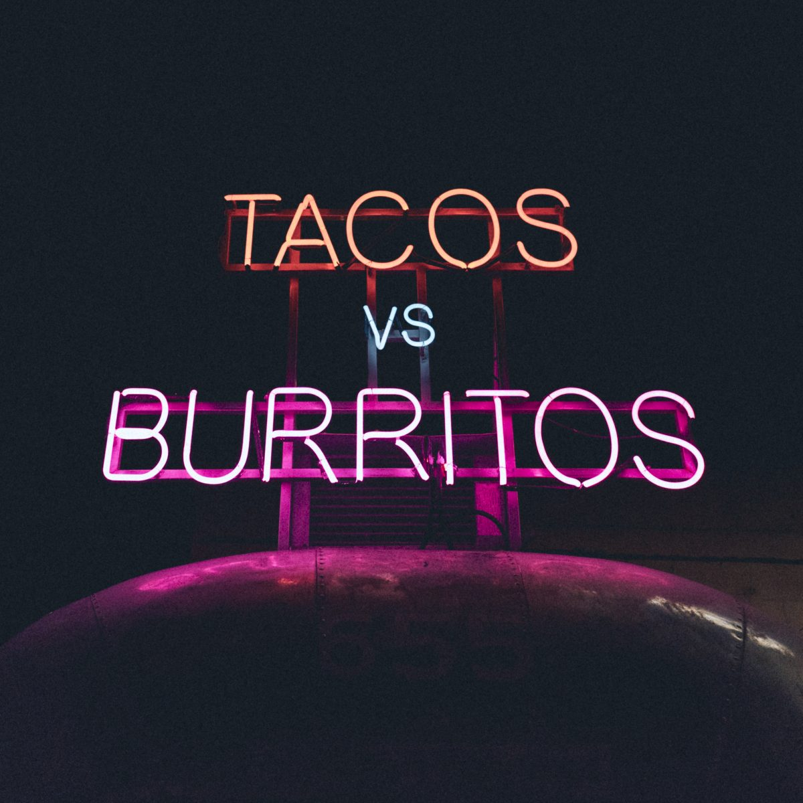

## Why and how I run. The first and I hope also the last post I write about it.

Running is hot. Or depending on who you ask cool, mindful, healthy or all of the above. For me it's just the easiest and cheapest way of working out. And I love running, because I can do it anywhere, I can choose to go far or fast and I can do it alone.

I love swimming too, but as I don't have a big pool at my house (yet), I had to go to a public pool. In my holidays that was fine, I could go in the morning or before dinner time. But if I had to go in the evening, the bath was so crowded, swimming at my pace was almost impossible.

But back to running. For me running has two big advantages over swimming:

1. I can **easily overtake** slower runners (try overtaking two blabbing women in a dual way swimming lane)
2. I don't have to **go somewhere** before I can even start my workout.

There is just one thing I don't like about running. It's the fact that it's so easy to do. Which means people **run for fun** and people who have **never ran a mile** in their life can start training for a marathon overnight.

The first group kind of forgets that there are also people who really run. With that I mean, they don't just finish a race, but they will actually be sad and disappointed when they don't reach their goal: **a fast time**. Every fast runner knows what I mean here. You have to run the first kilometer(s) zigzagging, walking next to the course and jumping up and down sidewalks just to get around the first group.

The second group just annoys me because they think they are superior runners; "people who really go deep". Yeah whatever.

## What is that with the (half) marathon?

Before I go into a rant, I think I have to explain myself about marathon runners. I'm not talking about the real runners here. People who set a goal for themselves, like 'I'm going to finish within 3 hours (or 3,5 or 4)'. You don't have to be a pro, but you know, it's a workout, not a walk in the park.

But I'm talking about people, who as their new years resolution (or any other arbitrary date like I'm turning 29 or 41 now) go into full training mode, to 'complete' their first marathon. That's just plain silly. Why the hell would you do that? Your body needs time to get used to running in the first place, but within a year you never reach a moment your body is ready for a marathon. Strictly speaking, your body (also that of pros) will never be 'ready' for a marathon.

Anyway, everybody can choose to run as far and fast as they like. I choose to do 10 km runs and a [15 km](http://www.nnzevenheuvelenloop.nl/) at the end of the season. What I hate is that I'm the one who has to defend that choice. "Why aren't you doing a half marathon?" As if that is **the only** distance that matters. So me, who runs for 6 years straight now has to defend himself?

## Speed vs distance

I like speed. I love it when I finish a certain distance faster than (ever) before. That's why I keep running. I'm still improving my speed and I know there is still room for more improvement. I'm not running to finish a certain distance. If I have to go somewhere far, I prefer other forms of transport.

Distance just isn't my thing. While training for the 15 km race, I have to do a few 12-14 km runs. I know it's needed, to get my muscles and body used to it. I also do it, to build up confidence. If I can run 13 or 14 km without issues, the 15 km race won't be a problem. Still I really dread those training runs. They are sooooo boring.

I can feel my body shifting it's internal pace twice during long runs. The first time between 10 and 15 minutes. I know because that's a hard bit. I feel out of breath, but once I'm through I can run "effortlessly" right up to about 30–35 minutes. There the same thing happens, I'm out of breath, but this time I feel like "what the hell are you doing, just stop already". But again, as long as i keep going, I will get through and I can almost go as long as I want.

But why should I? In this phase I have to slow down so I can't run my desired pace. This means I don't need my hyper focus to keep my breathing and stride under control. So I get bored. I'm looking around, counting down the kilometers I still have to do. The only exception is in that 15k race. I have the clock there and I go deep as it's the last run of the season. No worries if I'm sore on the couch for a few weeks.

## I'm not a pro

Back to the fun runners. For me running is not only fun. It is hard work. To get the finishing times I want, I have to train also when it rains or when it's cold. I have to push myself, also when I'm out of breath or when I feel I can't go any further. For me that's a pure mental game. I have to admit, I'm stubborn already, but running and pushing myself makes me even more resilient and strong mentally.

I won't tell you how to train. I also won't tell you my training is superior or my way of running is the way it should be. I can't, because I'm not a pro. That also means I don't train 4–5 times a week. I plainly don't have the time to do that. I have a full-time job and my own company. So when somebody says I can also run a (half) marathon, I just need to train more often….get lost (yes that's you [Runtastic](https://medium.com/@runtastic), why do you think we are all pros?).

## My goals

Damn, I did go into a rant anyway. Oh well, it feels good :). As said I run for myself and don't like to brag about it. But when you complain you have to be transparent and open too. If not for the people who disagree, than at least for everybody who has the same goals and philosophy about running.

Unfortunately I sometimes see people asking questions on how to improve their 10k and getting comments like "you're already fast enough" or "do interval" or "just enjoy the run". Common, what do they have to do with that?

So just so everybody knows what I'm talking about when I say speed. My goals for this year are doing 10 km around 41 minutes (2 min faster) and 15 km around 1:04 (1.5 min faster). Definitely not pro-times, but faster than average. I hope, with this, I can inspire everybody who is also trying to improve their 10k (and elsewhere hit a brick wall) to read on and share their results and ideas.

## Training

I struggled for years to find a training scheme that helps me achieve my goals. I started with just running as long and fast as I could. My body thought that was a very bad idea and forced me to stop (chin splints, twice). I than started at the very basic level: 6 times a minute, 5 times 2 min, etc. Progress was excruciatingly slow, but after 8 weeks I managed 20 minutes without pain.

During this training I started using my (still) favorite running app (Adidas Micoach). It isn't around anymore as Adidas bought Runtastic and kindly asked all Micoach users to migrate. Runtastic is also a good app, but the **interval training** functionality and build in **training schedules** of Micoach were superior.

Runtastic thinks everybody is a full time marathon runner. When you want a training schedule they think you have time and motivation to go 5 days a week. Unmanageable for me, so I 'devised' my own training plan. More on that later.

### What is interval training

But first, what is interval training? The holy grail according to a lot of runners. But seriously, it's a form of training, where you run at different speeds. For example: 2 minutes slow, 2 minutes normal, 2 minutes fast, repeat 5 times. It's the opposite of just start and see (continuous training).

The main advantage of interval training is it should get you progress more quickly. And it seems to be even more healthy than 'normal' training. Well, I'm not going into detail here. If you want to know more, just go to any running site, Google it or check it out on Wikipedia:

- [Continuous training](https://en.wikipedia.org/wiki/Continuous_training)
- [Interval training](https://en.wikipedia.org/wiki/Interval_training)
- [High intensity interval training](https://en.wikipedia.org/wiki/High-intensity_interval_training)

## This is what works for me

Now that all the frustration is out and I hope I got a chance to explain myself, let me share what works for me. Again, everybody is different and has different goals when running. This is specific for me to get to my 10k and 15k goals.

### Run consistently. Twice a week, 1 interval, 1 endurance.

I try to run twice a week consistently. That means also when I'm tired, had a drink (too much) the night before or when I'm on a vacation or business trip. When it rains, freezes or when it's soaring hot (for Dutchies &gt;25 Celsius is hot). I have to admit, I hate running in the dark. So I kind of have a winter break between November and March. I try to run once in the weekends during the day, but when it has snowed….I'm out.

In my running season I do one interval training and one endurance (or continuous) training a week. I would like to add a second interval, but I'm kind of out of time. To 'compensate' I try to do [bodyweight exercises](https://homegym101.com/bodyweight-exercises-at-home/) with my girlfriend in our living once or twice a week (that sounds way kinkier than it actually is). They help make me stronger, so running fast feels much easier.

For me the standard interval schedules don't work. You really have to train more often per week. So I modified them to work for me. I see interval training mainly as a way to run my distance faster. So I cut up my distance in fast and slow intervals and along the weeks decrease the slow bits and increase the fast bits. In the beginning I'm running fast 50% of the time, at the end 100%.

To see where I stand, my second run in the week is at a steady pace. At the start of the season I'm happy to run 4 km in one go and 5–6 km in total. Every week I try to increase that 4 km by 500 meters. So I steadily build up distance and speed.

### Don't eat or drink

This is a highly debated subject. Some people take multiple bottles of water with them, others need to eat something before they go and some even go before their breakfast.

For me one thing works best: eat energy rich food at least **two hours** before I have to run. It doesn't really matter if it's a peanut butter sandwich, a salmon pasta or some bananas as long as they contain carbohydrates. If I eat within two hours, I get stomach cramps.

The same with drinking. If I drink before I run, my stomach just kills me. So much I **have to** stop. So I drink plenty a few hours before my run. Not too much though, just one or two glasses of water or juice and an espresso.

On the other hand, I can't run when I'm hungry. So if I didn't get a chance to eat something at 4 at work, I can't run when I get home at 6. The only thing I can think of is foooood. So no way I can concentrate on my running technique, my breathing, etc. The only thing I can think of is food is still 30–60 minutes away, noooooo.

### Alone with my music

I'm not running to socialize. Running for me is a way to finally **not** have to talk to people. So you will never see me run with a running group. I used to ran with friends and it can keep you motivated or push you to go faster, but they will never run at your pace. I'm a lone runner and I love it.

I'm also not in it to show off or get compliments. You won't find me posting my training schedules, times and accomplishments on Facebook or Instagram. That's why I hope this will be my last post about running. I run for myself, for my own goals and for my own health. I get satisfaction of the run and achievement itself, not of the cheers.

By the way, after 6-7 km I don't see or hear any cheers when I'm running a race. I'm so into the act of running and battling with myself, pushing myself to keep going at my race pace, that everything around me is a blur. So no, I won't high-five you (why the hell do you deserve a high five anyway, you're just standing there).

And last but not least. When I run alone, I can put on **my** music. Not the party music for the crowd, the brass band or the ever present, fucking drumband. Wooow, there I go again.

When I run, I put on my headphones (earplugs actually), with some drum and bass. I already love drum &amp; bass, but for running it's brilliant. The 170 beats per minute fit my stride perfectly, so I can keep a steady pace by just hitting the ground at every beat. I don't have hard numbers, but my running pace definitely improves when I'm listening to drum &amp; bass.

Three Spotify drum &amp; bass playlist for your convenience 🙂

    <iframe allow="encrypted-media" allowtransparency="true" frameborder="0" height="380" src="https://open.spotify.com/embed/playlist/34MCkIYbevQQ1uPzJp1bjR?si=BKKt_IthRseoK7zIRZJvRA" title="Spotify Embed: Running drum &amp; bass" width="300"></iframe>

    <iframe allow="encrypted-media" allowtransparency="true" frameborder="0" height="380" src="https://open.spotify.com/embed/playlist/37i9dQZF1DX8jnAPF7Iiqp?si=ofT-Iae-RTqY9KcWuHSy1g" title="Spotify Embed: Run 'N' Bass 170-175 BPM" width="300"></iframe>

    <iframe allow="encrypted-media" allowtransparency="true" frameborder="0" height="380" src="https://open.spotify.com/embed/playlist/37i9dQZF1DXcCEH5EfTtzp?si=T1qDxeTDQ0uSPztBE27llg" title="Spotify Embed: Lactic Acid Run 175 BPM" width="300"></iframe>

### Warm up and cool down

When I was younger (low 20-ish) I never warmed up before exercising. It wasn't naivety only, I really didn't need it. Or at least, it didn't get me hurt. Now, I have to warm up. I do some basic dynamic stretching routine: 2x 20 leg swings (20 left, 20 right), rotate both of my arms 20x forward and 20x backwards and do 20 (or 40 depending on how you count) [high knees](https://www.livestrong.com/article/195318-high-knee-exercises/).

Afterwards I try to walk at least 5 minutes and at home do stretches. It's a 15–20 minute routine I started when I got some hamstring and back/shoulder issues. Learning the hamstring tension might be linked to having shorter than average hamstring sinews, I put together a stretch or yoga routine from exercises I found on Pinterest. Which also features the shoulder stretches I learned from my physiotherapist.

## Thanks

So, I still hope this will be my only post about me running. I might say something about running and music or running and mental health in the future. But you won't see any of my runs, times or maps.

I don't care if you run fast or slow. A short distance or far. Everybody has their own goals. And you made it this far down my blogpost, so you definitely have endurance 😉

I just hope I motivated everybody who is trying to complete a 10 or 15 k as fast as possible. It's not only the marathon or the 100 meter sprint that are "important". I think 'our' distance is the perfect blend between speed and endurance. Go for it and I hope you will share your thoughts, techniques and motivation.