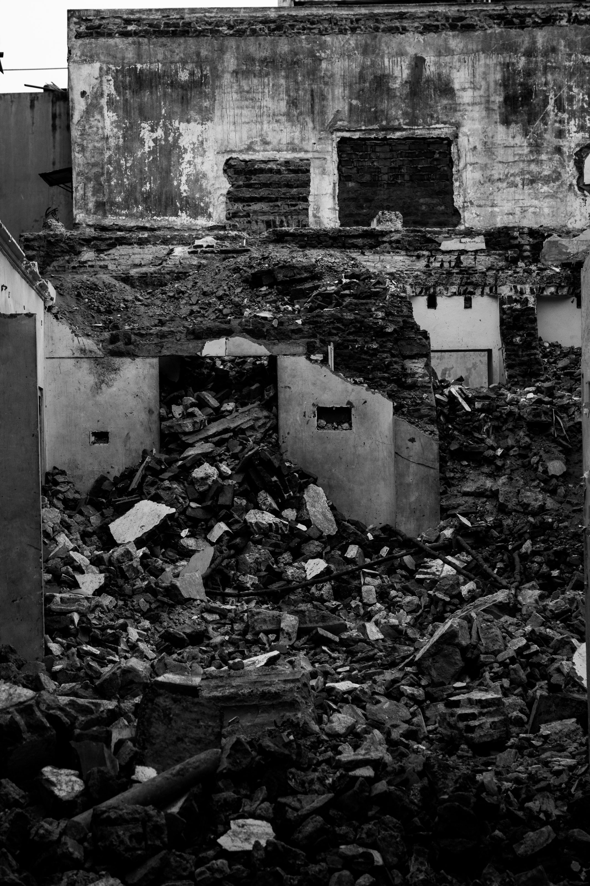
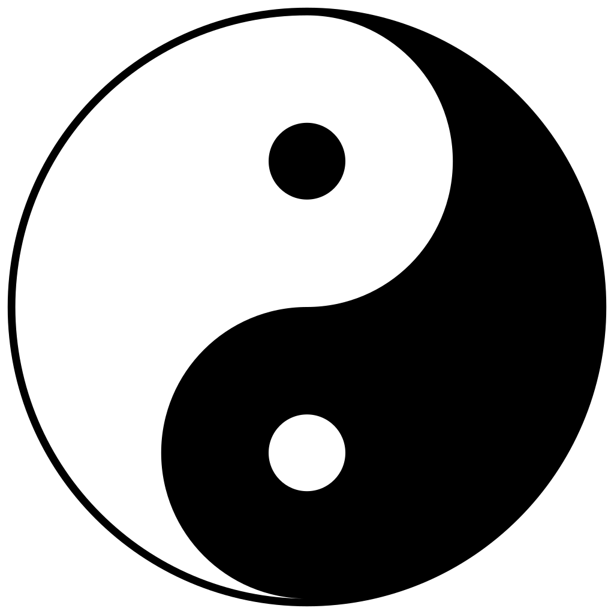

I recently turned 35. Normally that would be nothing special were it not for all the things that happened in my 35th year. It was a year that shook me to the core and made me reevaluate everything I thought was good and normal. I had to tear down my house to be able to redo my foundation. And that is fucking hard.

I'm totally exposed. It's cold without walls. Wet without a roof. And everybody can actually see me, when I'm not hiding in the basement. But that's ok. You can build a bigger and more beautiful house on top of a better foundation.

That all might sound abstract and woolly to you and it is. So let me give you an example.

## Birthday party

"You just had your birthday, how was the party?" Well, I didn't have one. I never really understood why people celebrated their birthdays either. To me it is just another day. Why all the fuzz?

I did celebrate it when I was younger, but mostly I did that because I thought it was expected of me. As a child you get presents, which is nice en later on your friends gather for a drink and a laugh, which can also be fun. But thinking about it, I never really wanted to be the birthday boy. I didn't like the attention as a child. And as a late adolescent and adult, well, the alcohol helped.

So some years ago I decided to skip hosting a birthday party and have done so ever since. I always felt guilty about it and didn't know why. But in the end, I liked having a quiet day and not having a hangover. So this year I decided to stop feeling guilty about how I wanted to celebrate my birthday.

## No bullshitting myself

I always thought I was a wise and emphatic thinker, but I wasn't really. It wasn't until this year that I actually started to think about things for real. Without bullshitting myself, without putting blame and judgement on others and without lying to myself to make me feel good. Why do I feel guilty? Why don't I want a party? Why do other people do like it? Am I weird?

As soon as I started doing that, there was no end. Almost everything I thought I knew for sure, I actually didn't know at all. And the whole house, which I thought was very well built, came down like a house of cards.

I don't have all the answers by far, because at the moment it's a complete mess. I'm trying to clean it up, but it's a big pile of bricks right now. Every brick needs to be picked up, examined and thrown away or kept. It's a painfully slow process.

Was it fair the way I treated my girlfriend? Am I really doing what is necessary to build a successful business? Am I putting enough effort in my relationships with friends and family? Why are they my friends? What are my politics and why? How did my past and childhood influence who I am today? How do I want to be remembered and am I doing what is needed to get that legacy?

Without bullshitting, the answers are: no, no, no, don't know, don't know because I always followed my bubble, don't know, I have no fucking clue.

## What now

I had so many questions and I didn't know what to do, because I didn't know what was right or wrong anymore. Normally I would discuss it with my girlfriend but her house has come down too. So I did something I never did before: I asked my friends for help.

It was the first time ever I let myself be completely vulnerable, which was fucking scary. But what was the worst that could happen? The house was down anyway.

It was also the first time I realized what it meant to have friends. I reached out to 4 people and all of them offered their help without any hesitation. Somehow I never thought I deserved something like that or something. I don't know. And in the mess I was in or because I let myself be vulnerable, it made me cry.

That was something I didn't know I could do anymore. The last time I cried (or can remember) I was 13 years old and a bully caught me completely off guard. Anyhow, somehow I told myself that I was not someone who did it.

## Metaphors

Through talking with these friends, I found a few stones that are still true for me. It's not much, but enough to start building from. What helped me was finding some words for my feelings and emotions and describing the situation using metaphors. These metaphors really help me return to my core and foundation when I feel like getting lost again.

The first is the title of this post: tearing down the house. It perfectly describes what happened and what state I'm in.

The second I got from one of these super friends: "Everyone finds stones and rocks on their road, but not all of those stones and rocks are yours. Examine them one by one and only clean up yours. All the others you can put to the side of your road."

A third one comes from Will Smith. Roughly paraphrased: I'm not building a house, I'm laying one brick at a time. Which makes it so much easier to focus on the current problem, instead of getting paralyzed by the immense amount of problems left.

<YouTube youTubeId="kk0oYY4zdAo" />

A fourth metaphor I got through other people from Albert Einstein: "The definition of insanity is doing the same thing over and over again, but expecting different results." If I don't work on my foundation and just rebuild the same house, it will come down again eventually.

## 12 rules

But the one that made the most impact on me comes from Jordan Peterson in his book [12 rules for life](/books/12-rules-for-life). He explains how each one of us is constantly balancing order and chaos. These two sides of life are always there and you need both.

Balance is the key here as too much order means you're stuck. You're not learning anything new. While too much chaos means you can't be productive and contribute. You cannot help the people around you when you're in chaos.

I was always in order. Probably too much. That made me boring, stubborn and rigid. I couldn't have fun and couldn't admit I was wrong. But there is another twist that really made the need for balance clear for me.

Imagine the yin-yang symbol where the white "snake" represent order and the black snake chaos. The black eye of the white snake is the seed or origin of chaos within order. So although you can live a very ordered life, chaos is always lurking around the corner. It will probably pop up when least expect it and consume you because you weren't prepared. Check!

Now imagine the other side. Chaos is fun for a while, but only when you know how to get back to order. When you're thrown into chaos you have to find your way out. But being chaos, you never know if you're going in the right direction. The alternative of just wandering around is building little patches of order, the white eye, where you are. These little patches of order will eventually grow and turn into the order you need.

## Influential people

Last year I already started examining myself, my dreams, my goals. Looking back that wasn't really serious. It was carefully peeking over the fence into the chaos of my neighbors yard from my own ordered house. But in that time I start finding people that would eventually have a great impact on me.

It's the people that not only have a message that sounds good, but actually live it. Sure they complain to, but they always try to see if they can fix it themselves. Every time I see or hear them talk, they remind me to focus on me. What can I do? What do I want and need? Will that get me to where I want to be?

First there was [David Goggins](https://davidgoggins.com/) who told me to look at myself and be brutally honest. You can do much more than you think you can. Than there was [Dave Rubin](https://www.youtube.com/rubinreport) who challenged my political views and introduced me to [Jordan Peterson](https://www.jordanbpeterson.com/) who explained why you have to be brutally honest with yourself. Jordan also gave me the basic rules to start building my new patch of order.

## The end?

This is not the end of the road, it's just the beginning, but I feel I'm making some progress. Besides opening up to friends, I also stopped thinking writing stuff down or keeping a journal was stupid. I learned it was a way for my brain to protect itself from things it didn't wanted to hear.

I often lay awake at night ruminating about what happened and all the things I have to or want to do. Following Einsteins advice, I tried doing things differently. So I started writing the thoughts down that keep me awake. And it works! I tend to fall asleep shortly after, but more importantly, I actually feel better about it.

Somehow writing it down makes it more okay or something. So although this post might be badly written, incomprehensible or plain weird, it helps me turn my thoughts and emotions into words and in the process make sense of them. Getting some order in the chaos and build a new house.