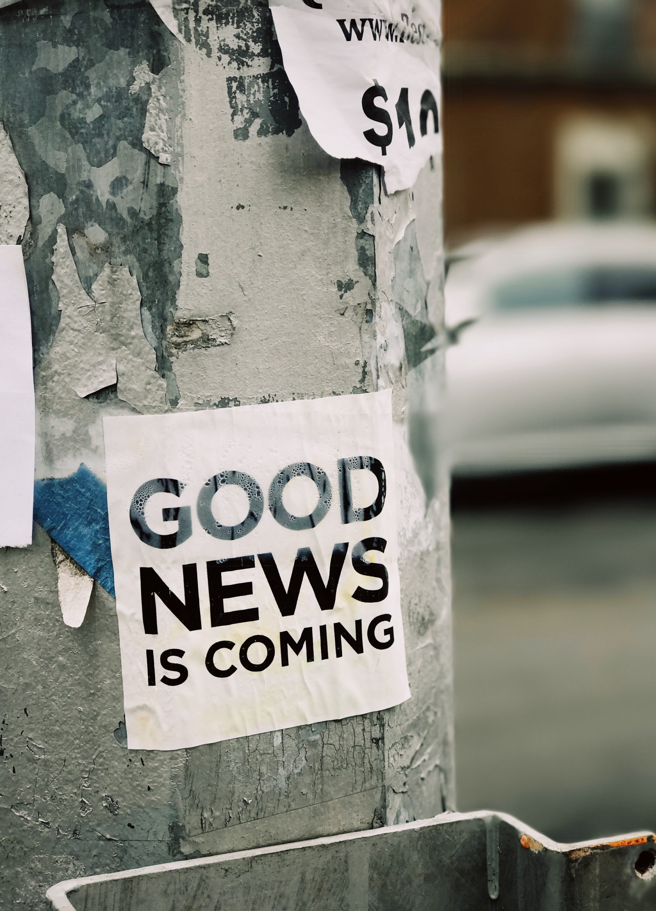

Six years ago in the spring of 2014 I decided to switch my internet subscription to another provider. It was also the moment that I made the decision to <u>not</u> add the TV-channel package (in the Netherlands internet and TV often come from the same company). I noticed I didn't watch TV anymore and at that time considered getting rid of the TV-subscription purely for the monetary savings.

About 1.5 years later I cancelled my newspaper subscription too. It always used to be a ritual on Saturdays; I got the paper from the mailbox, made some coffee and read it all afternoon. It was a moment of peace and learning. But in 2017 I noticed I was reading the paper less and less. I just couldn't motivate myself to read it anymore. It had become a shore instead of that moment of quiet introspection.

## Act it out before you understand it

When I cancelled those subscriptions years ago I didn't really know why, besides "this is a waste of money". Now though, all the pieces are coming together. I can see and start to understand why I did it back then. This is one of those examples that we humans often act out things before we know why. We just do it, because it feels right, or not even that. It's something ancient, subconscious, animal like thing inside of us that just makes us do it.

When I was in university I always felt it was "important" to follow the news, the talk shows about the news and to form an opinion about the news. That was my motivator for actually watching the news. To be able to talk about it and feel sophisticated. Then I got a job and had to get out of bed early in the morning, which forced me to skip watching the late night talk shows. I first blamed my boss for not allowing me to watch them, but I quickly learned that I didn't miss a thing. And instead of watching the evening news, I often opted for something more fun, like a movie or actually talking with friends or roommates.

I replaced the TV news with a Saturday newspaper. This kept my Saturday afternoons booked for a couple of years, until I started thinking about alternative life paths. I wasn't going to do this for the rest of my life was I? So when we seriously decided to start our own company, I had other, better things to do on my Saturdays. Things that actually gave me energy. The articles and especially the opinion pieces always made me angry, hopeless or sad. So why get myself in that state? On my free day even. A day that should be fun and reinvigorating.

## Explain it

The thing that comes to mind first when thinking about my TV-less and low-news years (I still get some news through YouTube and social media) is the difficulty other people have with understanding it. When I first tell them, I almost always have to explain myself. It is so alien to most people that somebody does not watch any TV. There are exceptions off course. For me it almost feels like I have to defend my choice of <u>not</u> watching TV. And you know, that's OK. I'm the exception here, so it's only fair I explain my choices.

What I still don't get though is that people not only don't understand it at first, but that the concept is apparently so alien, they can't remember it. Not watching TV is not an option any more in most peoples brains, so they can't store ‘watches TV = false' with my name. It staggering the amount of times that coworkers, friends and even family ask me if I have seen this or that last night/week/weekend/month. That's the most frustrating part to me, because we're back at explaining that I don't have a TV subscription.

Instead I would much rather discuss why I cancelled my subscriptions in the first place. Or discuss if I miss important conversations, facts or stories. We never get there and that's a shame. Because that question is not only relevant for news-less me, but also for my news-hungry opposites.

## The news is bad

By not having a TV or newspaper to consume the news with, I learned that you don't really miss anything important. If something really important happens, it will get to you. People will tell you in the end. I can't remember a single story I missed that would have changed my life for the better. All the stories that filter through by friends and family have proven to be minor stories that have no impact on my personal life.

This reminds me of [Mustrum Ridcully](https://wiki.lspace.org/mediawiki/Mustrum_Ridcully), a character in Terry Pratchett's' Discworld series, who "... *holds the view that if someone is still trying to explain something to him after about 2 minutes, it must be worth listening to, and if they give up earlier, it was not worth bothering him with in the first place.*" I identify with Ridcully in this stubbornness and think he has a point. In fact we can also apply this to the news: By not following the news, all minor issues, that are not worth getting distracted with, are ignored, but if a story is really important, it will be repeated and it will heard in the end.

That however doesn't make the news bad. The problem I have with this is that people seem to attribute too much value to the news. If the news was in fact a series of true stories, it would be just that, a series of unbiased stories. But that would be boring and people wouldn't watch it, except maybe a news-fetishist. Instead the media have to filter stories and look for the ones that make you watch, which are often stories that evoke an emotion. And by filtering they in effect tell you what is important (or at least what they want you to think of as important).

We forget that we only see what they want us to see and thus we might value the wrong things. That's why I think the news is bad. And that is what I now think (hindsight bias noted) is the reason I cancelled my TV and newspaper. I think somehow my subconscious already knew this, but couldn't put it into words. So instead it made me ‘feel' like I had to do it. Today I still can't articulate it fully, but this post is a first attempt.

Off course the media try to balance those emotional stories with actual news. At least that's what they used to do. I don't know if it was because I was younger or that the media have changed, but the balance has shifted dangerously towards the emotional side. This is not something from a "non-newser". Years ago I read "[The News: A User's Manual](https://www.goodreads.com/book/show/18282869-the-news)" by Alain de Botton, and while I have to read it again, this was, I think, one of the points he makes in that book.

## The news is evil

The news already was biased, you cannot be unbiased when you use a filter, but lately it has become extremely biased. Every news channel or program nowadays doesn't only filter their stories, but they also cover the stories in their particular way. I first thought that only happened in the US, but the media in The Netherlands are just as bad. I just have much less examples and American news is much more present on social media.

Nowadays the media doesn't only decide what stories you should find important. They also force you how to think about them. Apparently you can't form your own opinion based on the facts they decide to show you. They now deliver those "facts" with a ready-made opinion for you. Very convenient, you don't have to think for yourself anymore! I find that repulsive. By framing facts in a certain way, by selectively leaving things out and by overstating small parts of the whole, they force their view, their reality upon us. And this happens on all sides. The system somehow wants to [keep everything in balance](/our-emotional-seesaw/).

The media twists every story so that it fits a certain narrative, e.g. "Trump is bad". After all these years of tweaking and researching what stories appeal to us, they have found a way of keeping us in a constant state of arousal and anxiety. They are not providing facts and telling the truth anymore. Instead they play on our emotions so we keep coming back for more. I think that is evil. We have as a consequence locked ourselves up in our bubbles because after being riled up by the news, we have no energy left to hear the other side.

## How do I know

After years of having no TV, no newspaper and no social media I've gotten out of touch with what was considered news and what was actually happening. I opened my social accounts because I started my own business and it's a great place to connect with (potential) customers. Now three years later I see how often Facebook, Instagram and YouTube suck me in. It's somehow so addictive. And I hate it. I always come out cranky, angry and anxious. Not because of the actual facts I read, but because of the endless amount of hypocrisy, misinterpretations and misrepresentations.

Most of the outrage is completely out of proportion and often even misinformed. I'll give you some examples below this post. The media, journalists, used to have a principle: audi alteram partem (lit. hear the other side too) and they have thrown the baby out with the bath water. As soon as the media hears or sees something it is presented as the truth. Where the honorable thing to do would be to wait, get all the facts from all sides and present the full story and then let the viewer form their own opinions or conclusions. That however is considered suicide, as a news outlet doesn't want the competition to be the first to report it.

As consumers of the news, we have been trained to say, report and believe everything we hear at face value. We are not expected to really think, be skeptical and investigate anymore. I'm not exempt from this at all. My first reaction is always emotional. I have to force myself not to react instantly and write an angry comment. Only then can I start to look at it more rationally and often find my emotions were misguided.

We have lost the art of listening to what the other person actually says and we don't ask what the other person actually means. We only assume he means what we want to hear. And with that, we have lost a valuable way of living together peacefully. That is the evil of the news and media.

* * *

## Examples

### Trump says (Charlottesville) white supremacists are "fine people"

Well, not really. He said:

*"Excuse me, they didn't put themselves down as neo-Nazis, and you had some very bad people in that group. But you also had people that were very fine people on both sides. You had people in that group – excuse me, excuse me, I saw the same pictures you did. You had people in that group that were there to protest the taking down of, to them, a very, very important statue and the renaming of a park from Robert E. Lee to another name."*

*"I'm not talking about the neo-Nazis and white nationalists because they should be condemned totally."*

*"Racism is evil, and those who cause violence in its name are criminals and thugs, including the KKK, neo-Nazis, white supremacists, and other hate groups that are repugnant to everything we hold dear as Americans."*

> * Source (a CNN contributor): [https://www.realclearpolitics.com/articles/2019/03/21/trump\_didnt\_call\_neo-nazis\_fine\_people\_heres\_proof\_139815.html](https://www.realclearpolitics.com/articles/2019/03/21/trump_didnt_call_neo-nazis_fine_people_heres_proof_139815.html)  
> * Also just go onto YouTube and watch the full clips (3) or read the full transcript here: [https://www.politifact.com/article/2019/apr/26/context-trumps-very-fine-people-both-sides-remarks/](https://www.politifact.com/article/2019/apr/26/context-trumps-very-fine-people-both-sides-remarks/)

### Trump says drinking hand sanitizer treats Covid-19.

There are two sides to this story that are misrepresented. First he didn't say people should drink or inject hand sanitizer. Maybe a press conference isn't the place, but to me he seemed to be brainstorming some ideas: Something kills the virus, but also the body... hmm, isn't there a way to get it to kill the virus but not the body?

Second, when people were hospitalized or even died after drinking hand sanitizer, Trump was blamed for it. But the stories I read were about alcoholics drinking it for the alcohol, not against Covid. Something that isn't new too.

*"So, a question some of you are probably thinking of if your are totally into that world, which I find to be very interesting."*

*"So, supposing we hit the body with tremendous, I don't know if it's ultraviolet or very powerful light, and I think you said that has been checked but your'e going to test it."*

*"Then I said what it if you brought the light inside of the body which you could do either through the skin or some other way and I think you said you were going to test that, too, sounds interesting."*

*"Then I see the disinfectant, one minute. Is there a way we can do something like that, by injection inside, or almost a cleaning. Because you see it gets in the lungs and it does a tremendous number on the lungs. So it'd be interesting to check that so that you'll have to use medical doctors with. But it sounds interesting to me. So we'll see, but the whole concept of the light, where it goes in one minute. That's pretty powerful."*

*"Not cleaning through injection. Almost a cleaning, sterilization of an area. Maybe it works, maybe it doesn't work. But it certainly has a big effect if it's on a stationary object."*

> Source: almost any non-clipped video on YouTube of this press conference.

### Trump achieves "Peace in the middle-east"?

I don't know anything about this (I watch no news). So if this is indeed a victory I don't know. I'm so skeptical and cynical about the media now that because they don't or barely cover it, it probably is true. They so hate Trump they won't acknowledge any good coming from him.

> * [https://thefederalist.com/2020/08/19/what-corporate-media-wont-tell-you-about-trumps-historic-middle-east-peace-deal/](https://thefederalist.com/2020/08/19/what-corporate-media-wont-tell-you-about-trumps-historic-middle-east-peace-deal/)
> * [https://www.foxnews.com/politics/trump-israel-uae-peace-agreement](https://www.foxnews.com/politics/trump-israel-uae-peace-agreement)
> * [https://www.thegatewaypundit.com/2020/08/\_\_trashed-32/](https://www.thegatewaypundit.com/2020/08/__trashed-32/)

### White supremacist Richard Spencer endorses Joe Biden for president

> * [https://thefederalist.com/2020/08/24/white-supremacist-who-organized-charlottesville-race-riots-endorses-joe-biden/](https://thefederalist.com/2020/08/24/white-supremacist-who-organized-charlottesville-race-riots-endorses-joe-biden/)
> * [https://www.newsweek.com/richard-spencer-joe-biden-trump-maga-1527141](https://www.newsweek.com/richard-spencer-joe-biden-trump-maga-1527141)

### 94% of Americans who died from COVID-19 had contributing conditions: CDC

Enough about Trump. What about Covid? Apparently a lot of people already or also have other contributing illnesses. That's not saying they didn't die of Covid, but it's saying that you have a bigger chance of dying when you're already sick. Pretty obvious to me. Again the facts in and of itself are not surprising. What is surprising and worrying is the fact that Twitter banned sharing it.

> [https://www.webmd.com/lung/news/20200901/covid-19-primary-not-only-cause-94-percent-of-deaths](https://www.webmd.com/lung/news/20200901/covid-19-primary-not-only-cause-94-percent-of-deaths)

### COVID-19 Lockdowns Over 10 Times More Deadly Than Pandemic Itself

This one was hard to find, but eventually I got it.

> [https://www.revolver.news/2020/08/study-covid-19-lockdowns-deadlier-than-pandemic-itself/](https://www.revolver.news/2020/08/study-covid-19-lockdowns-deadlier-than-pandemic-itself/)

### The COVID-19 shutdown will cost Americans millions of years of life

> [https://thehill.com/opinion/healthcare/499394-the-covid-19-shutdown-will-cost-americans-millions-of-years-of-life](https://thehill.com/opinion/healthcare/499394-the-covid-19-shutdown-will-cost-americans-millions-of-years-of-life)

### How many years of life did lockdown save – or destroy?

> [https://www.spectator.co.uk/article/how-many-years-of-life-did-lockdown-save-or-destroy-](https://www.spectator.co.uk/article/how-many-years-of-life-did-lockdown-save-or-destroy-)

### BLM?

Why don't we hear the media tell and show us that all these black people being shot by police are resisting arrest or even assaulting the officers? Some of them even pull guns on the police. Just Google/YouTube it. The videos are there to be watched.

Or the other way around. Why don't we show that a white kid was cleaning a statue and guarding a business where he got a gun to defend himself? Why do we immediately say he was there to kill protesters while it might have been the other way around.

We have to look at it from both sides before we judge. We shouldn't block people from telling their truth.

> [https://www.breitbart.com/tech/2020/09/04/twitter-locks-account-of-kyle-rittenhouses-attorney-john-pierce/](https://www.breitbart.com/tech/2020/09/04/twitter-locks-account-of-kyle-rittenhouses-attorney-john-pierce/)

Another question: Why does Facebook block links to the documents about Breonna Taylor's case? If she is innocent, than why block the official police report? 

> [https://tatumreport.com/?p=9015](https://tatumreport.com/?p=9015)

### California Legislature Passes Bill Reducing Penalties for Oral, Anal Sex with Willing Children

Why do I have to get this news from Breitbart of all sources. I thought they were white nationalists. Well if they are, they have a point here. Why isn't the mainstream media talking about this?

> [https://www.breitbart.com/politics/2020/09/03/california-legislature-passes-bill-reduce-penalties-oral-anal-sex-willing-children/](https://www.breitbart.com/politics/2020/09/03/california-legislature-passes-bill-reduce-penalties-oral-anal-sex-willing-children/)