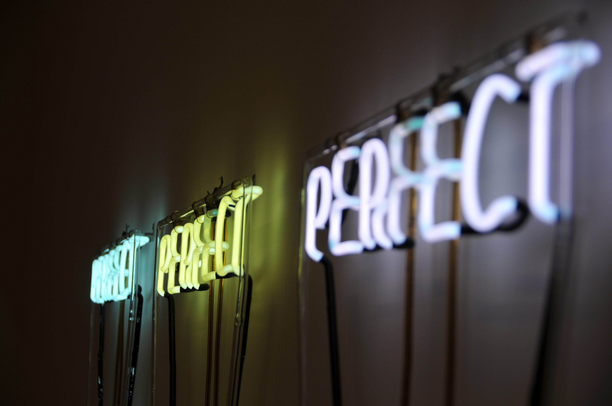
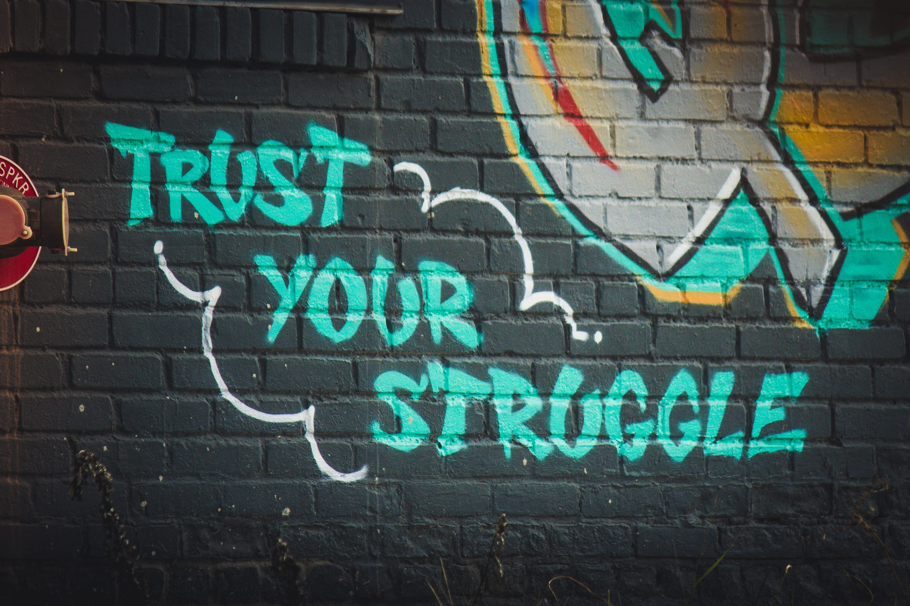

## Good is good enough, and it isn't

I'm a perfectionist. I struggle with releasing something into the world without looking at it from a million angles. Although I rationally know perfection is useless and too time-consuming, emotionally I can't let it go (yet). What if someone sees I forgot something obvious. It's something that I hoped to find advice on from wise people, who thought it through. But this made it even more distressing. There seem to be two views that are complete opposites:

1. You have to try to approach perfection, otherwise you get lazy.
2. Perfection is an illusion, so don't bother. Good enough is fine. Good is good enough.

And that's not even the end of that. In the end, this is what I made of it: If you want to be successful, you have to strive for something better, but you also have to keep moving. So you have to strive for perfection, but not too long. Perfection is a utopia that will never be reached, but you have to try.

## Frustrations

I'm struggling with this lately. Where is the line? When should I try to perfect something and when should I let it go? The biggest frustrations for me come with the marketing I (try to) do for [jodiBooks](https://www.jodibooks.com). I'm trained as an engineer and I'm not at all creative in the sense that I can draw or write or take pictures. At least, I think of myself I can't. It's not that I'm not creative and don't have any ideas, but I have no idea how to actually crystallize my ideas. How do I make that picture? How do I make that Instagram post? How do I write that copy?

Again, rationally I know I have to learn and practice how to do those things. I know I will be better in the future, as long as I accept now that I'm learning. And I know I definitely should not strive for perfection. I just have to do it.

## Running for ideas

This weekend during a run a thought popped up. Funny how that often happens at moments when you least expect it. Walking and running works wonders for me, but that's a story for another time. Over the years I definitely and measurably improved my running skills. I know, because I've tracked all my runs with my smartphone.

I know I said I'd [never talk about running](/running-for-me/) again, but bear with me here. I'm not bringing this up because I want to boast about my running skills. I don't even consider myself a great or even a perfect runner; the winner of the [Zevenheuvelenloop](http://www.zevenheuvelenloop.nl/) did it in 41:05, that's 19 minutes or 32% faster than me. The way I experience running is just a great example to explain my point here.

. The first runs weren't even a full runs. I did intervals of 1-2 minutes running followed by a few minutes of actual walking.")

If that's not enough proof, I participated in the "[Zevenheuvelenloop](http://www.zevenheuvelenloop.nl)" in Nijmegen 5 times now. In that 15 kilometer run, my time was tracked by calibrated clocks, last few editions every kilometer (brings out the geek in me).

    <table class="table table-striped">
        <thead>
            <tr>
                <th>Year</th>
                <th>Tme</th>
                <th>Avg. speed</th>
            </tr>
        </thead>
        <tbody>
            <tr>
                <td><NewTabLink text='2013' href='https://www.nnzevenheuvelenloop.nl/uitslagen/2013/static/webrepalfa15k_67.html'/></td>
                <td>1:09:25</td><td>13.0 km/h</td>
            </tr>
            <tr>
                <td><NewTabLink text='2014' href='https://evenementen.uitslagen.nl/2014/zevenheuvelenloop/'/></td>
                <td>1:08:29</td>
                <td>13.1 km/h </td>
            </tr>
            <tr>
                <td><NewTabLink text='2016' href='https://evenementen.uitslagen.nl/2016/zevenheuvelenloop/'/></td>
                <td>1:09:10</td>
                <td>13.0 km/h </td>
            </tr>
            <tr>
                <td><NewTabLink text='2017' href='https://evenementen.uitslagen.nl/2017/zevenheuvelenloop/'/></td>
                <td>1:05:15</td>
                <td>13.8 km/h </td>
            </tr>
            <tr>
                <td><NewTabLink text='2018' href='https://evenementen.uitslagen.nl/2018/zevenheuvelenloop/'/></td>
                <td>1:00:58</td>
                <td>14,8 km/h</td>
            </tr>
        </tbody>
    </table>

Last edition was a real surprise and eye-opener. I thought the 1:05 from the previous year was an awesome time, a lucky one-off even. So I basically trained to run another 1:05 and was right on track the weeks before. I joked to Diana and later to my running mate David that I had 6 years left (before turning 40) to run the race in under an hour. And then I actually almost did it!

I didn't enter the race with that time as a goal and during the race I was struggling a lot. It was tougher than I could remember from previous times, so I settled for "better luck next time". It was only when I entered the last part of the race, after the 6th hill (zeven heuvelen means 7 hills in Dutch), that I noticed that I was way ahead of my 1:05 schedule. I could "easily" finish with a time of 1:04 or even 1:03. So I let my worries go, focused on running and enjoyed (if you can call it that) the last 4 km.

## Running as a metaphor

By letting go of the goal and just going with the flow, I outperformed myself. I did way more than I thought I was capable of. For me this makes running a perfect metaphor for my struggles with marketing. When I enlist for a race, I set a goal that's ambitious, yet realistic. I start preparing by training, training and training, even if it hurts sometimes. It's a lonely process, but I love it. Eventually race day is there and the real struggle begins: the race.

Racing is always different than training, I don't yet fully understand why, but it's always tougher than I imagined. It's a real struggle and I often hear myself thinking: "What the hell are you doing? You could be doing something comfortable right now? Why are you doing this? What do you have to prove? And to who?

I always push through though, because I know, there will be a reward for me at the end, at the finish line. It is the personal victory. It's the victory over my own doubts and proving to myself that I can do things, especially hard things, that I didn't know I could do. I don't know how that works, but I actually feel invincible at that moment.

And that is exactly what I thought during my last "leisurely" training run. I might be struggling with marketing right now and the things I produce (right now) might not be as perfect as I want them to be. But that's OK. Because it's exactly the same voice in my head, questioning why the hell I'm running a race, that is now telling me I could also do something chill, instead of struggling over some Instagram pictures or a blog post. So yes, it will be hard and it will be tough, but I know at the end, I will amaze myself again, just as I do in my races.

## Align work with your values

So where does that leave us with my initial paradox: good is good enough, yet it isn't. Well this is something I thought about a lot lately. And the answer eventually made me quit my job.

In my job I needed to do things that were opposite to who I am and what I stand for. That just drains energy and eventually motivation. I still think you first have to work and try to fix the situation you're in. But working hard without slowly aligning your work with your internal values is not sustainable. I could have tried harder or changed my values, but I chose to leave. I wasn't willing to sacrifice more of my values, energy and health, risking the [things I find truly important](/the-ultimate-why-improve-things/).

So, working hard and striving for perfection only works if you have a clear goal to work towards. That goal has to be aligned with what you stand for. For me it's the dream of one day being able to make the life of millions or even billions of people easier and better. I'll only reach that goal if my daily work makes me feel I'm making progress in that direction. In the case of running: I can see I'm becoming faster or I'm able to run further every week.

I only work for a dream that is good, better or even perfect. Why should I care about good enough? Almost everything we have right now is good enough. It works, so why bother making it better? Well, by doing things only good enough, I will not challenge myself. I will not have to come out of my comfort zone and I won't learn anything new.

## Sacrifice

I hated some tasks I had to do in my job, but quitting that job doesn't mean I now only do the fun stuff. I think I now even do more things I hate to do, but it feels completely different. All the things I hate to do now have a purpose to get to where I want to be. And I "self-inflict" them. I now voluntarily go out of my comfort zone, because I see the purpose of doing those things.

To reach your dreams, you have to work for it. You have to sacrifice something now to help the future you get to where you want to be. That can be something small, like skipping one evening of Netflix a week and read a book, watch a documentary or a Ted talk instead. You might see something you fully disagree with, or you might not understand the true significance yet, but it will definitely broaden your perspective. I know, because that's how I started too (minus the Netflix, that didn't exist 10 years ago).

So, in sacrificing something you value now, which can be free weekends, parties, drinking with your friends, holidays or just chilling on the couch, but also a job or a believe you hold dearly, your future you will get better. The thing is, what should you do instead. Sacrificing something for doing nothing doesn't work. For me I know I'm doing something of value when it's hard, when I hate doing it at this moment, when I'm struggling. That means I'm learning something new and thus I'm improving myself, so future me will be a better person. A person that can make that dream come true.

To reach my goals I have to improve myself. I need to learn new skills and let go of beliefs I hold about myself that are holding me back. I have to let go of perfection and I have to believe I will be better at things I suck at now. I'm not saying that will be easy. I know for a fact it is very hard, because I'm doing it right now. In the end I'm working hard to achieve something I value. That something will definitely not be good enough, it will be close to perfection, but it will take an enormous amount of good enough steps to get there.

## Sources

#### Microbe and gut related:

- [Tim Spector](/the-diet-myth)
- [Emeran Mayer](https://www.goodreads.com/book/show/28837738-the-mind-gut-connection)
- [the gut stuff](https://en.wikipedia.org/wiki/Gut%E2%80%93brain_axis)
- [Gut-Brain axis](https://en.wikipedia.org/wiki/Gut%E2%80%93brain_axis)
- [Gut flora](https://en.wikipedia.org/wiki/Gut_flora)
- [Zoe](https://joinzoe.com/)

#### How to read scientific papers, what is cholesterol actually and what is ketosis.

- [Peter Attia](https://peterattiamd.com/articles/)

#### What's the science behind diets

- [Giles Yeo, Gene Eating](https://www.goodreads.com/en/book/show/41154735)