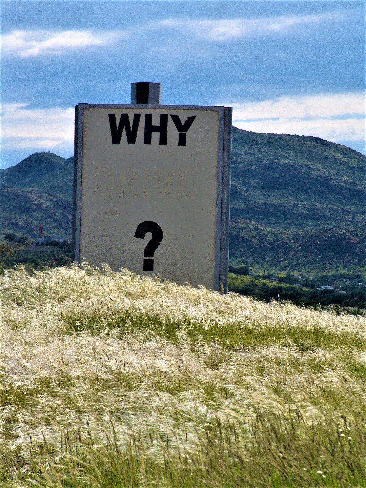
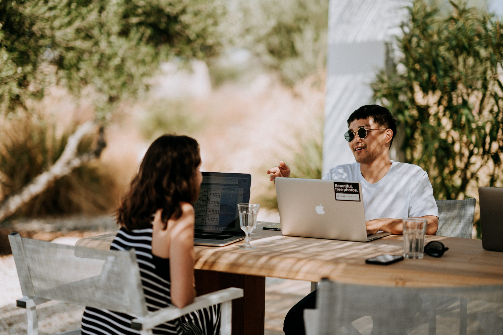
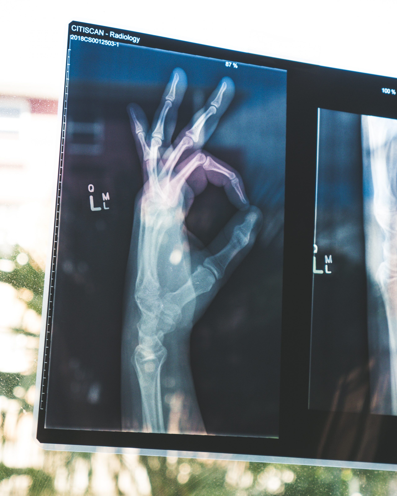

## I want to improve things

I want to [reach the year 2100](/my-goals-a-little-more-context-part-1/) in good health and shape. That's all well and good, but why? Apart from the fact that it's natural we don't want to die, there has to be something more that pushes me to this goal, right? It sounds really good as the ultimate goal, but I couldn't fully believe that I meant it. I have been thinking about this for some time now, but my brain has been too busy dealing with other stuff (more on that later).

This week, however, I slowly regained some mental capacity and it dawned on me. Getting old on itself is not the goal or mission. Yes, I want to be here for a long time, but not to play around and travel to every country in the world. I want to be here for as long as possible so I can improve as many things as possible.

### Selfish

At first this is a purely selfish need or desire. I can get so annoyed when people don't take the time or put in the effort to explain things properly. Or when people even make things harder than they need to be (jargon, unnecessary paperwork). I hate it even more when people don't listen.

Until recently my life was humming along pretty smoothly and all of just annoyed me. I never considered myself to be someone who would radically change his life or take risks. I've always been risk-averse and hated any level of confrontation, but at some point I realized that's not enough to change things.

Changing myself to accept risk and confrontation isn't easy. But it beats being unhappy and compliant by a long shot. This goes back to two things that happened to me (and us) lately:

1. A colleague of mine burned-out and I wasn't feeling happy too
2. Diana, my girlfriend got seriously sick

### Burn-out

My last job has always been demanding. As engineers we got a lot of freedom to come up with our own solutions, but there also was a lot of (sudden) pressure to get a lot of things done in an unreasonable short amount of time. Then in December, one of my colleagues collapsed and hasn't recovered yet. If I needed a wake-up call, this was it.

After I warned my manager, that I was very close to collapsing as well, it went pretty smoothly for about a month, but than Diana got really sick. Just as I was recovering a little from the pressures at work, something else pulled me back under again.

### Relationship troubles

Normally if someone is sick, like your partner, you try to care for them, console them and help them wherever you can. The hard part is listening and actually giving them what they actually need at that moment. That also happens to be the thing you can't do anymore when you're under pressure yourself. I can tell you now empirically, that not listening is not good for your relationship.

For us the initiator of our troubles were the symptoms Diana had. They were all really vague and they could be linked to a number of diseases. Diana already knew what she had as she describes [here](https://medium.com/@dianakoenraadt/what-every-woman-should-know-before-getting-sterilized-with-any-type-of-device-5c66d157198a), but she didn't have the actual proof. When I'm stressed, I emotionally shut down and go into rational survival mode. Meaning, my brain tries to spend as little energy on "guessing" someone else emotions and has my body only spend energy on things that have a proven result. I.e. minimizing my energy needs on external things, because my body needs it for something else.

We've seen many doctors and Diana had a lot of test done privately, but none believed her "perceived" illness. It was stress, irritable bowel, psychosomatic, but not the thing she actually had. Even I didn't believe it, because she couldn't proof it. In hindsight the stupidest thing I have ever done. I should have believed and supported her from the start, but was unable to do so.

### In hindsight

We're 2,5 months on from her operation and physically she's healthier than ever. However, mentally we are both still struggling with what happened. We've talked a lot about it together. We've seen a therapist together. And we're slowly getting closer and closer together again.

In looking back at the last half year, we're discovering some things about the relationships we have and about our own histories. Starting with the latter, we both never learned at home how to deal with situations like this. For me, I never learned how to deal with emotions or even how to recognize them. During my childhood I learned to be a fixer. If someone is sad or frustrated, I will try to fix it. That also makes me look after other people, while neglecting my own needs.

For the former, I learned I don't have the relationships, with family or friends, to discuss these kind of things with. Normally when I'm upset, I discuss it with Diana. That wasn't possible in this case and I had no one to fall back on. I don't know if it's the people or that I should have been more explicit, stating my needs. I lean to the former as a handful of people have asked me if I was doing okay. Interestingly most of those were having some sort of trouble themselves.

But the thing that upsets me the most is that not a single doctor took the time to actually listen. Even now, after things have cooled down and Diana is physically okay, they still don't believe her. That's just shocking.

## Me first

What I learned from this -I think it's safe to call it a little crisis- is I have to radically choose for myself from now on. To be able to help others, you have to first be strong and healthy yourself first. I couldn't help Diana, as I wasn't healthy myself. So that's what I did, I radically choose me.

I quit the job that gave me the stress in the first place. I'd rather be "poor" and take on silly, small, temporary jobs than be that unhappy at work ever again. In hindsight I have been closer to a burn-out than I could see or would at admit at the time.

I decline parties with my friends, because at this moment, they are not what I need. I need to find out who I am and how to prevent a next crisis. I don't learn that drinking beer at a party.

I will look for relationships and people that support me, no matter what I do. People who accept me for who I am, not for who I become in their company.

Last but not least, from now on I fully focus on [jodiBooks](https://www.jodibooks.com/) as that's what gives me energy and motivates me. That means I decline even more activities with people, as a night out for me means two days of no jodiBooks. I'm going to do what ultimately drives me towards my goal. Improving other peoples life by improving my own life.

### Improve things

#### Improvement #1

I started improving my life by starting my own company and eventually quitting my job to relieve me from stress imposed by corporate managers. The goal and mission of that company, [jodiBooks](https://www.jodibooks.com), is to make starting your own business so easy, everybody can do it. We will eventually make it as easy as clicking a single button. With jodiBooks I hope to be able to help as many people as possible to avoid burning-out, or getting close to that.

We're starting with improving the basic financial part. If you ever want to have an example of a line of business that obscures itself behind jargon, and makes no effort to make it easier for us normal people, finance is a great one. After that we're moving on to agenda and customer management. Really looking forward to that part.

#### Improvement #2

The second thing on my list to improve is the health care system. The call for efficiency in health care has gotten us all completely on the wrong track. I'm all for efficiency, but if that means a doctor doesn't have the time to listen to a patient, I'm out. I also see health care costs are rising out of control, but that's not fixed with efficiency. You can only squeeze that much efficiency out of the system, the people working in it aren't robots.

I want a different system. Instead of going to a doctor when you're sick, you get a thorough checkup once a year. Some businesses in Europe and insurance companies in the US already do something similar. So why not expand this to everybody?

Having a yearly checkup, where the doctor takes the time to really listens to the "patient" can in my view drastically cut down costs. It's much cheaper to treat someone in an early phase of disease or prevent disease altogether, by proposing a change in someones diet or providing support in stress relief.

But much more important than the money is the chance for the patient to be listened to. And by having a system in place where people are helped before they get sick, I hope nobody will ever have to bear what Diana and I went through.