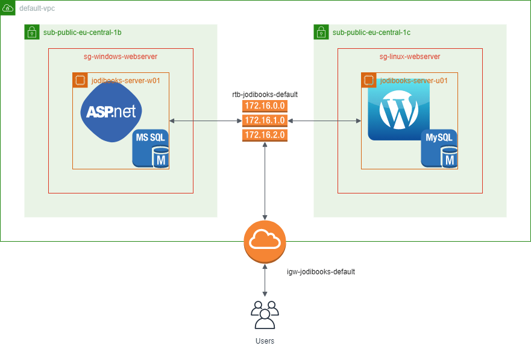
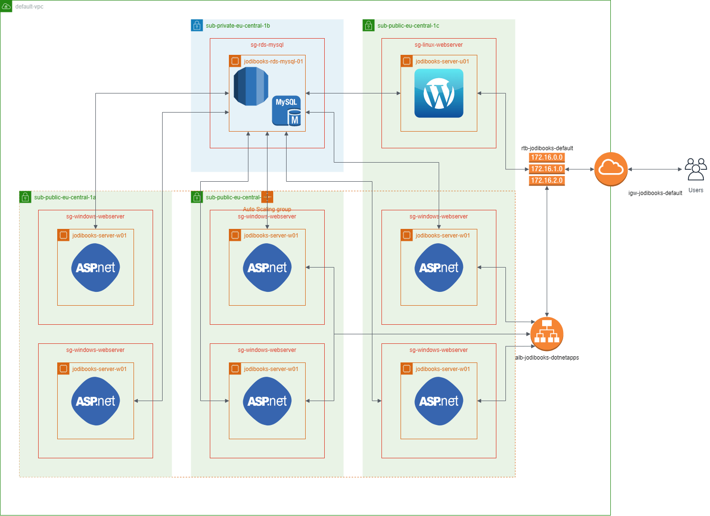

## What did we do?

In January of 2020 we ([jodiBooks](https://jodibooks.com)) migrated our websites and applications from a shared hosting platform to the AWS cloud. As Diana is currently dealing with [her own torn down house](https://www.telodelic.nl/2020/02/on-dealing-with-the-aftermath-of-a-traumatic-childhood-and-medical-misdiagnosis/), I took full ownership of this project. As this was the first time I ever did something like this, it took me a few months to get up to speed with all the web hosting terminology and how to apply that to our applications in AWS. So this post is about what I learned from migrating our websites.

## Why did we do it?

Let's start with the year 2019 in general. It wasn't a good year to be honest. It started with a [severe sickness of Diana](https://blog.telodelic.nl/) and me almost burning out. These two issues are difficult enough on their own, but the universe really wanted to test us and let them happen at the same time. In hindsight, we both didn't know how to communicate our own needs and how to really listen.

In the end this is all due to our pasts, and how we learned to deal with difficult, emotional situations. Last time I wrote about how I am [re-evaluating everything I know](/tearing-down-the-house/). I want to know what kind of person I want to be, because if I know that, I can figure out how to become that person and what I have to do to become or be that person.

I came to see myself more clearly after I saw [a movie](https://www.youtube.com/watch?v=wHNzJgW-kYI) from Mark Gungor about "<u>not</u>" a [personality test](https://markgungor.com/pages/flag-page-1) he was promoting. He, and the test-developers, divided people into four countries or flags: control country, fun country, perfect country and peace country. Part of me knew it all along, but now that I had the words, I knew I was a controller.

<YouTube youTubeId="wHNzJgW-kYI" />

Controllers are good at taking control, obviously, and like building frameworks, guides and processes. Indeed I LOVE that. But we can also take it to far. We are controllers, because we don't like uncertainty or surprises, so we try to control <u>everything</u>, also other people! Exactly what I tried to do with Diana and her illness when I was trying to keep my own head above water.

Now that I know that, I can do something about it. I know I can't control everything and I don't want to. I have to learn to let go, to trust other people, so people can be at ease when they are around me. This means I want to know, to learn when I can use my "control" as my expertise, or to let go when it's not appropriate.

## Wait, what about the websites?

This might sound like a strange diversion from migrating websites, but it's not. We had our website and applications hosted on a shared hosting platform. This meant we outsourced or delegated a lot of control to another party. As soon as something went wrong all my alarm bells would be triggered and the immediate impulse was to see them as incompetent and to "do it myself" instead.

We always tried to push those emotions and feelings away and rationalized we had better things to do. Which was true. For two years, we (I) struggled with this, knowing it would be a lot of work (too much we thought) to do it ourselves. So I often said to myself, trying to calm me down: "Joep, they are the expert, right? So you have to learn to trust them, goddamnit!"

Well, that didn't work. We already wrote about that [here](https://blog.jodibooks.com/2019/10/architectuur-deel-1-een-eigen-website-best-wel-een-gedoe/) and [here](https://blog.jodibooks.com/2019/12/hosting-problemen/). So we decided we wouldn't wait any longer and just do it. Start hosting our websites and applications ourselves. Yes, this meant more work and it counter the "let go of control" I just described. But it is also knowing when you <u>do</u> need to take control and ownership. It's knowing what you're good at, acknowledging it and using it at the right moments.

## What did I learn?

Obviously I learned how to host a website in AWS. I learned [what services AWS offers](https://www.joeplaa.com/how-to-host-asp-net-websites-on-aws/hosting-asp-net-apps-aws-appendix-a-aws-services/) and which of them would be useful to us. Most importantly which services were necessary to [host our current architecture](https://www.joeplaa.com/how-to-host-asp-net-websites-on-aws/hosting-asp-net-apps-aws-part-3-architecture/), but also which services we could possibly use in the future. This also means thinking about how we need to refactor (modify) our existing applications to fully utilize the possibilities and services of AWS.

In this process of browsing all the services, watching [training videos](https://www.joeplaa.com/how-to-host-asp-net-websites-on-aws/hosting-asp-net-apps-aws-appendix-c-aws-training/) and actually doing the cloud environment configuration I learned three things:

1. Damn, Diana build a lot over the last 2,5 years...
2. I really like thinking about software architecture and architecture improvements,
3. But I really love fiddling and playing with the [hosting environment](https://www.joeplaa.com/how-to-host-asp-net-websites-on-aws/hosting-asp-net-apps-aws-appendix-e-improved-architectures/) to support that architecture!

Diana often kind of jokingly calls me her sysadmin. But I think this is actually true. She must have felt it, knowingly or not. I don't know if she secretly knew, but didn't want to push it on me? If so, thank you! Because I know I would have dismissed it as it would not have been my own idea. Anyway, as she didn't tell me, I actually did it, went all-in and discovered I love it.

## I'm a nerd

Recently a friend of mine wrote on her Facebook page about [her childhood passion](https://www.facebook.com/ishootweddingsbyjosephine/posts/998068187234465) which she never pursued. This made me realize something. As a teenager I was always tinkering with Windows, Linux and websites. I learned how to make movies in Flash. I made websites for my dad's band and then wife. But I never pursued it. I always thought computers were for nerds and I "wasn't" one.

I always told the story all my fellow mechanical engineers will tell you. In fact in my last job I had to interview several candidates and they all told me: "I always took things apart and wanted to know how they worked". And although I had and have that same curiosity for mechanics, but I actually always did it with computers. I love building and configuring them. So why didn't I pursue what I really loved doing? Why did I choose to do mechanical engineering instead?

It all comes down to perceived peer pressure. I <u>thought</u> people would think I'm a nerd. This might actually be true by the way. But I also <u>thought</u> that being seen as a nerd would make me a lesser person. Which is total bullshit obviously. This perceived pressure also comes in the form of our society and families.

Not everybody will be this self-censoring, but I assumed I had to do mechanical engineering or at least a form of "real" engineering. I can't tell you how often my mother told me my granddad would have been so proud that there would be another engineer in the family tree. She probably doesn't even realize her words made such an impact on me.

Don't get me wrong, I really liked university. I liked the courses, the challenges, and the freedom, but also learning how to use a skeptical framework to view the world and all problems. Especially I liked the opportunity I got to join a committee to host a series of celebratory events for the 50th anniversary of the study association. I learned more in that 1.5 year than in all of my "official" studying and I'm very grateful for that.

## Sharing knowledge

Now that I know that I like this, I want to learn more about it. I have been experimenting with computers and servers at home all this time, but never had the actual necessity to push through some of my knowledge barriers. With jodiBooks I can't just give up when I can't get something to work. I have to figure it out one way or another. We have actual customers (who pay us!) who rely on our service.

I know I don't know a lot about this. I didn't study for it, I didn't take courses and I didn't even have a mentor or took an apprenticeship in this field. All I know is self taught. But I also know I learned a lot the past few months. One of the things I learned is that there aren't many tutorials and manuals written for unskilled people like me. Most documentation is written by and for people who know the jargon and most ins and outs of the subject. But how do you figure something out when you don't even know what most of the words mean?

So I took the time to write it all down in a way I would understand. I have to admit this is what I would understand <u>now</u>. I think it's probably fair to say that the me of 6 months ago still isn't able to understand it. But I tried and wrote a 20 piece tutorial on [how to host ASP.NET applications (and a WordPress blog) on AWS](https://www.joeplaa.com/hosting-asp-net-apps-on-aws/). In this series I'm sharing what I learned so other people can give me feedback so I can improve, but also so other people like me can learn it faster. It took me several (4) months and I hope with this tutorial other me's can do it in just 1.

## Further learning

I learned a lot already. From the obvious practical stuff to the more personal development oriented. In the next year I'm going to further explore this part of me. Do I really love it? Or is it just something new and exciting?

I do want to learn how to migrate our SQL server database to MySQL and host it in AWS RDS. I'm very intrigued by their Aurora (serverless) solution, so I will be researching that. With our current plans I also hope to start using more perks of AWS like the load balancer combined with auto-scaling groups and their container service.

Also, after I learned I knew so little of what Diana had built, I asked her to explain some of the inner workings of jodiBooks. As she is on sick leave from her job and jodiBooks, I now want to pick up some of her work on the backend, where I want to start with refactoring some parts of it to better work with AWS services and I'm really excited about that.