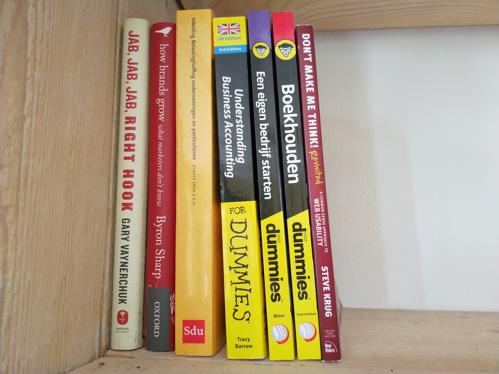
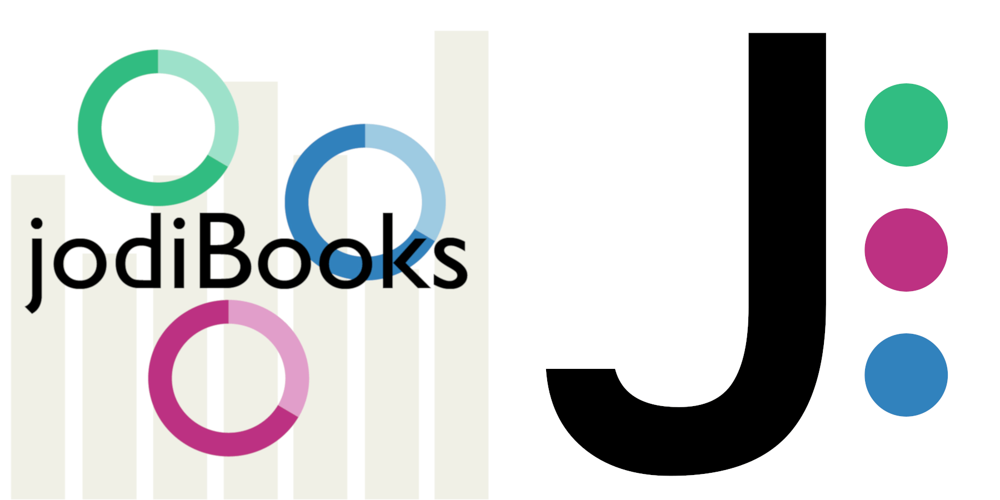
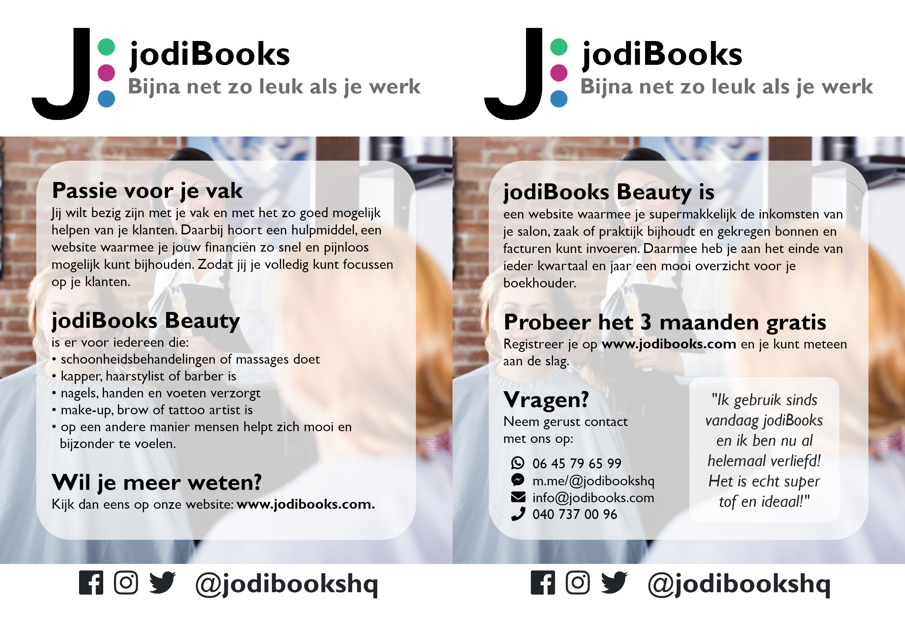

## Do something for the first time

It's perfectly normal to learn new things, we are even being encouraged (forced even) to go to school. Until we grow up. As soon as you graduate from whatever education you had, you have to stay in that very specific field you studied. Or is that just me?

I often get the question from my managers what additional schooling or training I would need. Apparently I often give the wrong answer (as I have never gotten any). Maybe because I want to learn new things, things I have never done before. These obviously don't fit into the narrow fit of that what's appropriate for my profession. Why would a mechanical engineer need marketing or finance skills?

On the other hand I see a lot of my peers doing just fine. They are engineer and don't even think of or want to do other things. And that's OK. Just as I'm okay with being the weird one for wanting to do completely different things, but if you tell me I only dream and don't do stuff, you piss me off. Yes, that really happened.

I'm not saying I am where I want to be. Not even close as you can read in my previous posts about my goals, [here](/my-goals-a-little-more-context-part-1/) and [here](/my-goals-a-little-more-context-part-2/). But if you don't see me making progress, it doesn't mean I'm not doing anything. It takes time to find what you're good at, what you love to do, how you can contribute. In short: what makes you special.

My point is this: you never learn something new without doing something for the first time. Some things might be easy, others won't. Some things might be useful, some not so much. You might be really good in some while you suck at others. You will also never find what you love to do, without trying. So this is what I did for the very first time this last 1 – 1.5 year.

## Personal

I already felt something wasn't right with how I was living my life. I had no clue what it was though. But it was in August of 2016 that I first ran into a YouTube video about investing. Investing?... yes yes, bear with me.

At first it was the title "How To Get Rich" that got my attention, obviously. But something else was triggered while watching the video. It wasn't at that moment, it actually took quite a while to figure it out, but what it triggered was the realization that I was completely dependent on others and as such also blamed everything that happened to me on others.

<YouTube youTubeId="dQnZO8-s8T0" />

From there I started reading books and watching other videos on the subject of getting financially independent. One of the most influential ones for me has to be "[The Millionaire Fastlane](/books/the-millionaire-fastlane)" by [MJ DeMarco](http://www.mjdemarco.com/). Again, don't focus too much on the title. The main thing it thought me was that I could actually start, build and have my own company. This might sound obvious, but this was really big for me as my family always told us (the kids) that "we weren't business people", as if that's something genetic.

### Mindset

While the message of that book was running through my subconscious mind, YouTube showed me an ad from [Gary Vaynerchuk](https://www.garyvaynerchuk.com/). Unfortunately I can't find the exact video now, but the two below also show the message. He basically kicked me in the ass to actually do something about it.

<YouTube youTubeId="5efhZEN89tE" />

<YouTube youTubeId="VJx5A0gIUnI" />

From there I started watching more and more motivational videos. I learned to identify positive people who actually wanted to help people (for free that is!).

I'd stay away from people who make nice and shiny videos and websites and then want to charge you for their advice. Firstly because you can find it all for free. And secondly because you never know if they'll charge you again later. Obviously you can make an exception if they presented the information in a really clear and organized way. In that case they add value by saving you time.

Anyway, in my binging of motivational videos on YouTube I came across Tom Bilyeu (interviewing Gary Vaynerchuk). I didn't like him (Tom) at first, he was so "American" (a reference only Europeans get I think). His introductions of the guests on his show "[Impact Theory](https://www.youtube.com/channel/UCnYMOamNKLGVlJgRUbamveA)" were so grandiose and felt so exaggerated, as did the show endings. It felt like he was sucking up to his guests. I was soooo wrong.

It isn't shameless exaggerating, instead what he says is completely real. He doesn't suck up, he actually means everything he says. He and his guests have so many wisdom to share (for free!). I learned so much by just watching and listening to his show. One of those things: why you should be [setting ambitious goals](https://www.facebook.com/tombilyeu/videos/344335646192928/) 😉

<YouTube youTubeId="-lITalyctN4" />

### Health

It was also watching one of the Impact Theory episode that I realized I'm not doing everything to be as ready as possible for whatever needs to be done. Wow, that's a long vague and woolly sentence.

To be able to work on getting independent, by having my own business, I have to be mentally and physically healthy. If you're sick you can't work hard or will burn out quickly. It was something I had heard a lot of successful people say, but I never realized that I wasn't really living healthy.

Looking into my health I discovered there is so much that could be impacting my health. It was the episode with Aubrey Marcus that resonated with me and made me buy my first e-book: [Own the Day, Own Your Life](/books/own-the-day-own-your-life). Aubrey describes what a "perfect" day would like. Do you meditate? When? What to eat? How to deal with stress, etc.

<YouTube youTubeId="2R_BKlb_Y8k" />

My day won't be the exact day as described in the book, but it's my guide on what I can improve. I already learned (and experienced) that taking cold showers are good for my body and mindset (I really have to force myself to do something unpleasant). I'm rethinking what food is actually good for me and recently we started doing breathing exercises in the morning to start the day relaxed. I then do some 5 minute quick exercises in the morning to wake up my body. It's already amazing and I'm just getting started.

## Running a business

Enough about the personal development stuff. Let's get practical. All the things above will always be pretty vague and hard to measure. Running a business though requires some real hands-on skills. I literally had to do something or I would get stuck immediately.

### Starting

It started with starting (I couldn't resist) the business. How the hell do you "get" a business? So we studied the differences between all the options, listed all the pros and cons, and went to a notary office. Below a list of some items we had to understand and learn to make a well informed decision.

- Sole proprietorship vs. Limited liability company
- Income tax vs. company/corporation tax
- How to write a business plan
- What official (legal) paperwork do we really need?
- What's the chamber of commerce exactly?

### Marketing

Next thing to learn was marketing. We had to show something to the world and let everybody know we existed.

#### Logo

So, the first thing I started with was designing a logo. I had never done anything like that before.

- Made the first logo with the free trial of Adobe Illustrator
- Learned about do's and don'ts for logo design
- Learned to use [GIMP](https://www.gimp.org/) and [Inkscape](https://inkscape.org/) to do the second for free

#### Social media

Next on the list was to get on social media. I didn't even have an Instagram or Facebook account until December of 2017. I had to learn from scratch how these platforms worked. After these two big ones came Pinterest, LinkedIn and Twitter.

- Learned the basics of these 5 platforms
- Learned which one to focus on (Instagram and Facebook)
- Learned to use Buffer, to help me with posting to Insta and FB
- Learned Instagram can be called Insta!
- Learned to make images with our logo for all platforms
- Started to learn more advanced stuff on especially Facebook
- Learned to place ads on Instagram and Facebook

#### Flyers

- Learned to design a flyer
- Learned to write copy (it might not be particularly good yet)
- Learned that GIMP doesn't support the CMYK color palette, so had to find and use another program for that: [Krita](https://krita.org/en/)
- Roughly speaking: [CMYK](https://en.wikipedia.org/wiki/CMYK_color_model) = printing, [RGB](https://en.wikipedia.org/wiki/RGB_color_model) = screens
- Learned that using pressing is cheaper than printing

#### YouTube videos

We made screencasts to show how jodiBooks worked. It was a first go at it and now I would make them much shorter and more concise. But, you learn as you go.

If you're interested in the complete process of making screencasts and are ok with reading Dutch (or use translate), I wrote a [blog post](https://medium.com/jodibookshq/screencasts-be680c521a4b) on how to do that.

- Learned to write a script
- Learned to use [OBS Studio](https://obsproject.com/) to record a screencast
- Learned to us [Audacity](https://www.audacityteam.org/) to remove (filter) noise from audio
- Learned to use [Shotcut](https://shotcut.org/) to edit the videos + audio
- Learned to us [Aegisub](http://www.aegisub.org/) to make the subtitles
- Learned to use [Handbrake](https://handbrake.fr/) to hardcode the subtitles into the video
- Learned that the previous step wasn't necessary. YouTube and Facebook both support separate subtitle files
- Learned to upload videos to [YouTube](https://www.youtube.com/playlist?list=PLNcJlEPWbpGxNltAq4bzGUTF4LDIhEjcR) and [Facebook](https://www.facebook.com/jodibookshq/playlist/923294514521767)

### Technology

This might not be the correct word. It's not pure technology as I'm not programming or engineering anything (yet), but these items are definitely not marketing or finance.

#### **Blogging**

Before [jodiBooks](https://www.jodibooks.com) I had never written a blog or used a blogging website for that matter. So using these platforms was something new for me. WordPress is cool, but quite distracting when you just need to write stuff. So I quickly turned to [Medium](https://medium.com/jodibookshq), before returning to WordPress. I now use it for this website and for [jodiBooks](https://blog.jodibooks.com).

- Learned the WordPress basics
- Learned to use Medium
- Really learned to use WordPress
- Ow, and I learned to blog (which is more marketing I guess?)

#### Planning

When you have your own business you have to plan somethings. Especially when you're developing products. At first we just had a business plan and todo lists. But we soon found us arguing which todo list was leading and how we could see our own and each others priorities. Being a software company working in two week sprints, we needed a tool that was flexible and easy to use.

So I dove into the world of planning tools. There are tools to visualize priorities using gantt charts, backlogs, the already mentioned todo lists, timelines and projects. Obviously we also wanted the tool to be free, not making the search any easier.

- Learned we need the tool to have backlog functionality (haven't found a free one that does this combined with the next point)
- Learned we also needed the tool to have gantt/timeline functionality (these are available)
- Learned to prioritize
- Learned my estimates are waaaay too optimistic
- Learned Diana's estimates are pretty realistic

#### Website design

Somehow I never thought I would do this. I always thought I couldn't program or design things. I know it's not programming and full design. And yes, I'm not good at it and I need a lot of help, but I did do the front-end design of the [jodiBooks website](https://www.jodibooks.com) and dashboard. Which is pretty cool.

- Learned what [Bootstrap](https://getbootstrap.com/) actually is
- Learned about the difference between screen and CSS pixels
- Learned to design sites for mobile and desktop (hooray for Bootstrap)
- Learned to edit CSS files
- Learned to use CSS classes in HTML
- Learned to edit HTML in Visual Studio

### Finance

You might want to forget this part, but having your own company means having to do some level of finance. I have to admit, sometimes I hate it too. Finance is often so vague and a lot of professionals hide themselves behind their jargon. But I also like it. That's because everything I have to learn for myself, as I'm doing the bookkeeping for jodiBooks, I can [pass on to other people](https://blog.jodibooks.com/hoe-werkt-administratie/). Hopefully customers of jodiBooks.

Also, because jodiBooks goal is to make business administration "(almost) as fun as your work", we're diving deep into a lot of bookkeeping and administration stuff. It's hard work, but so rewarding.

- Learned about the double-entry bookkeeping system
- Learned to do basic bookkeeping
- Learned about invoicing
- Learned about sales tax
- Learned about business taxes in general
- Learned to make a balance sheet and a profit/loss statement
- Learned what insurance is available and/or needed
- Learned to submit tax declarations (sales, business)
- Learned about different ways to (personally) finance your business

## Conclusion

Don't ever say you can't do something, before you tried. Never say somebody can't do something because he or she never had the formal education. As you can see I did a lot of things in just one and a half year. I had to learn a lot to be able to even do the most basic things, but from there I will only become better.

I used to blame my family, my genes, the company I worked for, the government, society for everything. I learned that despite the headwinds all of those other people will give me, I can change how I see myself and the world. I'll never ever blame something outside of myself, because when you do that, you also can never change it.

Writing this as made me realize how much I have achieved just this year. What else can I do, when I really invest all my time and energy into what I want to do? I will find out eventually, but the prospects look almost limitless.

* * *

## References

### People

- [Aubrey Marcus](https://www.aubreymarcus.com/)
- [Gary Vaynerchuk](https://www.garyvaynerchuk.com/)
- [MJ DeMarco](http://www.mjdemarco.com/)
- [Tom Bilyeu](https://impacttheory.com/)

### Books

- [Own the Day, Own Your Life](/books/own-the-day-own-your-life) - Aubrey Marcus
- [Rich Dad Poor Dad](/books/rich-dad-poor-dad) - Robert T. Kiyosaki
- [The Millionaire Fastlane](/books/the-millionaire-fastlane) - MJ DeMarco

### Videos

- [Gary Vaynerchuk originals](https://www.youtube.com/playlist?list=PLfA33-E9P7FAvnrOcgy4MvIcCXxoyjuku)
- [Impact Theory](https://www.youtube.com/channel/UCnYMOamNKLGVlJgRUbamveA)
- [Share Your Goals With Everyone – Tom Bilyeu](https://www.facebook.com/tombilyeu/videos/344335646192928/)

### jodiBooks referals

- [Main website](https://www.jodibooks.com)
- [Main blog](https://blog.jodibooks.com)
- [Medium blog](http://medium.com/jodibookshq)