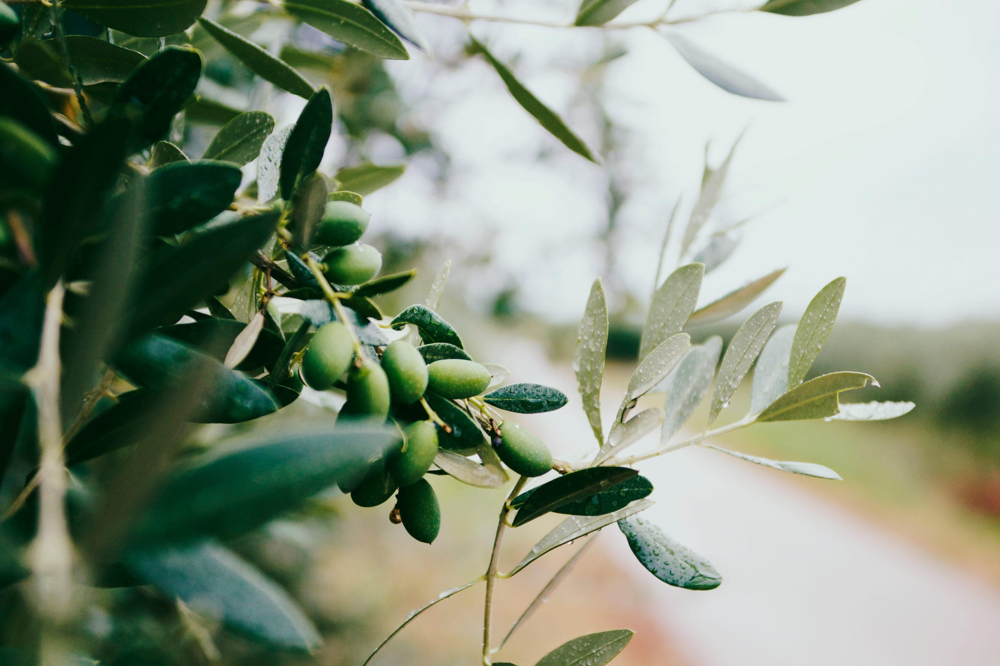
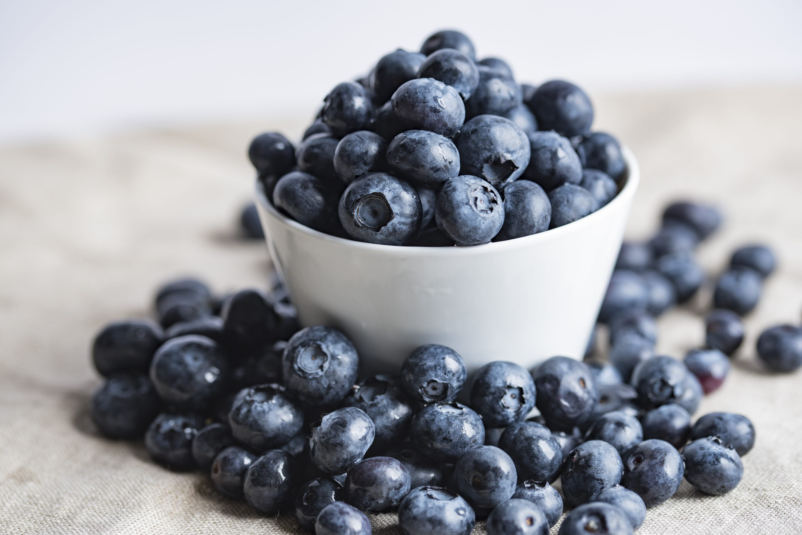

Lately the world opens up to me in a lot of different ways. I guess as I'm opening up myself, other ideas are finally able to trickle in. It started with different ways you can view and use money, followed by the different mindsets you can have related to work and jobs. In that latter category I love the YouTube show [Impact Theory by Tom Bilyeu](https://www.youtube.com/channel/UCnYMOamNKLGVlJgRUbamveA). It was there that I saw an interview with Aubrey Marcus, who was talking about the need to take care of your sleep, diet, body and mind, so you can enjoy your success.

<YouTube youTubeId="2R_BKlb_Y8k" />

He had a slightly different approach to the hard work mentality a lot of people were/are preaching. Yes you need to put in the work to become successful, but you also need downtime and rest. What's not to like about that? So he had me and I bought his book. My first book on an e-reader by the way. I had been very conservative about reading, it had to be paper books. Well, I love the e-reader now.

Aaanyway, I always thought I ate healthy. Not super-food, quinoa, non-fat smoothie healthy, but I ate my vegetables, tried to limit fat and sugar and tried to not overdo on alcohol. Sounds reasonable right? Apparently, it is way more complicated than that. Aubrey has his own ideas about what is healthy food and what's not. He tries to make a solid case by adding references to scientific papers, but use Google and the jury is still out on a lot of issues.

## Food is complicated

Aubrey couldn't fully convince me, but he did open my mind. I started to think about what I put into me and what effects it could be having. But where to start? If you start to think about food, it becomes really complicated quickly and there is no consensus at all, even among scientists. So let's start by stating some of the issues.

1. A lot of conventional wisdom is just not true. Or at least not proven.
2. There are so many theories about what is good and bad food.
3. A lot of diets claim to be THE solution.
4. I'm not medically trained, so I can't judge the science.

So I started investigating and reading. And I have to say, so far it has been enlightening, funny, depressing, confusing, frustrating and rewarding. People really can't agree on anything, not even about the stuff that keeps them alive. Depending on my mood I find that funny, depressing or downright frustrating. But I learned so much and already helped one person, which makes the bad stuff worth it.

## Just start trying

Where to begin when you apparently know nothing about food? It's a long story, but due to circumstances I started with trying a [Whole30](https://whole30.com/) diet. Whole30 is based on the idea that some foods can be "bad" for you, but you don't know which. Are you sensitive to dairy or soy or legumes? Normally you don't test that, you just eat everything that tastes good.

So with Whole30 (you can find recipes all over the internet) you cut out potentially bad food groups and only eat wholefoods for 30 days. Hence the name. This period should be enough to "clean" your body, so you have a baseline level before you start reintroducing food groups.

If I eat dairy, do I feel different? Do I poop different? Do I think different? What about soy? Etcetera. After the diet you should have a good feel about what foods are treating you well and which food groups don't. I tried it for 4 days, but at the time it was too much trouble. Diana was ill, so couldn't help me with the cooking and I just didn't have enough energy. Also it made me feel tired, slightly hungover and I had really bad poops (part of the experience apparently).

    <Instagram instagramId="BuLZGwehleI" />

## Keto diet experience

After that experience, I still felt there was something about the low-carb, no sugar, high-fat diet theory. The Keto variant is also being promoted by two people I think highly of, Tom Bilyeu and Peter Attia, both for different qualities. I love Tom for the way he talks about mindset and how your health (and thus what you eat) can influence that. While from Peter I learned about what [fat and cholesterol](https://peterattiamd.com/category/cholesterol-2/) actually are and why [sugar (in excess) is bad](https://peterattiamd.com/category/biochemistry/). Peter is the medically trained doctor that can actually [read and interpret the science](https://peterattiamd.com/category/understanding-science/) and explain it.

First thing I learned from the Keto diet: it did the same as the whole30. I didn't wanted to admit it at the time, but my poops where awful, I had a headache for a few days and was tired. I tried it for a week or two, I guess, and after a week the tiredness and headaches were gone. My poops however…

All the time I was tracking my food intake with an app: [Lifesum](http://www.lifesum.com). I could see it was really hard to "be strictly Keto". I just couldn't eat enough fat and protein (I'm not a big meat eater). Low-carb however was much more reasonable. So I morphed from Keto into low-carb: on some days pasta or rice were okay and a few slices of bread a day were also allowed.

All this experimenting didn't make much difference for my mood, strength or endurance. I ran as fast and far as on my regular diet. But still, my bowel movements didn't improve. I still felt bloated and well, shitty.

## Your gut as a garden

It was at that time that I started reading about gut microbes and the microbiome. I was still intrigued by the low-carb, high-fat theory, but couldn't find any convincing proof. Some said it was the healthiest way to eat, others said it was downright dangerous. It was then that I stumbled upon a talk by Tim Spector about the science of the gut microbiome and what to eat to keep them healthy. In short: healthy microbes = healthy you.

<YouTube youTubeId="-LUuqxQSaFQ" />

I bought his book and was reading it when I went to my sister for a week. She lives in Valencia, Spain, where the food is obviously amazing. I had to let go of my low-carb, because I couldn't miss out on that. While reading I decided I had to change my diet again. I had to eat what's good for my microbes and thus for me. As everyone has a different set of microbes, that could perfectly explain why others thrived on Keto, while I didn't.

Tim's metaphor for what to eat is very simple and enlightening. Treat your gut as a garden. A healthy garden has lots of different plants (diversity is key). The more plants and animals the better it can fight off enemies and survive harsh conditions (droughts, floods). In turn it will take care the environment it's in will be healthy.

Your gut is the ground for the microbes of which you thus want to have a lot of different ones. The food you eat is their fertilizer and if they like it, they will send out good nutrients to their environment, you, and keep it healthy.

I was on the right track, as good foods for your microbes are vegetables, fruits and "living" dairy (unpasteurized cheeses, yoghurt, cottage cheese). Also great are olive oil, dark chocolate, coffee and an occasional glass of red wine. Not good is sugar, which I had to eliminate for Keto anyway, but carbs (grains, rice) are fine, as long as they are whole grain (as the fibers are what the microbes love to eat). But please buy [the book](/books/the-diet-myth/). The ebook is just a few dollars or euros but will teach you so much about food (not only gut microbes).

## Everybody is different

Now I'm trying to eat the foods that should be good for my microbes. I think it's been about 4-6 weeks now and I have never felt better. Admitted, also my stress levels are down, but we may never know what was cause and what was the effect. I think it doesn't really matter, because I feel great. I hope to dive deeper into this in future posts.

When I was doing the Keto diet I posted a pic of a [juicy hamburger](https://www.instagram.com/p/BvXC2CYhmR-/?utm_source=ig_web_options_share_sheet). I still drool when I see it now. Back then I didn't post it with any particular goal in mind. I was just sharing what I was doing, [documenting](https://youtu.be/RVKofRN1dyI) as Gary vaynerchuk would call it. But my sister saw it and started to think about her relationship with food and what she was eating. We discussed it when I was visiting her (over fantastic tapas by the way) and she decided to go low-carb.

The funny thing is now, that where I was struggling, my sister thrives on low-carb. I just saw her this weekend and she looks amazing. She also told us she feels amazing. Her skin improved, she doesn't feel bloated anymore, she can think clearer and now has the energy to workout more. Again, we never know the actual cause and effect, but that doesn't matter.

It just goes to show that even brother and sister can react completely different to the same foods. So why do we keep trying to put everyone on the same diets? I don't even mean the diet gurus and fanatics here. Even for example the US, UK and for me Dutch governments have one averaged nutritional advice.

While writing this something funny occurred to me. My sister lives in Spain, so quite literally in the Mediterranean, but I'm the one who thrives on a Mediterranean diet.

## So what works for me

Well, the first thing I did was limit my sugar intake. I tried to eliminate it altogether at first, but that's almost impossible. Almost everything you buy contains sugar nowadays. I'm lucky I'm not into sugar anyway. I don't eat candy, ice cream or drank lots of sugary drinks. Still I can definitely feel the difference. If I eat or drink anything sugary, it tastes overly, almost too, sweet.

Because I'm limiting sugar, I don't drink any soft drinks or fruit juices anymore. That's probably the main reason why lately I physically just can't eat "enough" calories (according to the Lifesum app). I lost 6-7 kg and can eat as much fat and, if I want to, potato chips as I want (I cannot not eat potato chips...this must be what it feels like for people who love ice cream). I still do drink beer now and then, but I limit the amount. In the end beer is also just a sugary drink.

Apart from limiting some foods I also changed other food habits:

- I minimize the amount of "white" carbs. So only whole grain pasta and bread, brown rice and potatoes with skin.
- For breakfast I started eating full fat yogurt with blueberries.
- I now eat a lot more olive oil, nuts (cashews) and (fatty) fish.
- I eat way more different vegetables.
- And almost no meat. On average once a week chicken en every two weeks red meat. And some salami and chorizo because that is sooo good.

So in the end I don't fully agree with Aubrey, but I ended up eating a lot of things he proposes in his book. I eat less sugar, more fat, more vegetables and more pre- and probiotics.

## Diet mindset

I'm far from done investigating this subject. I still have a lot of questions. Why are some foods good for you? How does it work? What does food do with you? What nutrients do you really need? And what are unsupported claims? I think the questions are endless and the answers will definitely not be straight forward.

I wanted to end with one last thing that's bothering me. There is a fierce discussion between scientists and self-made nutrition gurus. Scientists claim genetics play a big part in how you react to food. This means you shouldn't say fat people are lazy for example. It's their genetics they are fighting and that's in the end a losing battle. The gurus however say you you can lose weight and be healthy if you want it enough. You can almost say: if you believe it enough.

I think there is truth in both. Yes your genetics (and gut microbes) play a big part in how you react to food. But if we stick with that doctrine, you lose all agency. Why even bother about your health? We are conscious beings, we can decide how we treat ourselves. We might not be able to determine how food is processed in our body, but we can determine what, when and how much we eat in the first place.

I'm not saying that's easy, or that we should blame all obese people, not at all. It's probably very hard, but that makes it all the more rewarding.

## Sources

#### Gut and microbes

- [Tim Spector](http://www.tim-spector.co.uk/)
- [Emeran Mayer](https://emeranmayer.com/)
- [The gut stuff](https://thegutstuff.com/)
- [Gut flora](https://en.wikipedia.org/wiki/Gut_flora)
- [Microbiome](https://en.wikipedia.org/wiki/Microbiota)
- [ZOE](https://joinzoe.com/science)

#### Science, cholesterol and ketosis

- [Peter Attia](https://peterattiamd.com/articles/), check the articles through the menu.

#### The truth about diets

- [Giles Yeo, Gene Eating](https://www.goodreads.com/en/book/show/41154735)