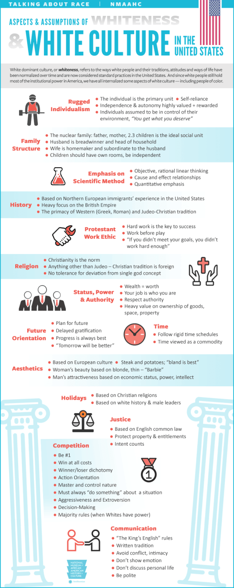

So this is "whiteness"? I never knew I was that one dimensional. But you know what, I can live with that. Although you obviously don't have to tick every box, this reads like a recipe for success.

I'm just wondering… If this is whiteness, what is blackness? Is that by definition the opposite of all these things?

It's one thing to have a brainstorm session to gather a list of notable "differences". But I can't believe they actually attributed those differences to a skin color and then made the effort to put that list on a nice infographic and actually release it to the public. Without any numbers or background.

Whatever, please watch this video for more context:

<YouTube youTubeId="QztQm5NVoG7h1iwOVYBwP0" />

## Sources

Pick whatever source you think is reliable:

- Smithsonian National Museum of African American History &amp; Culture: [https://nmaahc.si.edu/learn/talking-about-race/topics/whiteness}(https://nmaahc.si.edu/learn/talking-about-race/topics/whiteness)
- Washington Post: [https://www.washingtontimes.com/news/2020/jul/17/smithsonian-african-american-museum-remove-whitene/](https://www.washingtontimes.com/news/2020/jul/17/smithsonian-african-american-museum-remove-whitene/)
- Breitbart: [https://www.breitbart.com/politics/2020/07/15/smithsonian-african-american-history-museum-defines-whiteness-individualism-science-hard-work/](https://www.breitbart.com/politics/2020/07/15/)
- Newsweek: [https://www.newsweek.com/smithsonian-race-guidelines-rational-thinking-hard-work-are-white-values-1518333](https://www.newsweek.com/smithsonian-race-guidelines-rational-thinking-hard-work-are-white-values-1518333)