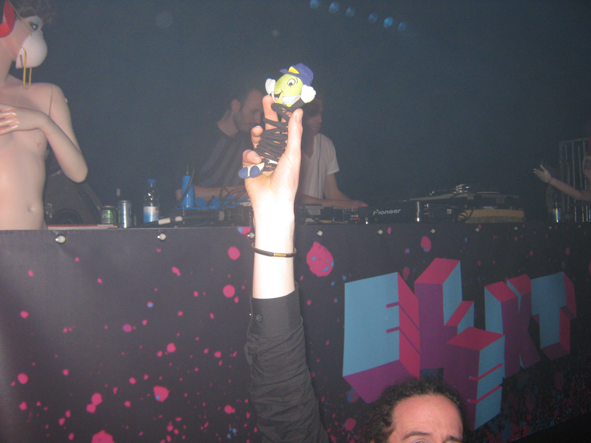
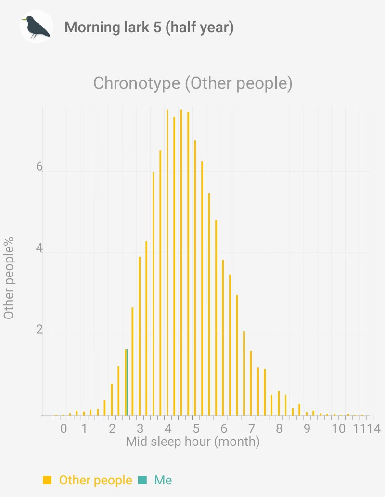
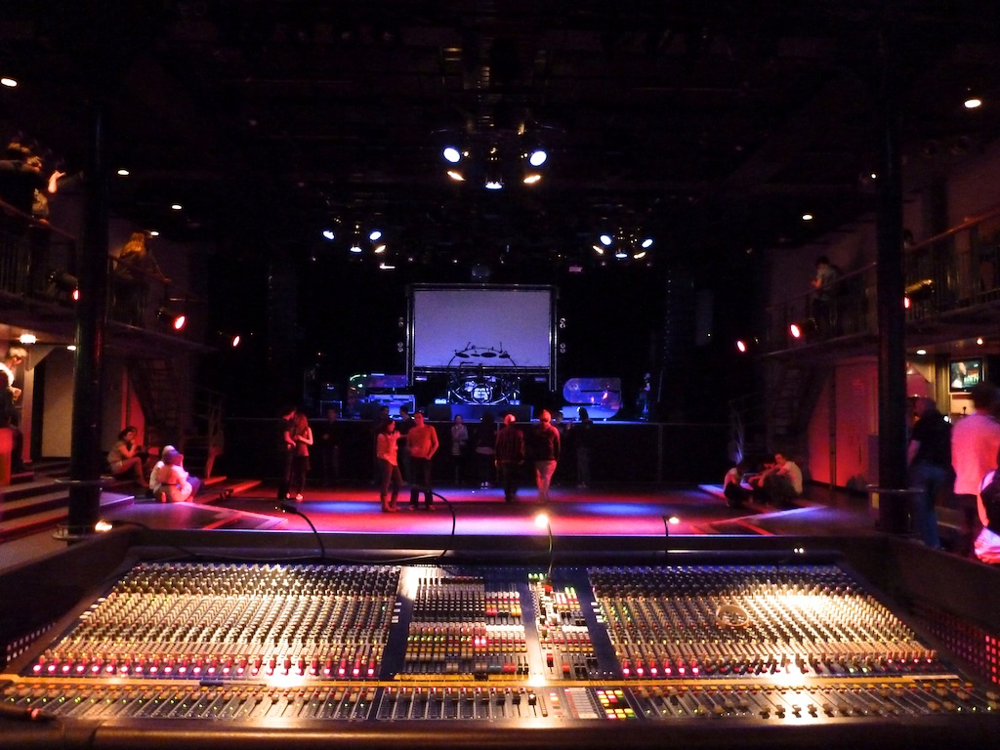
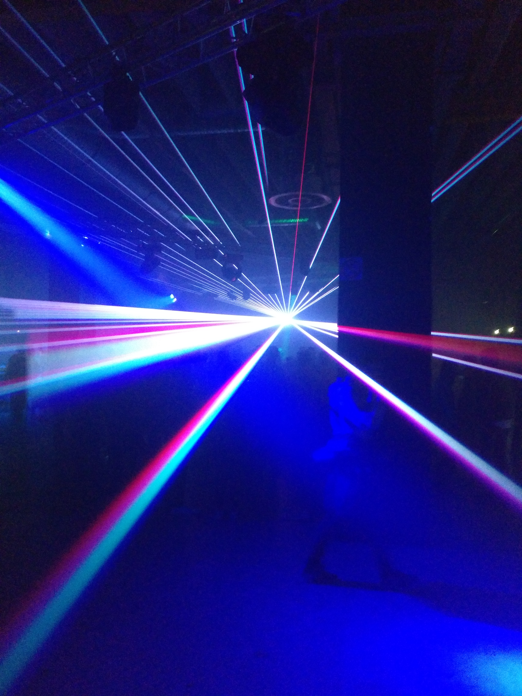

*Originally posted on* [*Medium*](https://medium.com/joeplaa/why-do-most-parties-start-around-midnight-59663fdb908a) *on June 16, 2018.*

I don't know if this is something Dutch or if this happens everywhere. But, to my frustration, most parties (in The Netherlands) start around midnight and sometimes end after the sun rises again. At least the cool ones.

I'm wondering, for some time now, why that is. And why it bothers me? I used to enjoy, even love these late night parties. I've attended many of them and mostly was one of the last people leaving. So why didn't it bother me then. Or did it bother me, but just not enough to care?

Lately it does bother me though. So, did I change that much? I never fully understood my friends who left before the party was over. Why leave now? And now I am the one wanting to leave early... What is going on there?

## Growing up, adulthood

The first thing I normally hear is: "Joep don't worry about it. You're getting older and your priorities change". Although that might be true, it can't be the full story. Yes, I now have a full-time job, I'm starting a business and my friends are marrying and getting children. But I still love the music, the atmosphere and the happiness when I'm at a party.

I know and feel I'm getting older though. Yes, even at 33 I feel old at most parties and concerts. My back starts killing me after 2 to 3 hours and I often find myself laughing at/commenting the latest party outfits (what is up with those ripped up jeans?). But mostly it's the sleep I'm missing out on that's really gets to me.

## My circadian rhythm

Which brings me to my sleep pattern and my natural circadian rhythm. Your body's internal clock tells you when you need sleep and determines when you're awake. Everybody's rhythm is different, some people are fully alive in the morning, some can't imagine getting out of bed voluntarily before 12.

Researchers have introduced the terms '*morning lark*' and '*night owl*' just to describe these different types. As a child I was definitely a lark. Always up early in the morning, and voluntarily back in bed at 8 pm. As an adolescent and definitely when I was in university, I became the late night owl. I just couldn't sleep before 11pm and if I didn't set an alarm, I woke up after 11am. Now, I'm a lark again as you can see in the picture below (left of the hill is lark territory, on the right the owls are prowling).

If you want to know more about larks and owls, I can recommend 'When' by [Daniel Pink](https://en.wikipedia.org/wiki/Daniel_H._Pink?wprov=sfla1). He gives a good summary of the types (lark/owl) and the possible implications.

## What if I didn't have a job?

There is one questions I can't answer and can't get out of my head "Would my rhythm change if I didn't have a job?" Is this really my biological rhythm, or am I forced into this rhythm? What would happen if I could determine when to go to bed and when to get up? Well ok, 4 questions...

I have a feeling this would shift. Probably this feeling is more a very strong wish it would change. That would mean I could blame the world (and my boss) instead of myself. And I want it to be true, so I can enjoy late night parties as I always have.

### Measure

I'm a scientist, so just having a feeling doesn't really do it for me. Next to that I want to be really, really sure before I start blaming others. So I started measuring my sleep.

Years ago I installed a [sleep tracking](https://play.google.com/store/apps/details?id=com.urbandroid.sleep) app on my phone. It tracks the time I fall asleep and when I wake up. It then applies some statistics to tell you all kind of stuff about your sleep. Pretty cool, but it didn't gave me the answer I wanted to hear (see the graph above).

An easier and more fun way to measure is taking a long vacation. The first weeks nothing changes for me. I still wake up around 7 am, no matter what time I go to bed. Only in the 3rd week will my rhythm start to shift. Waking up at around 8 am, woooh. Well, maybe 3 weeks is too short and unfortunately I don't have enough holidays to test for longer periods.

Until I find a way to find my natural rhythm, I'm going to accept that waking up before my alarm at 7 am and going to bed before 9:30 in the evening is who I am and what my body needs. Besides, I actually like the quiet mornings.

## So, should parties be earlier?

Back to the late night parties. So why are parties late in the first place? I'm certainly not the only one with this sleep pattern. Let's say, looking at the graph, roughly 25% loves late nights (owls), 25% hates them (larks) and 50% doesn't really care (everybody else). So 75% doesn't mind the late hours.

### Economic reasons

First there are some impersonal, rational reasons. By starting late, everybody has time to get home after work (without taking half a day off). Take the time to go out for diner. Get together with some friends and have a drink to start the evening. So restaurants and pubs can also serve the same people who go the a party later that night.

Sounds reasonable right? But most people attending late night parties are broke youngsters. They don't eat out and drinking in a pub or bar is expensive. So there must be something else.

### Social reasons

Knowing from my days as a party boy (oh god, now I have Jackass on my mind) we tended to get together with the group at somebody's house and have some drinks there. The host bought a case of beer and later some wine for the ladies and we just sat there, talking, laughing, just having a good time.

Especially after all of us moved to different places, these evenings gave us a chance to catch up. Ever tried to have a conversation in a club...? So, by getting together before the party, there is time to socialize.

But this social behavior also has some weird side effects. There is a certain group pressure, a social norm, that these late night parties are normal and cool. I've also often heard people say "There is nothing to do before midnight." Which off course is a weird thing to say. You are the party, so if you're there at 11 or even 10, there is something to do.

### Age

In the end, I guess it's mostly an age thing. I'm 33 and I already often feel old at parties. Most people my age are busy having children. They are too tired to even go out the door. And when their kids reach party age, they have forgotten that they too attended and enjoyed late night parties. Who doesn't know the phrase "in my time we went out at "*a weird early hour*" and had to be home at "*ridiculously early*" Awful...

Anyway, most party people are much younger, say 16–25. At that age you don't have a lot of responsibilities, so you don't have to care about a wasted Sunday, or even skipping some classes on Monday. And above all, you don't want to run into anyone's parents. How awful is that, explaining your definitely not drunk, or that boy/girl is not your boy/girlfriend... So, if moms and dads think 12 pm is late and want to go home, that's the perfect time to start the (real) party. They can have [theirs](https://40up.nl/) in the early evening.

### Something magical

But the most important reason is one I actually can't properly describe. It's a feeling. A feeling I get that is so strong, it's almost addictive. Yet it is so illusive, so rare and special that I'm willing to sacrifice my easy, productive, awake Sunday.

When a party progresses, you get this feeling. A feeling you share in that moment with a select group of people. People who aren't asleep too. People who sacrifice their normal rhythm and their Sunday too. It's the music, the flashing lights, the hidden tiredness, the alcohol, the people, the ambiance.

I don't know what I feel at that moment. It's not pride that I'm one of the few who are willing to bring that sacrifice. It's not just listening to good music. It's not the alcohol (well maybe a little). It's all of the above and more. It's this transcendent, amazing, almost magical feeling.

## (No) alternatives

So where do I go from here? The first thing is to accept that it is what it is. Yes I'm getting older and yes the parties I want to go to will be late. There are little to no alternatives and I'm not going to organize them. Besides who will come if I do?

I have to work with what I have and look for opportunities that fit in my schedule. I can take an extra day off or find parties that start in the afternoon (thanks to [NOX](https://www.facebook.com/NOXbass/) hosting a [stage at Kingsday](https://www.facebook.com/events/220299298505835/)). I can find an employer who allows me to have more flexible working hours or I can start my own business.

In the end I have to accept that I won't do much the day after and hope my circadian rhythm changes when my work permits. Because I really love the late night parties!

